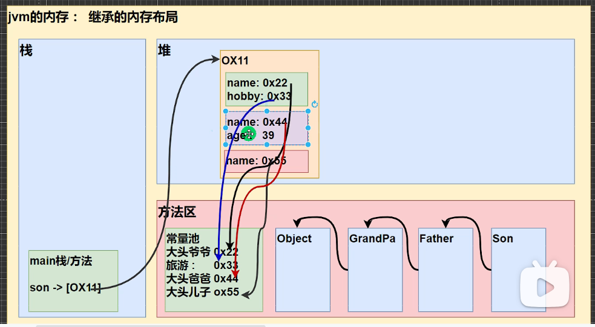

# Java基础学习笔记

此笔记基于韩顺平的Java基础课程，用于记录课程中一些知识点，难以区分的概念

## 2023/10/20

今天学习了Java的用处，就业方向，JDK,	JVM，JRE的概念介绍

### 1.JDK

java development kit,Java开发工具包，由JRE+Java开发工具组成

### 2.JRE

java running environment,Java运行环境，由JVM+Java的核心类库组成

### 3.JVM

java virtual machine,Java虚拟机，用于在不同的操作系统上建造相同的Java程序运行环境，从而实现Java的跨平台性

````
JDK包含了所有，适用于开发人员
JRE不包含Java开发工具，适合需要运行Java程序但不需要进行编译等需要Java开发工具的人员
````

***

***

## 2023/10/21

今天学习了JDK的安装及环境配置，java输出语句，java代码的编译及运行，常用转义字符，java注释（单行，多行，文档，其中文档注释是第一次学），doc常用指令（最重要的是绝对/相对路径），变量类型介绍

### 1.总结编写中遇到的一些问题及经验

1. 需要配置环境，是因为系统在运行java工具时，默认路径中没有工具所在位置的索引，因此需要修改环境变量，一是JAVA_HOME（自己给路径起的名字），二是path
2. 编译用javac+java文件，运行用java+java文件（后一个不包含.java，运行实际上是用的java文件里类的名字，当一个程序里有多个类时，调用不同的类名可运行其中不同的方法），因此准确来说，运行用java+类名
3. java与C类似，写完一句话，末尾要加`;`
4. java的格式是类套主方法，一段程序中必须有一个主类，类的数量不限，文件名必须与主类的类名相一致
5. 注意编码方式，调成中文编码保存，才能在doc编译
6. \r这个转义字符是第一次学，意思是不换行的回车，后面再加上字能起到覆盖的作用

7. 文档注释，一般用于注释类和方法，标注作者，版本，参数含义等等。

```
//写完代码之后，命令行输入javadoc -d 存储路径 -author -version 存储的文件
//文档注释中写了什么，命令行中就要加什么，如-author。存储的文件，若不在当前文件夹下操作，则需要加路径
```

8. java的变量定义与C++类似，整形有几个名字不同

```
byte  占1字节的整型
short  短整型
int    整型
long   长整型  定义完在数字后需加l或者L（因为整型数默认为int)
```

***

***

## 2023/10/22

今天学习了字符型，浮点型，布尔型，字符编码规则，基本数据类型转换的细节。下面对一些新学的或是知识点薄弱的进行总结

### 1.字符型需要注意的细节

1. ""表示字符串类型，不像C++通吃，因此要定义字符型变量只能用''
2. 字符型的本质是数字，通过unicode编码将字符变为数字，通过ascii码将数字变为字符
3. 判断最终输出的数据类型，关键看输出的是定义的字符类型数据，还是经过数据转换或者运算的数字
4. 字符型数据存储流程：字符->数字->二进制编码->计算机

### 2.浮点型数据需要注意的细节

1. 有小数点的数，默认为double型，若赋给float型变量，末尾需加上f或F
2. Java运算中认为8.1/3是8.100000..../3，得到的值不会是2.7，因此不可将运算所得数与赋值所得数进行比较，若想要进行比较，只能进行绝对值得近似判断，小于某值时就可以认为相等
3. 输入的浮点型数据为0.几时，可省去整数部分

### 3.布尔型

注意格式是boolean，和C++不同

### 4.字符编码规则

1. unicode：英文字母2字节，汉字2字节
2. utf-8:英文字母1字节，汉字3字节，为unicode的改进版

### 5.基本数据类型转换细节

1. 不同精度的数据，可依据精度从低到高进行转换，即低精度数据可自动转换为高精度数据，而高精度数据无法转换为低精度数据

```
char->int->long->float->double
byte->short->int->long->float->double
```

2. char,byte,short三种类型的数据无法进行自动转换，即使他们有精度高低之间的差别
3. 不同精度的数据进行运算，会自动转换位数据中最高精度对应的类型
4. char,byte,short之间进行运算，无论是同类型还是不同类型的运算，以及与数值进行的计算，结果都会升为int型
5. 将具体的数值赋给byte类型时，先检查数值是否在承受范围内，若在则赋值成功（这与第1条不同，若是将int型赋给byte型，则会失败）

**总结这么多，都是在于写最终赋值变量时，确定好变量类型，以防报错**

***

***

## 2023/10/23

今天学习了强制类型转换，基本数据类型与String类型之间的转换，算数运算符，逻辑运算符，关系运算符，三元运算符，赋值运算符，输入操作，不同进制间的转换

### 1.基本数据类型<->String

1. 基本数据类型->String

直接在原数据后+""即可

```
例：
char c='a';
String s1=c+"";
```

2. String->基本数据类型

* 用对应类下的方法`parse**`进行转换（除了char，`**表示类型名`，类和方法的首字母都要大写)

```
例：
String s1="123";
int n1=Integer.parseInt(s1);
```

* 无法将字符串直接转换为字符型，因为字符串中有很多个字符，一次只能转一个

```
字符串数据.charAt(位置)
```

### 2.算数运算符

* 包括+，-，*，/，%，++，--，基本都已学过，挑其中的三个记录一些细节和以前没学到的
* 计算机中的运算，要区分好哪些式子需要先算，若不符合运算符优先级，加上括号；若不符合数据类型，则修改数据类型

1. /

除法满足之前不同类型数值计算的法则，得到的最终数据类型取决于其中精度最高的数据，用几个例子来清晰地表明

```
System.out.println(10/4);  //2 整数/整数，结果为int型
double d1=10/4;         //2.0  右边先得到2，然后赋给左边的字符型变量d1
System.out.println(d1);
System.out.println(10.0/4);     //2.5
```

2. %

取余的本质在于公式：a%b=a-a/b*b，因此即使是负数也是可以取余的。**注意**：当a为浮点型时，有一步要强转成整数进行计算，此时`a%b=a-(int)a/b*b`

3. ++和--

当其在单独一行时，++在前面和后面都不影响最后+1的操作。当其与其他关系式融合时，要严格遵照`++a`是先+1，再赋值，`a++`是先赋值，再+1的规则，下面举一个我做错的题目：

```
int a=4;
a=a++;    //(1)temp=a (2)a=a+1 (3)a=temp
System.out.println(a);   //输出a=4

int a=4;
a=++a;    //(1)a=a+1 (2)temp=a (3)a=temp
System.out.println(a);   //输出a=5
这种利用同变量赋值的方法，能够真正理解其中的运算步骤是分三步的，当换成不同的变量时，也是相同的规则
```

### 3.逻辑运算符

包括&，&&，|，||，^(异或)

1. &与&&的区分(|与||同理)

* &：逻辑与
* &&：短路与
* 当第一个条件为假时，&&不会进行下一条件的判断，&会把下一条件判断完
* 因此常用&&

2. ^

异或，相同为0，相异为1

### 4.关系运算符

包括==,>=,<=,!=,>,<

### 5.三元运算符

包括if a 关系运算符b ? 式子1：式子2

### 6.赋值运算符

包括+=,-=,/=,%=等

其实就是算数运算符加上=的形式，需要注意的是，这类运算符会自动进行数据类型的转换，下面举一例

```
byte x=1;
x+=1  //x=(byte)(x+1)
x+1会转换为整型，系统自动将其强制转为byte型，否则赋给x会报错
```

### 7.输出操作

这和C++,Python不同，需要使用包下面的类的方法才能进行输出

```
import java.util.Scanner;   //使用util包下的Scanner类
Scanner myscanner=new Scanner(System.in);   //创建Scanner类的实体化对象
System.out.println("输入姓名：");
String name=myscanner.next();      //获取String型输入值
注意：1.调包语句最后要加分号
	 2.Java中要根据不同的输入类型，创建对应数据类型的接收变量，并且使用的方法也要符合输入类型，如输入整型，则是myscanner.nextInt()
	 3.输入类型为char型时，Scanner没有对应的方法，只能先接收为字符串，再取其第一个字符，即myscanner.next().charAt(0)
	 3.与C++，Python不同，Java不能在输入语句中加入别的字，因此想加提示语句，只能写输出语句
```

***

***

## 2023/10/24

今天学习了位运算，if语句，switch语句，for循环语句，这三个语句几乎和C++一模一样

### 1.位运算

位运算包含&，|，~(非)，^，<<，>>，>>>七种运算，前四个为一类，后三个为一类，其运算都应遵守以下的规则

```
1.数字间的位运算到计算机中会转换为二进制补码形式进行运算，这也就涉及到了原码，反码以及补码
2.正数的原码，反码和补码都是其二进制形式的本身
3.负数的原码是其数字对应的二进制数，再将符号位改为1
4.负数的反码是其原码除了符号位其余位都取反
5.负数的补码=反码+1，由此得负数的反码=负数的补码-1
6.数字在计算机中运算的形式是补码，但其显示的形式是原码，因此遇到负数时，要将数字->原码->反码->补码，若得到的补码符号位为1(是负数)，则还要将补码->反码->原码，才是最终位运算的结果。而正数就方便很多，因为正数的原码就是补码
```

1. '<<'算数左移，低位补0，高位消除，本质是2的乘法
2. '>>'算数右移，低位消除，高位补与符号位相同的数字,本质是2的除法
3. '>>>'无符号右移，低位消除，高位补0，**注意**：符号位经右移后变为0，因此负数的无符号右移不可视为简单的除法

### 2.switch

记录三个我以前学时没注意到的细节

1. switch(num)，这个变量num的类型仅限于byte,short,int,rnum,char,string六种数据类型
2. 写在case后的常量类型，要与num类型相同，或者，可以向num的数据类型兼容
3. 若当前case满足条件且未设置break，则会忽略下面的case，穿透执行里面的语句，直至遇到下一个break。利用这个性质，可以设置多个case，满足其中一个case时，输出他们共同的输出语句。

```
case1:
case2:
case3:
	System.out.println('yes');
	break;
```

***

***

## 2023/10/25

今天学习了while,dowhile,break,continue,return,数组，记录一些数组不同的地方

### 1.数组

1. 数组的定义

```
int[] data=new int[5];   //定义一个容量为5，数组名为data的整型数组
```

2. 数组的定义并同时赋值

```
int[] data={1,2,3,4}
```

3. 获取数组的长度

```
数组名.length
```

### 2.中断语句

在学break,continue时，学到了一种定义标签`break label`的形式，从而退出时可以从指定标签地点退出，若没设置，则默认退出当前所在最小循环

***

***

## 2023/10/27

今天继续学习了数组，二维数组，类和对象，有很多语法和知识点与以前所学重合，仅记录难点

### 1.二维数组

二维数组拥有不同的定义方式（一维数组也是）

1. 定义数组同时赋值

```java
int[][] num={{1,2,3},{4,5}}
int num[][]={....}
int[] num[]={....}
```

2. 定义数组并定义大小

```java
int[][] num=new int[2][3]
若只确定了行数，没确定列数，列数可以先不写，但如此只会给两个行数组分配地址空间，其中每个行数组的具体空间是未分配的，在以后要进行数据的插入时，要先定义，在插值
例：int[][] num=new int[2][]
    num[1]=new int[2];     //针对第二行的数组分配两个空间
```

`int[] x,y[]`这个定义中，x是一维数组，y是二维数组

### 2.类和对象

1. 对象实体化（以cat类为例）

```
cat cat1=new cat();
```

***

***

## 2023/10/29

今天学习了类的方法，方法中引用和普通形参的底层生成及调用原理（这个很重要），递归

### 1.方法的底层原理

先将内存中的空间分为栈，堆，方法区三个分区

* 栈：使用每个方法时，都会在堆中生成一个空间存储该方法，以及该方法下的对象名，属性名等
* 堆：存储了具体对象对应的真正物理地址，其中还包含了一些普通属性
* 方法区：存储了对象定义的引用型属性（数组，对象），以及一些对象方法（针对对象而言，若是方法，这部分不是很重要，主要看堆和栈）

说这么多，是为了区分普通属性和引用型属性作为方法形参时，采取不同操作得到的结果，下面举一些例子：

1. 普通形参的传递

```java
int a=10;
int b=5;
s1.Getsum(a,b);      //调用对象的方法时，会在栈中给该方法开辟一个新的空间，因此在该方法中对普通形参的修改也会只存在于该方法中
System.out.println("主函数中的a为:"+a+"b为："+b);

public void Getsum(int a,int b){
	a=20;
	System.out.println("方法中的a为:"+a+"b为："+b);
}
```

2. 引用型形参的传递（对象）

```Java
Person s2=new Person();
s2.name="wanke";
s2.age=10;
s2.changeage(s2);
System.out.println("主函数中的age为:"+s2.age);//虽说changeage方法生成了一个新栈，但其中的age和类s2的age指向的是栈中的同一个地址

public void changeage(Person p){
	p.age=20;
	System.out.println("方法中的age为:"+p.age);
}
```

3. 引用型形参的传递（对象，但在方法中将对象指向空）

```java
//方法中的对象指向了null，只是删除了该对象指向堆中地址的指针，而s3中的指针未删除
Person s3=new Person();
s3.name="hhh";
s3.age=10;
//s3.change(s3);
System.out.println("主函数中的age为:"+s3.age);

public void change(Person p){
	p=null;
	System.out.println("方法中的age为:"+p.age);
}
```

4. 引用型形参的传递（对象，但在方法中创建新对象）

```java
//因为函数中创建了新对象，开辟了新的对象空间，其指向的堆的地址就不再是s4对象在堆中的地址
Person s4=new Person();
s4.name="hhh";
s4.age=30;
s4.changeage2(s4);
System.out.println("主函数中的age为:"+s4.age);
		
public void changeage2(Person p){
	p=new Person();
	p.age=20;
	System.out.println("方法中的age为:"+p.age);
}
```

总结：1. 普通型数据在不同的方法中，会因为在不同的方法的栈中，其数据会指向不同的地址，因此修改方法中的值不会影响其主函数的值。2. 引用型数据（数组也是一个道理，这里只举了类对象），只要其对象不变，不管在何方法中，他们都指向堆中的同一地方。

***

***

## 2023/10/30

今天学习了递归，方法的重载，可变参数，类的构造器（即类的重载），类中的全局变量与局部变量，this，IDEA安装

### 1.递归

学了几个实际案例：斐波那契数列，猴子吃桃，走迷宫，汉诺塔，八皇后，总结一下经验

1. 想好递归退出的条件是什么
2. boolean型函数，在进行一系列判断后，还需要返回一个默认的bool值（当上面所有的判断都失效时，这个返回值就是有效的）
3. 递归调用自身的同时，必然是要将函数的规模减小的，想好如何推进递归的发展，以朝着退出条件前进
4. 回溯经常用在探索路径失败的问题上，递归是会继续执行当前递归函数之后的语句的(有return除外)，当探索失败时，回溯会将之前走过的路复原
5. 写代码之前，想好每个数字的定义，递归函数中参数的意义定义

### 2.方法的重载

可以理解为，同名的方法，可输入的参数不同，进行的运算也不同，以下几个特征要牢记

1. 函数返回类型没有限制
2. 函数名必须相同
3. 函数的形参类型必须不同，个数可以不同

### 3.可变参数

可以变化数量的参数，其基本定义形式如下：

```
数据类型... 数据名
例：int... num
```

可变参数作为函数的形参，既可以传入多个参数，也可以传入一个数组，此时num当作数组来看。一般多用于参数数量变化且数量很多时。

可变参数有以下需要注意的点：

1. 可变参数可以和普通参数共同作为函数的形参，但可变参数必须放在末尾
2. 在一个函数的形参中，可变参数只能有一个

### 4.构造器

就是类的重载，在构造类的同时对其成员属性进行赋值，基本形式：

```
public 类名(属性){}
例：
public person(String pname,int page){
	name=pname;
	age=page;
}
```

注意：

1. 构造器起到的是初始化作用，而不是创建对象
2. 构造器可以有多个，根据赋值的成员属性的个数
3. 若没有写构造器，系统会默认有一个`person(){}`构造器（这里以person类为例），但如果定义了一个构造器，这个默认的就会失效，此时创建新对象`person p1=new person()`就会失效，需要自己手动再声明一遍没有参数的构造器

### 5.全局变量与局部变量

在Java中，全局变量指类的成员属性，局部变量指成员函数中定义的属性。全局变量在定义时可以不赋值，因为有默认值，而局部变量定义时必须赋值。

### 6.this

this适用于指向类中的成员属性，方法以及构造器，在创建类的对象时，this会指向该对象。this在解决重名，父子类方法，构造重复部分有很大的作用

1. this指向成员属性

指代当前对象的成员属性，当函数传参的参数名和成员函数名一致时，用this可以有效区分

```
this.属性名
例：（这是类中定义的一个函数）
public void f1(){
	//若不用this,name与age会采取就近原则，很可能会被最近定义的同名词干扰
	System.out.println(this.name+" "+this.age);
}
```

2. this指向成员函数

```
this.函数名()
例：
public void f2(){
	System.out.println("这是f2");
}

public void f3(){
	f2();
	this.f2();
	System.out.println("这是f3");
}
注：这里只是演示了在一个方法中调用另一个方法，等学到继承这个作用才会被放大
```

3. this指向构造器

用该方法可以避免在多个构造器中定义重复的属性

```
this(实参值)         //因为构造器没有函数名，因此也就没有.
例：
public person(){
	//this访问构造器，只能在一个构造器内访问另一个构造器，且必须写在开头位置
	this("syx",23);
	System.out.println("这是person()构造器");
}

public person(String name,int age){
	System.out.println("这是person(String name,int age)构造器");
	this.name=name;   //this指向当前创建的对象
	this.age=age;
}
```

注意：this访问构造器，只能在一个构造器内访问另一个构造器，且必须写在开头位置

***

***

## 2023/10/31

今天学习了IDEA环境下的快捷键，包，访问修饰符，封装

### 1.IDEA下常用的快捷键

1. 删除当前行

```
ctrl+D
```

2. 复制当前行(自定义)

```
ctrl+alt+↓
```

3. 运行代码

```
ctrl+shift+f10
```

4. 格式化代码（调整格式，但这个指令在我电脑上用不起来）

```
ctrl+alt+L
```

5. 补全代码

```
alt+\
```

6. 在类中自动定义构造器，定义查看私有成员属性get，修改私有成员属性set的函数

```
alt+insert
```

7. 初始化对象时自动创建对象名

```
new person().var
```

注意：在函数中.var才会生效

8. 查看类的层级关系

```
ctrl+H
```

**接下来是生成Java代码模板的快捷语句**，在settings->editor->live templates中可查看全部

9. 生成循环语句

```
fori
```

10. 生成主函数

```
main
```

11. 生成输出语句

```
sout
```

### 2.包

* 用于分类管理同一个项目下相同名字的文件/类，将其放入不同的包即可。包可以理解为文件夹。

* 在调用不同包下的同名类时，只能导入一个包下的类进行快捷调用，剩余的在使用时需要显式地声明出这是哪个包下的同名类

例：

```java
//不同包下的同名类，只能导入一个
import com.xiaoming.Dog;

//对不同包下调用相同类名的测试
public class test01 {
    public static void main(String[] args) {
        //注意：.var需要在函数中使用
        //因为导入了com.xiaoming.Dog,第一个对象是小明的Dog类
        Dog dog = new Dog();
        //再用其他包下的同名类，就需要显式地声明了
        com.xiaoqiang.Dog dog1 = new com.xiaoqiang.Dog();

    }
}
```

### 3.访问修饰符

* 分为四类：public,protected,private,默认
* 访问修饰符用于限定类，成员属性，成员方法的访问限制，其中属性和方法可以用四个类，类只能用public和默认两个类

| 访问级别  | 同类 | 同包 | 子类 | 不同包 |
| --------- | ---- | ---- | ---- | ------ |
| public    | ✅    | ✅    | ✅    | ✅      |
| protected | ✅    | ✅    | ✅    |        |
| 默认      | ✅    | ✅    |      |        |
| private   | ✅    |      |      |        |

### 4.封装

封装的目的：使外界不能显式地访问类内的成员属性和函数

封装三步骤：

```
//1.属性私有化
//2.通过类中方法对私有属性进行修改和访问
//3.修改时添加限制条件
```

虽然成员属性被设置为私有，但可以通过类内的方法来访问与修改成员属性，这样达到了在别的类中无法之间查看和修改属性的目的

注意：如果设置了构造器进行赋值，则会跳过修改时添加的限制条件，此时应将构造器与修改函数相结合

```java
 public Person(String name, int age, double salary, String job) {
       this.name = name;
       this.setAge(age);
       this.setJob(job);
       this.setSalary(salary);
}
```

***

***

## 2023/11/1

今天学习了继承，包括继承的形式，继承的细节，继承在内存中的形式

### 1.继承

1. 继承的基本形式

```
public class 子类名 extends 父类名
```

继承简化的是类定义时的代码量，将共有的属性，方法写在父类中，从而简化子类的定义。在类对象的生成中，该怎么写还是怎么写。

2. 继承的细节

* 在生成子类的构造函数之前，必然会先执行父类的构造函数，并且这会逐层向上递进（父类的父类。。。。

​		以下用父类Base和子类Sub为例，分为几种情况：1.父类没有写构造函数，子类有构造函数，在子类的构造函数中隐式地调用super() 2.父类写了带参数的构造函数，而没有写默认构造函数，此时系统默认的父类构造函数失效，需在子类的构造函数中显式地调用super(实参) 3.父类写了多个构造函数，子类的构造函数需根据需求，调用相应参数的super

```java
public class Base {
    //默认空值构造器
//    public Base(){
//        System.out.println("调用了父类Base()构造器");
//    }

    public Base(String name){
        System.out.println("调用了父类Base(String name)构造器");
    }

    public Base(String name,int age){
        System.out.println("调用了父类Base(String name,int age)构造器");
    }
}

public class Sub extends Base{
    //在调用子类的构造器之前，必定会先调用父类的构造器
    public Sub(){
        //super();      这行表明调用了父类构造器，在父类有默认构造器时，这行是可以省略的
        //当父类有带有参数的构造器时，且没写默认构造器，系统的默认构造器会失效，此时必须显式写出super(实参)，来调用父类指定的构造器
        super("syx");
        System.out.println("调用了子类Sub()构造器");
    }

    public Sub(String name){
        super("syx",23);
        //this();     this用于调用同类的其他构造器，因为super和this都只能放在构造器的第一行，因此不能同时使用
        System.out.println("调用了子类Sub(String name)构造器");
    }
}
```

* 当无法访问父类的私有属性时，可通过父类的公有方法去间接访问私有属性
* Java中类是单继承的关系，若想继承多个，可通过传递间接继承
* 类的最顶层是object
* 子类可以继承父类的一切属性，但无法直接访问其私有属性
* super()要放在构造器的第一行，而之前所学的this调用本类中的构造器方法也要放在构造器的第一行，因此两者不能同时出现

3. 继承在内存中的形式

将虚拟机内存分为栈，堆及方法块三个部分，以grandpa,father,son三个类为例

* 只有子类son的类名会存放在栈中
* 堆中存放son类的物理地址，这个类中还包含了其父类的属性地址，表明全部都继承下来了，当调取属性时，按照子类->父类的顺序进行查找
* 方法区中存放类之间的继承关系，以及一些不是常量的属性的真正地址



***

***

## 2023/11/2

今天学习了super获取父类信息，子类对于父类方法的重写，多态，instanceof

### 1.super

super可以获取父类的成员属性，方法以及构造器，其中构造器在昨天的笔记中已经记录

#### 1.super获取父类成员属性

```
super.属性名
```

#### 2.super获取父类方法

```
super.函数名()
```

注意：父类的私有成员属性和方法是无法通过super获得的

#### 3.使用super的好处及细节

1. 可将父类与子类的东西分开来定义，父类初始化父类的属性，子类初始化子类的属性，从而提高代码的复用性
2. 当子类与父类中存在同名属性和方法时，通过super可有效区分
3. super不仅仅是访问父类，当要查找的东西在父类中没有时，继续向上查找，直到object为止

#### 4.super，this以及默认

当使用默认时，遵从以下查找顺序：

1. 在本类中查看是否存在该属性
2. 在父类中查看是否存在该属性，没有则继续往上查找，直至到object
3. 若找到，且可以访问，则返回。若找到，但不可以访问，则报错。

总结：this和默认都是从当前子类开始查找，super是从当前子类的父类开始查找

### 2.重写

发生在父类与子类中，与父类的方法名相同，形参个数及类型相同叫做重写。重写与之前重载类似，在下面做区分

| 名称 | 发生范围                           | 函数名   | 返回值类型                             | 参数                                 | 访问权限                     |
| ---- | ---------------------------------- | -------- | -------------------------------------- | ------------------------------------ | ---------------------------- |
| 重写 | 父类与子类，子类对父类的方法重写   | 必须相同 | 必须是父类函数返回值类型的子类或者相同 | 必须相同                             | 必须大于等父类函数的访问权限 |
| 重载 | 同一个类中，重载同一方法的不同形式 | 必须相同 | 无要求                                 | 参数个数，参数类型，至少有一个不一样 | 无要求                       |

### 3.多态

#### 1.编译对象和运行对象

出现原因：在多态中，编译对象和运行对象可以是不同的，编译对象要求是父类，运行对象要求是子类

辨别：等号左边是编译对象，等号右边是运行对象

```
例：AA a=new B()
AA为B的父类，AA是编译对象，B是运行对象
```

#### 2.多态的基本形式

```
Animal animal=new Cat();
```

* 在内存中，对象引用名animal指向了堆中类Cat的地址

#### 3.多态的细节

1. 调用方法，看的是运行对象。即从子类开始找，若子类中重写了父类的方法，则运行子类的方法
2. 调用成员属性，看的是编译对象。本质在于编译对象是无法重写的
3. 对象引用名无法调用子类的特有方法，想要使用，得先向下转型（特有方法：除了重写父类方法之外的方法）(无法调用，因为从编译层面上就无法通过)

#### 4.向上转型

使用父类引用指向了子类对象，目的：实现多态，达成子类的具体化

```
父类名 引用名=new 子类名()        //即多态的基本形式
```

注意：

1. 引用名能使用的方法，是由编译对象决定的（即细节中的第三条，无法使用运行对象的特有方法）
2. 可以使用父类的成员，但也要看访问权限
3. 最终运行效果看子类的具体实现，符合之前所学的从当前运行类开始的向上查找的原则

#### 5.向下转型

目的：能够使用子类的特有方法

```
子类名 引用名=(子类名) 原引用名
例：
Cat cat=(Cat) animal;    //此时cat引用名指向堆中的Cat类，和animal指向同一位置
```

注意：

1. 原引用名只能被其指向的类对象类型进行转换，比如他指向的是Cat,那只能被强转为Cat

2. 编译对象和运行对象都是子类

#### 6.instanceof

属于关系运算符，用于判定当前引用的运行对象是否属于该类或是该类的子类

```
a instanceof B   //返回bool值
```

注意看的是运行对象，即等号的右边

***

***

## 2023/11/3

今天学习了多态的动态绑定机制，多态数组，多态参数

###1.动态绑定机制

体现在父类和子类拥有相同的属性/函数名时，调用的究竟是哪一个

本质上说，调用类的函数时会和运行对象进行绑定，调用类的属性时，无动态绑定。

简单来说，调用函数看运行对象（等号右边），调用属性看编译对象（等号左边），和昨天总结的类似。

### 2.多态数组

用父类作为数组类型创建数组，可在数组内存入同类(就是父类)或是子类的对象（用到了向上转型）

#### 1.基本形式

以person父类为例

```
Person[] persons=new Person[5];
//往数组中插入具体对象
persons[0]=new Person("普通人",20);    //向上转型，Teacher和student是Person的子类
persons[1]=new Teacher("老师1",40,10000);
persons[2]=new Teacher("老师2",50,15000);
persons[3]=new Student("学生1",21,70);
persons[4]=new Student("学生2",22,80);
```

#### 2.调用子类的特有方法

这在昨天学过，向下转型，今天记录两种转换的方法

```
一：
Student s1=(Student) person[3];
s1.特有方法();
二：
((Student)person[3]).特有方法();
```

### 3.多态参数

将父类作为函数的传参类型，在实际调用时，实参可根据具体情况输入同类或是子类

**在实践中获得的一点经验**：即使是在同一个类中，写了多个函数，想要在主函数中调用普通函数，也要先生成当前类的对象，再通过对象引用普通函数。

***

***

## 2023/11/4

今天学习了Object类下的一些方法以及对它们的重写：equals(),hashcode(),tostring(),finalize()，断点调试

### 1.equals和==

####  1.==

* 当两边是普通数据时，比较的是值
* 当两边是引用型数据时，比较的是他们在内存中指向的地址是否相同

####  2.equals

在Object类中，判断的是地址是否相等。在子类中，可通过重写该方法，将其用于比较基本值，对象属性等等是否相等。

### 2.hashcode

返回当前数据对应的哈希值，若两个引用型数据指向同一个对象，则他们的哈希值相等

### 3.tostring

* 在Object类中，返回的是"全类名+@+十六进制的哈希地址"，全类名指包名.函数名.java

```java
/*public String toString() {
        return getClass().getName() + "@" + Integer.toHexString(hashCode());
    }*/
```


* 一般在子类中将其重写，目的是为了返回当前类的属性值的信息，可通过alt+insert自动生成
* 若创建了对象并输出，则会隐式地调用tostring方法

```
System.out.println(monster);  //等同于monster.tostring()
```

### 4.finalize

* 自动回收生成但长时间未使用的对象（比如引用名和内存中相应的对象断联了），但不是立即回收

* 子类中重写的话可以用于关闭数据流，关闭数据库连接等等
* 想要立即调用，可使用System.gc()语句

### 5.Object类下的方法总结

更重要的是在于重写，从而更好地适应子类的需求。其默认的应用感觉了解即可，只有在没有重写时，调用该方法，才回去使用Object类下的默认方法

### 6.断点调试

1. 方法：左键打点，可打多个
2. 逐步执行：step over ，快捷键F8
3. 进入当前函数/类：step into ,快捷键F7
4. 强制进入当前函数/类：force step into ，用于进入函数失败时，3，4两个方法可以去查看java源码的底层实现
5. 退出当前函数/类：step out，快捷键shift+F8，当进入了多层函数时，可以一层一层地退出，和3，4联合使用
6. 打多个断点的情况下，从当前跳到下一个断点：resume，可将中间跳过的地方一次性执行完

***

***

## 2023/11/6

今天练习了：

1. 零钱通一些功能的制作，将其做成了面向对象的形式，将功能以及属性集成在了一个类里，这样外部调用很方便，总结一下学到的知识点

* 获取当前时间的操作来自Data类，调用时先实体化。并学会了修改显示时间的格式，需调用SimpleDataFormat类

```
SimpleDateFormat sdf=new SimpleDateFormat("yyyy-MM-dd HH:mm");  //将日期转换成熟悉的形式
sdf.format(date)
```

* 写代码的功能时，最好一个功能单独写一小块，降低各功能间的耦合性，方便后期阅读和修改

2. 类的三大特性的章节练习

* 更新了一下冒泡排序的记忆，不练就忘了
* 子类的特有属性，在其初始值不确定时，可以不在构造器里赋值，而是后期调用set()方法赋值
* 体验了类的重写的方便性，可以基于父类已写的方法，再调用时修改实参，或是加上新的输出，而不用将父类的方法全部列出来再写一遍，能够再次利用到就不去写相同的代码，而是调用其函数。

***

***

## 2023/11/7

今天接着昨天，练习了一些课后作业，完成了房屋出租系统的查看以及添加功能

总结练习中的经验：

* 能够共享的，就让父类去完成
* 房屋出租系统，采用了多层架构：视图层，业务层，类对象，工具包。视图层用于获取数据，显示菜单。业务层用于完成crud（增删改查），类对象用于定义对象的属性和方法。工具包包含已写好的常用功能，避免重复写。
* 视图层与业务层的交互，传输数据给了我一种新的体验，通过传递普通数据/类对象，从而分工完成，目的很明确，但需要想好参数类型，函数返回类型再设计

***

***

## 2023/11/8

今天完成了房屋出租系统，以及给Java第二阶段开了个头

### 1.总结

针对房屋出租系统总结一些经验：

1. 对数组遍历时，想好是对数组长度还是已有数据长度进行遍历，若遍历到空值则会报错
2. 多个程序块内定义变量时，要想好名字以及变量的含义，尽量不要重名，否则在用到继承这方面，还要去区分用的是子类的还是父类的同名变量/构造方法
3. 增加/删除数组元素的同时，要记得长度的增减。在删除元素后，除了要将元素前移，还要将最后的位置置为空
4. 判断字符串为空的方法：`"".equals(变量名)`,若是true，则是空

### 2.Java第二阶段

第二阶段的笔记记在Java第二阶段学习笔记中


