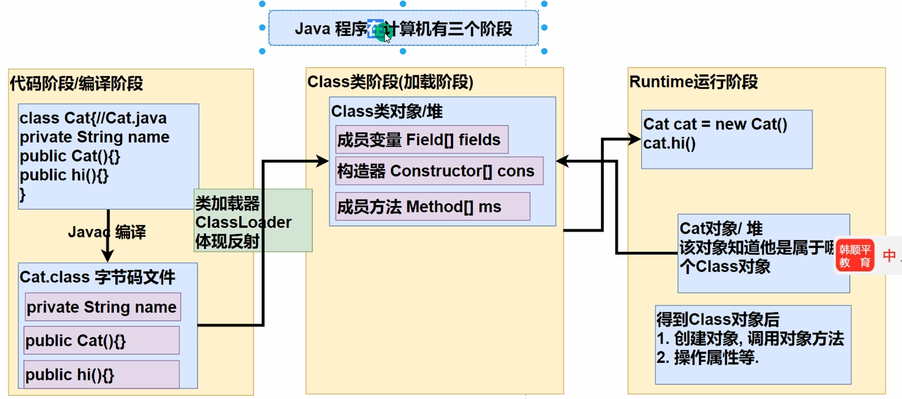
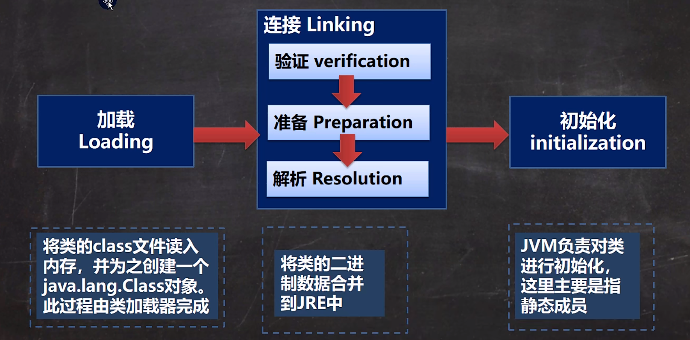
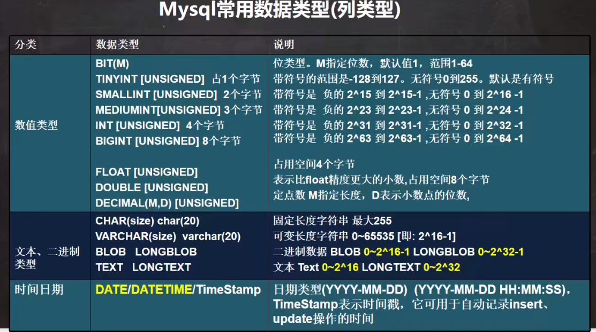
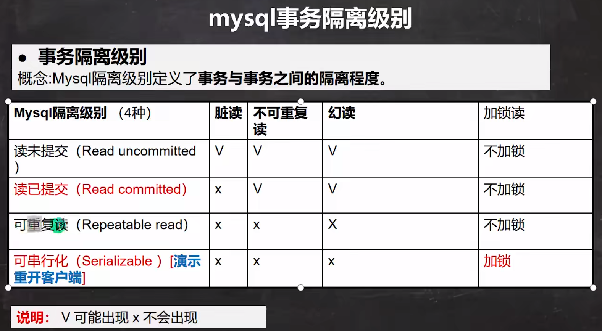

# Java第三阶段

##2024/1/23

今天将坦克大战全部完成，开始结合网络学习Java，学习了获取本地域名与ip地址，socket在网络通信中的作用，TCP字节流编程

### 1.获取本地域名与ip地址

借用InetAddress类下的静态方法来获取，并可以进一步仅获取域名/ip

```java
//获取域名和IP地址
        InetAddress localHost = InetAddress.getLocalHost();
        System.out.println(localHost);
        //通过域名获取域名和IP地址
        InetAddress byName = InetAddress.getByName("LAPTOP-UL6VNLBC");
        System.out.println(byName);
        //获得ip地址
        String hostAddress = localHost.getHostAddress();
        System.out.println(hostAddress);
```

### 2.Tcp字节流实现

tcp通信分为服务端和客户端，通过三次握手实现通信

1. 服务端

```java
//服务端
//1.在本地创建指定接口进行监听
ServerSocket serverSocket = new ServerSocket(9999);
System.out.println("等待9999端口的消息传送...");
//接收来自客户端的消息,这里如果没有消息传送过来，则会阻塞一直等待连接
Socket accept = serverSocket.accept();
System.out.println(accept.getClass());
//进行消息的接收，传输到控制台上
InputStream inputStream = accept.getInputStream();
//接下来就是io方面的内容
byte[] data=new byte[1024];
int line=0;
while((line=inputStream.read(data))!=-1){
    System.out.println(new String(data,0,line));
}
//给客户端回消息
OutputStream outputStream = accept.getOutputStream();
outputStream.write("hello,client".getBytes());
accept.shutdownOutput();
//关闭接口
outputStream.close();
inputStream.close();
serverSocket.close();
System.out.println("服务端已关闭");
```

服务端先用的是SeverSocket类，用于监听指定接口，在通过获得接口连接后，再使用Socket类进行数据的获取/传输操作，若未获得，则一直阻塞等待

2. 客户端

```java
        //客户端 与服务端进行交互
        //连接本服务器的指定端口 ip+端口
        Socket socket = new Socket(InetAddress.getLocalHost(), 9999);
        //获取输出流。将数据输出到数据通道
        OutputStream outputStream = socket.getOutputStream();
        outputStream.write("hello.server".getBytes());
        //设置写入结束标记
        socket.shutdownOutput();
        //获取来自服务端的回复
        InputStream inputStream = socket.getInputStream();
        byte[] data=new byte[1024];
        int line=0;
        while((line=inputStream.read(data))!=-1){
            System.out.println(new String(data,0,line));
        }
        //关闭流及socket
        inputStream.close();
        outputStream.close();
        socket.close();
```

客户端连上服务端开放的指定端口，创建输出流，往数据通道输出内容

需注意，两端并不知道对方何时数据传输结束，需在自己方设置`socket.shutdownOutput();`表示写入结束。否则在第一段通话结束后，陷入等待

***

***

## 2024/1/24

今天学习了TCP字符流传输，TCP图像传输

### 1.TCP字符流传输

字符流传输就是在昨天的字节流传输的基础上，进行字节流->字符流的转换操作

1. 服务端

```java
//服务端
        //1.在本地创建指定接口进行监听
        ServerSocket serverSocket = new ServerSocket(9999);
        System.out.println("等待9999端口的消息传送...");
        //接收来自客户端的消息,这里如果没有消息传送过来，则会阻塞一直等待连接
        Socket accept = serverSocket.accept();
        System.out.println(accept.getClass());
        //进行消息的接收，传输到控制台上
        InputStream inputStream = accept.getInputStream();
        String data=null;
        //字节流转字符流
        BufferedReader bufferedReader = new BufferedReader(new InputStreamReader(inputStream));
        data=bufferedReader.readLine();
        System.out.println(data);


        //给客户端回消息
        OutputStream outputStream = accept.getOutputStream();
        BufferedWriter bufferedWriter = new BufferedWriter(new OutputStreamWriter(outputStream));
        bufferedWriter.write("hello,client");
        bufferedWriter.newLine();   //字符流中，换行就表示当前输出结束，和字节流的shutdown同理
        bufferedWriter.flush();    //进行此步才会将数据写入通道

        //关闭接口
        bufferedWriter.close();
        bufferedReader.close();
        serverSocket.close();
        System.out.println("服务端已关闭");
```

2. 客户端

```java
//客户端 与服务端进行交互
        //连接本服务器的指定端口 ip+端口
        Socket socket = new Socket(InetAddress.getLocalHost(), 9999);
        //获取输出流。将数据输出到数据通道 字节流->字符流
        OutputStream outputStream = socket.getOutputStream();
        BufferedWriter bufferedWriter = new BufferedWriter(new OutputStreamWriter(outputStream));
        bufferedWriter.write("hello,server");
        bufferedWriter.newLine();   //字符流中，换行就表示当前输出结束，和字节流的shutdown同理
        bufferedWriter.flush();    //进行此步才会将数据写入通道

        //获取来自服务端的回复
        InputStream inputStream = socket.getInputStream();
        BufferedReader bufferedReader = new BufferedReader(new InputStreamReader(inputStream));
        String data=null;
        data=bufferedReader.readLine();
        System.out.println(data);


        //关闭流及socket
        bufferedWriter.close();
        bufferedReader.close();
        socket.close();
```

注意：

1. 在字符流中，通过newline()来表示当前输出结束
2. 输出结束后必须通过flush()方法才能正常传输数据
3. 对应newline()，接收的一方必须通过readline()来获取信息

### 2.TCP图像传输

说法很高级，可以分为以下几步

1. 新建输入流，根据具体路径获取图片，将其转为字节数组形式
2. 在客户端新建socket的输出流，将字节数组通过通道传给服务端
3. 服务端新建socket的输入流，获取字节数组
4. 服务端新建输出流，将获取的字节数组转化为文件存储到指定路径

注意：socket的输入流和输入流是两种说法，第一种指定从数据通道获得输入，第二种自定义路径获得输入，注意区分

1. 服务端

```java
//设置8888为服务端端口号
        ServerSocket serverSocket = new ServerSocket(8888);
        //等到客户端连接
        Socket socket = serverSocket.accept();
        //读取图片的字节信息
        InputStream inputStream = socket.getInputStream();
        byte[] bytes = StreamUtils.streamToByteArray(inputStream);
        //将字节信息转化为图片放在本地的src目录下
        String path="src\\bg.png";
        BufferedOutputStream bufferedOutputStream = new BufferedOutputStream(new FileOutputStream(path));
        bufferedOutputStream.write(bytes);


        //关闭流
        bufferedOutputStream.close();
        inputStream.close();
        socket.close();
```

2. 客户端

```java
Socket socket = new Socket(InetAddress.getLocalHost(), 8888);
        //进行图形信息的读取
        String path="d:\\bhg.png";
        BufferedInputStream bufferedInputStream = new BufferedInputStream(new FileInputStream(path));
        //借用已写好的工具包，获取图片的字节数组形式
        byte[] bytes = StreamUtils.streamToByteArray(bufferedInputStream);
        //将数组通过通道传递给客户端
        OutputStream outputStream = socket.getOutputStream();
        BufferedOutputStream bufferedOutputStream = new BufferedOutputStream(outputStream);
        bufferedOutputStream.write(bytes);
        //表示当前输入结束
        socket.shutdownOutput();

        //关闭流
        bufferedOutputStream.close();
        bufferedInputStream.close();
        socket.close();
```

注：获取字节数组的方法是通过直接调取写好的工具包的静态方法生成的

***

***

## 2024/2/27

今天学习了netstat指令，UDP传输

### 1.netstat

在命令行中输入该指令即可查看本机活动连接的ip地址，端口号以及状态

```
netstat -an |more
-an  加上这个瞬间就能显示出全部
more  翻页模式
```

### 2.UDP传输

1. UDP传输是不可靠的，将信息扔给对方后无需确认对方是否接收到即可结束
2. 因此每一方既可以是发送方，也可以是接收方
3. 每一方使用Datagramsocket进行接口的设置，数据的接收和发送
4. 每一方使用Datagrampacket进行数据的封装，要发送到的ip地址，接口，内部数据的各种信息的获取

下面列举一个代码例子，每一方既是发送方，也是接收方

1. A

```java
//发送一条信息
        //创建Socket，用于发送信息，每一方都有自己的端口号
        DatagramSocket datagramSocket = new DatagramSocket(9998);
        //创建Pocket，用于包装信息
        byte[] data="你好！".getBytes();
        //包装的同时设置要发送的ip地址以及端口号
        DatagramPacket datagramPacket = new DatagramPacket(data, data.length, InetAddress.getLocalHost(), 9999);
        datagramSocket.send(datagramPacket);

        //接收来自ReceiverB的回复（9999端口）
        //准备字节数组进行接收
        byte[] data_2=new byte[1024];
        //创建packet，接收传过来的信息
        datagramPacket = new DatagramPacket(data_2,data_2.length);
        datagramSocket.receive(datagramPacket);
        //获取数组的实际长度
        int length = datagramPacket.getLength();
        byte[] data1 = datagramPacket.getData();
        System.out.println(new String(data1,0,length));

        //关闭socket
        datagramSocket.close();
        System.out.println("A端退出");
```

2. B

```java
//接收一条信息
        //监听9999端口
        DatagramSocket datagramSocket = new DatagramSocket(9999);
        byte[] info=new byte[1024];
        //用packet来接收传送过来的信息包
        DatagramPacket datagramPacket = new DatagramPacket(info, info.length);
        //读取packet
        datagramSocket.receive(datagramPacket);
        //输出其中的内容
        int length = datagramPacket.getLength();
        byte[] data = datagramPacket.getData();
        System.out.println(new String(data,0,length));

        //发送一条消息给SenderA
        byte[] data_2="明天见！".getBytes();
        //用packet封装
        DatagramPacket datagramPacket1 = new DatagramPacket(data_2, data_2.length, InetAddress.getLocalHost(), 9998);
        //用socket发送
        datagramSocket.send(datagramPacket1);

        //关闭socket
        datagramSocket.close();
        System.out.println("B端退出");
```

***

***

## 2024/2/28

今天练习了网络编程这部分的作业

### 1.作业

TCP下载文件这道题卡了很久，说是下载，但他不仅仅是下载，他是一个下载，上传，数据通道，自己通道的一个多重结合，下面总结一些自己卡的比较久的点

1. 将在项目中提前准备好的文件转换为字节数组的形式，再通过数据通道传送给客户端，这其实是一个输入数据（inputstream），再输出数据（outputstream）的过程，可以总结为：输入数据，是通过确定的路径获取文件，将其转化为字节数组的形式。输出数据，目的地是尚未存在的文件，通过自己设置具体的输出路径，将字节数组传送到目标路径上。
2. 每一次的输入结束，都要手动提示系统已输入完成。字节流对应的是socket.shutdownoutput()，字符流对应的是bufferedWriter.newLine()以及bufferedWriter.flush()（这两句都要有）

***

***

## 2024/2/29

## 2024/3/4

这两天开始了一个和QQ类似的项目的练习（涉及网络通信，多线程，类这些方面的知识点），并完成了多用户登录这点，相当于打通了客户端和服务端之间的通信通道，难点很多，有许多封装的思想，一个模块一个类，还要加入线程来区分不同的账号，加入集合来管理多个线程，下面总结一些跟着视频学了之后仍有疏漏的敌方

1. 凡是需要通过数据通道传输的数据类，必须实现Serializable接口
2. 1中的数据类，在服务端和客户端中，必须通过`private final static long serialVersionUID`设置相同的数值，保证版本的一致性

***

***

## 2024/3/5

今天继续写前面的项目，完成了用户与用户之间私聊，用户安全退出，获取在线用户列表模块

***

## 2024/3/6

今天完成了用户间群发信息，发送文件，系统发送通知模块，预计明天完成发送离线消息/文件模块，然后开始反射部分的学习

## 2024/3/8

昨天完成了离线发送消息模块，刚开始看反射就要睡着了。今天又把昨天看了的反射又看了一遍，并开始反射的学习，学习了反射的原理，反射的相关类，反射的优化，Class类的细节以及Class类的常用方法。我觉得这部分的知识点挺反人类的，从类名到调用方法的实现形式都不是很好记

### 1.反射的原理



反射主要体现在加载阶段，在堆中会生成一个Class类，这个类就是对具体类的反射。就目前所学，反射的主要作用是可以自动获取类及其成员，包括构造器，并且可以对它们进行查看，修改，这是后面要学的各种设计模式的底层基础

### 2.反射的相关类

一共是四个类：

1. Class类，用于获取具体类的反射（我复制你）

```java
        //1.加载类
        Class cls = Class.forName(classfullpath);
        //2.获得类的对象实例
        Object object = cls.newInstance();
        System.out.println(object.getClass());
```

2. Field类，用于获取类的成员属性

```java
//得到类的公有属性的对象
        Field field = cls.getField("age");
        System.out.println(field.get(object));    //成员属性对象.get(对象名)
```

3. Constructer类，用于获取类的构造器

```java
        //得到类的构造器的对象
        Constructor constructor = cls.getConstructor();
        System.out.println(constructor);

        //得到类的带参构造器的对象
        //String.class表示获得String类在堆中对应的对象
        Constructor constructor1 = cls.getConstructor(String.class);
        System.out.println(constructor1);
```

4. Method类，用于获取类的方法

```java
//3.得到方法的对象
        Method method1 = cls.getMethod(method);
        //4.方法.invoke(对象)
        method1.invoke(object);
```

注意：

* 反射中输出成员属性/方法是和正常情况相反的，调用方法是`方法.invoke(对象)`,调用属性是`属性.get(对象)`
* 这几个类都只能访问公有成员，访问私有的会报错
* 这些类包含了访问单个及访问所有成员的方法，单个要指定属性/方法名，多个用for循环遍历

### 3.反射的优化

需要优化是因为，反射调用方法比直接生成对象调用方法要慢，因此加入`方法对象名.setAccessable(true)`使得在反射时不用检查调用方法的修饰权限

```java
//通过路径获得类
        Class<?> cls = Class.forName("com.syx.Reflection.Cat");
        //获得类实例对象
        Object object = cls.newInstance();
        //获得该类下的方法
        Method hi = cls.getMethod("hi");
        //关闭对方法的类别的检测
        hi.setAccessible(true);
        long start = System.currentTimeMillis();
        //循环调用该方法
        for (int i = 0; i < 90000000; i++) {
            hi.invoke(object);
        }
        long end = System.currentTimeMillis();
        System.out.println("反射方式耗时："+(end-start));
```

### 4.Class类的细节

```java
        //对象在首次加载时，都会经过loadclass方法,且只加载一次
        //Class类是系统生成的
        //Cat cat = new Cat();
        Class<?> cls = Class.forName("com.syx.Reflection.Cat");
        Class<?> cls2 = Class.forName("com.syx.Reflection.Cat");
        System.out.println(cls.hashCode());
        System.out.println(cls2.hashCode());
```

最后输出会发现两个对象的hash地址是一样的，这也就证明了对于同一个类的反射，只加载一次，指向的都是堆中的同一地址

### 5.Class类的常用方法

```java
//1.获取堆中的类的反射
        Class<?> cls = Class.forName("com.syx.Reflection.Car");
        //2.获取类的完整路径
        System.out.println(cls);   //class com.syx.Reflection.Car  获得具体对哪个类的反射
        System.out.println(cls.getClass());   //class java.lang.Class 获得运行对象
        System.out.println(cls.getPackage().getName());    //获取包名
        System.out.println(cls.getName());        //完整路径
        //3.获取类的对象
        Object object = cls.newInstance();
        System.out.println(object.toString());   //调用重写的toString方法
        //4.获取成员属性对象
        Field brand = cls.getField("brand");
        System.out.println(brand.get(object));
        //对成员属性值进行修改
        brand.set(object,"宝马");
        System.out.println(brand.get(object));
        Field[] fields = cls.getFields();
        for (Field field :fields) {
            //输出属性名
            System.out.println(field.getName());
        }
```

注意：调用类的成员是使用类的反射调用的，而不是根据类的对象进行调用

***

***

## 2024/3/10

今天学习了获取反射类的方法，哪些类包含了反射类对象，反射在加载阶段的底层过程及原理（没听懂），动态与静态加载

### 1.获取反射类的方法

共有六种方法，在不同阶段，不同情况下，使用不同的方法

```java
String path="com.syx.Reflection.Car";
        //1.在编译阶段，通过输入完整路径获得的类对象  forname
		//适用于读取加载文件，获得完整路径
        Class<?> cls1 = Class.forName(path);
        System.out.println(cls1);

        //2.在加载阶段，通过类型.Class的方法获取对象
        //适用于参数的传递
        Class cls2 = Car.class;
        System.out.println(cls2);

        //3.在运行阶段，通过getclass获取对象
        //由此可见，car对象是知道自己在加载阶段属于的是哪个class对象
        Car car = new Car();
        Class<? extends Car> cls3 = car.getClass();
        System.out.println(cls3);

        //4.通过类加载器
        ClassLoader classLoader = car.getClass().getClassLoader();
        Class<?> aClass = classLoader.loadClass(path);
        System.out.println(aClass);

        //5.获取基本数据类型对应的对象
        Class<Integer> integerClass = int.class;
        System.out.println(integerClass);

        //6.获取包装类的对应的对象
        Class<Integer> type = Integer.TYPE;
        System.out.println(type);
        System.out.println(type.hashCode());
        System.out.println(integerClass.hashCode());
```

### 2.具有反射类的类

包含外部类，数组，枚举，注释，接口，void这些，通过`.class`可获取其对应的class类

```java
        //1.外部类
        Class<String> stringClass = String.class;
        System.out.println(stringClass);
        Class<Class> classClass = Class.class;
        System.out.println(classClass);

        //2.接口
        Class<Serializable> serializableClass = Serializable.class;
        System.out.println(serializableClass);

        //3.数组
        Class<Integer[]> aClass = Integer[].class;
        System.out.println(aClass);
        Class<Integer[][]> aClass1 = Integer[][].class;
        System.out.println(aClass1);

        //4.void
        Class<Void> voidClass = void.class;
        System.out.println(voidClass);

        //5.注解
        Class<Deprecated> deprecatedClass = Deprecated.class;
        System.out.println(deprecatedClass);

        //6.枚举
        Class<Thread.State> stateClass = Thread.State.class;
        System.out.println(stateClass);
```

### 3.动态与静态加载

1. 静态加载，指一般情况下，用new Person()生成对象这种情况，是在编译阶段就会检测是否包含Person类，若没有则会报错
2. 动态加载，指使用反射获得类对象，在真正运行到这句时才回去检查是否包含相应的类对象，在编译时则不会去检测

***

***

## 2024/3/11

今天学习了类加载的三个阶段（昨天没听懂的又听了一遍），利用反射来获取类的结构，利用反射来构造对象，利用反射获取修改成员属性，利用反射获取调用成员方法

### 1.类加载的三个阶段

类加载，指的是程序三阶段的第二阶段（编译，加载，运行），这阶段又可以细分为三个阶段，为加载，连接，初始化



连接：

1. 验证：验证成员的安全性
2. 准备：将类中的静态成员初始化为默认值
3. 解析：将间接地址转换为直接地址

初始化：

同样时针对类中的静态成员，将默认值转换为预设值，若没有设置则不替换

### 2.利用反射获取类的结构

初学反射时，学了一部分获取类的结构的方法，这里进行统一比较。获取类的结构，指获取类的成员属性，方法，构造器，接口，父类，注解（总称为获取类的成员），获得后可以帮助我们利用反射构造对象。

下面是代码例子：

```java
		//先获取反射
        Class<?> cls = Class.forName("com.syx.Reflection.Person");
        System.out.println(cls.getName());
        //获得所有类型的成员属性
        Field[] declaredFields = cls.getDeclaredFields();
        for (Field declaredField : declaredFields) {
            System.out.println(declaredField.getName());
        }
		//获取当前类的所有类型的构造器
        Constructor<?>[] declaredConstructors = cls.getDeclaredConstructors();
        for (Constructor<?> declaredConstructor : declaredConstructors) {
            System.out.println(declaredConstructor.getName());
        }
        //获得所有类型的方法
        Method[] declaredMethods = cls.getDeclaredMethods();
        for (Method declaredMethod : declaredMethods) {
            System.out.println(declaredMethod.getName());
        }
        //获取本类以及父类的公有属性
        Field[] fields = cls.getFields();
        for (Field field : fields) {
            System.out.println(field.getName());
        }
        //
        System.out.println(cls.getSimpleName());
        //获取父类
        Class<?> superclass = cls.getSuperclass();
        System.out.println(superclass.getName());

        //获取当前类实现的接口
        Class<?>[] interfaces = cls.getInterfaces();
        for (Class<?> anInterface : interfaces) {
            System.out.println(anInterface.getName());
        }

        //获取注解信息
        Annotation[] annotations = cls.getAnnotations();
        for (Annotation annotation : annotations) {
            System.out.println(annotation);
        }

        //获取本类的所有public类型构造器
        Constructor<?>[] constructors = cls.getConstructors();
        for (Constructor<?> constructor : constructors) {
            System.out.println(constructor.getName());
        }
```

注意：

1. 所有方法的前提是利用反射先获取对象
2. 大致可分为两类，带Declared的和不带的
3. 不带Declared的，除了构造器只能够获取到本类的所有public类型的构造器，获得属性/方法都可以获得本类以及父类的public类型的属性/方法
4. 带Declared的获取构造器/属性/方法，可以获得本类的所有类型的成员（public,protected,private,默认）

5. 通过`数组名.for`的方式即可直接打出带参数的增强for循环，很方便

***

进一步地，在获取类对象的成员后，还可以获得其值的类型，修饰符，方法返回值类型，方法形参等等

```java
		//先获取反射
        Class<?> cls = Class.forName("com.syx.Reflection.Person");
        System.out.println(cls.getName());
        //获得所有类型的成员属性
        Field[] declaredFields = cls.getDeclaredFields();
        for (Field declaredField : declaredFields) {
            System.out.println(declaredField.getName());
            //获取成员属性的类型
            System.out.println(declaredField.getType());
            //获取成员属性的修饰符
            //0 默认 1public 2private 4protected 8static
            System.out.println(declaredField.getModifiers());
        }
        //获得所有类型的成员函数
        Method[] declaredMethods = cls.getDeclaredMethods();
        for (Method declaredMethod : declaredMethods) {
            System.out.println(declaredMethod.getName());
            //获得类型
            System.out.println(declaredMethod.getReturnType());
            //获得修饰符
            System.out.println(declaredMethod.getModifiers());
            //获得函数传递的参数类型
            Class<?>[] parameterTypes = declaredMethod.getParameterTypes();
            for (Class<?> parameterType : parameterTypes) {
                System.out.println(parameterType.getName());
            }
        }
        System.out.println("====================");
        //获得构造器的传参类型
        Constructor<?>[] declaredConstructors = cls.getDeclaredConstructors();
        for (Constructor<?> declaredConstructor : declaredConstructors) {
            System.out.println(declaredConstructor.getName());
            Class<?>[] parameterTypes = declaredConstructor.getParameterTypes();
            for (Class<?> parameterType : parameterTypes) {
                System.out.println(parameterType.getName());
            }
        }
```

### 3.利用反射构造类对象

指的是利用类的构造器构建出类的对象，可以分为有参，无参以及私有的构造器，在处理私有成员问题时，会涉及到反射爆破的知识点

```java
        //1.通过反射获得对象
        Class<?> cls = Class.forName("com.syx.Reflection.User");

        //2.通过无参构造器创建对象
        Object object = cls.newInstance();
        System.out.println(object);

        //3.通过公有的有参构造器创建对象
        Constructor<?> constructor = cls.getConstructor(String.class);
        Object object1 = constructor.newInstance("syxx");  //注意既然使用的是带参构造器，创建对象时就要输入参数
        System.out.println(object1);

        //4.通过私有的带参构造器创建对象
        //Constructor<?> constructor1 = cls.getConstructor(String.class, int.class);
        Constructor<?> declaredConstructor = cls.getDeclaredConstructor(String.class, int.class);
        //反射爆破，使其能够访问私有成员
        declaredConstructor.setAccessible(true);
        Object object2 = declaredConstructor.newInstance("syxx", 10);
        System.out.println(object2);
```

注意：

1. 只有无参构造器可以直接用newInstance获得对象，其他情况都需要先根据参数类型获取相应的构造器，再用构造器.newInstance()获取对象

2. 多用getDeclaredConstructor，这对任何修饰形式的构造器都是通用的
3. 与getDeclaredConstructors区分，后者是获得所有的构造器，前者是根据输入的参数个数及类型返回相应的构造器

### 4.利用反射操作成员属性

同样是分为带Declared的和不带的，可以获得查看成员属性，修改成员属性

```java
        //1.获取类对象
        User user = new User();
        Class<? extends User> cls = user.getClass();
        User user1 = cls.newInstance();
        //2.获取公有属性
        Field field = cls.getField("age");
        System.out.println(field.get(user1));
        field.set(user1,20);
        System.out.println(user1);

        //获取私有属性
        Field name = cls.getDeclaredField("name");
        //通过爆破的方式
        name.setAccessible(true);
        System.out.println(name.get(user1));
        name.set(user1,"syxx");
        System.out.println(user1);
```

注意：当操作的是静态属性的成员属性时，对象那一空格可以填null，如`name.set(null,"syxx")`，因为静态属性是和类相关联的，而不是类的具体对象

### 5.利用反射操作成员方法

可以根据方法名调用相应的成员方法，这也是我感觉鸡肋的地方，得先知道具体名字才能调用，并且同时需要输入传参的类型

```java
        //1.用反射获取对象
        Class<?> aClass = Class.forName("com.syx.Reflection.User");
        Object object = aClass.newInstance();
        //2.获取公有方法
        //先看看有哪些
        Method[] declaredMethods = aClass.getDeclaredMethods();
        for (Method declaredMethod : declaredMethods) {
            System.out.println(declaredMethod.getName());
        }
        Method m1 = aClass.getMethod("f1", String.class);
        m1.invoke(object,"syx");

        //3.获取并运行私有方法
        Method f2 = aClass.getDeclaredMethod("f2", String.class);
        //爆破
        f2.setAccessible(true);
        f2.invoke(object,"hhh");
```

***

***

## 2024/3/12

今天开始学习数据库部分的内容，因为这部分之前就已经学过，我的目标是重新熟悉一遍数据库指令，学会如何在java中结合数据库并使用。

今天学习了对数据库的操作，导入导出数据库，创建表

### 1.数据库操作

总结针对database的相关操作

#### 1.创建数据库

```sql
#创建数据库db_01  默认的是不区分大小写的
CREATE DATABASE db_01;

#创建一个使用utf8字符集的数据库db_02
CREATE DATABASE db_02 CHARACTER SET utf8;

#创建一个使用utf8字符集且能够区分大小写的数据库db_03
CREATE DATABASE db_03 CHARACTER SET utf8 COLLATE utf8_bin;

#从db_02的表t1中获取名为tom的数据,因为不区分大小写，最终会有两行

SELECT * FROM t1 WHERE NAME='tom'
```

注：`character`可以设置字符集，`collate`可以设置对字符的一些限制，这是之前未学过的

#### 2.查询，创建，删除数据库

```sql
#查询所有的数据库
SHOW DATABASES

#查看指定数据库的构建指令
SHOW CREATE DATABASE db_03

#创建具有特殊名字的数据库
CREATE DATABASE `create`

#删除create数据库
DROP DATABASE `create`
```

注：与系统重名的名字可以用``标注

#### 3.导入导出数据库

又称数据库的备份

```sql
#1.导出（备份）数据库
mysqldump -u root -p -B db_02 db_03 > d:\\test.sql

#2.删除本地相应的数据库
DROP DATABASE db_02
DROP DATABASE db_03

#3.从外部导入备份的数据库(必须在登录sql后的命令行执行）
source d:\\test.sql
```

注:导入导出语句必须在命令行执行，导入更为严格，需要先登录数据库

### 2.创建表格

```sql
CREATE TABLE USER(
	age INT,
	`name` VARCHAR(255),
	`password` VARCHAR(255),
	`birthday` DATE
)
```

属性名+数据类型，中间用逗号间隔

### 3.sql中常用的数据类型



#### 1.int类型

int类型用于存储数字，包含上图中的tinyint,smallint,mediumint,int,bigint，按顺序存储的数值大小递增，若未标注unsigned，默认存储有符号数（一半的范围在负数），若显式标注，则存储无符号数

#### 2.bit类型

bit类型将输入的数字以二进制的形式存储在数据库中，具体容量的大小由在创建表格时设置的参数决定，如`a BIT(8)`,表示a可存储的最大字节数为2^8

#### 3.浮点型

用于存储带小数点的数，包含上图中的float,double,decimal,能够存储的精度按顺序提升，decimal在定义时可以指定两个参数（具体定义见上图，默认是10和0，最大是65和40），其可存储的值得大小比bigint还大，因此很好用

#### 4.字符串类型

包含上图中的char,varchar,text，其中varchar虽然显示最大长度字符串为65535，但在实际应用中因为编码格式的不同有不同的限制：

1. 在utf8编码下，先减去3个用于存储容量大小的空间，再算上三个字节存储一个字，最大容量为(65535-3)/3=21844
2. 在gbk编码下，先减去3个用于存储容量大小的空间，再算上2个字节存储一个字，最大容量为(65535-3)/2=32766

下面总结一些细节问题：

1. varchar是变长的，char是固定长度，因此varchar灵活性强，省空间，当不能确定具体容量大小时就用varchar
2. char的检索速度比varchar快
3. char和varchar在创建表格时设置的大小是字符个数的大小
4. text同样也能够存储字符串

#### 5.日期类型

包含上图中的time,datetime,timestamp,其中timestamp通过额外的参数设置可以自动在insert和update时更新当前时间

```sql
CREATE TABLE t12(
	a DATE,
	b DATETIME,
	c TIMESTAMP NOT NULL    #不为空
	DEFAULT CURRENT_TIMESTAMP   #默认填入当前时间
	ON UPDATE CURRENT_TIMESTAMP   #有更新语句时自动更新当前时间
)

SELECT * FROM t12
INSERT INTO t12 (a,b)
	VALUES('2022-11-11','2024-3-11')
```

***

***

## 2024/3/13

今天学习了对于表的结构的操作，update语句，delete语句，select语句，数据统计语句，字符串操作函数

### 1.表的结构操作

包含对表的属性的增加，修改，删除（add,modify,drop）,对表名的修改，对表的字符格式的修改，修改表的列名，查看表的所有列名

1. 增加，修改，删除属性

```sql
#修改表的结构 add modify drop
ALTER TABLE `emp`
ADD (image VARCHAR(30))

ALTER TABLE `emp`
MODIFY job VARCHAR(60) NOT NULL DEFAULT '';

DESC `emp`   //查看该表的所有列名

ALTER TABLE `emp`
DROP sex
```

注意最好不要加括号，我一开始是全加的，结果只有增加运行成功

2. 修改表名

```sql
RENAME TABLE emp TO employee
```

3. 修改表的列名

```sql
ALTER TABLE emp
	CHANGE `name` name_1 VARCHAR(64)
```

4. 修改该表的字符编码格式

```sql
#修改表的字符编码格式
ALTER TABLE emp
	CHARACTER SET utf8
```

### 2.update语句

* update更新的是表的属性的内容，而不是表的属性的名字，和第一个知识点做区分

* 标准形式`update...set...where...`

```sql
#所有员工薪水改为5000
UPDATE emp
SET salary=5000

#小妖怪薪水改为3000
UPDATE emp
SET salary=3000
WHERE name_1='小妖怪'

#老妖怪的薪水在原来基础上加1000
UPDATE emp
SET salary=salary+1000
WHERE name_1='老妖怪'
```

### 3.delete语句

一般都是根据where指定删除某一行内容

```sql
#删除emp表中老妖怪的记录
DELETE FROM emp
	WHERE name_1='老妖怪'
SELECT * FROM emp

#删除表中所有记录
DELETE FROM emp
```

### 4.select语句

* 从表中筛选数据，单表较为简单
* 标准形式`select...from...where...`
* 去重加上distinct
* 求数值总和用加法就行

1. 普通形式的select

```sql
#指定查询一列
SELECT english FROM student

#去重查询
SELECT DISTINCT english FROM student

#统计每个学生的总分
SELECT chinese,english,math FROM student
ALTER TABLE student
	MODIFY total FLOAT
UPDATE student
SET total=chinese+english+math
SELECT * FROM student
#方法二：直接在select语句中使用加法
SELECT `name`,(chinese+english+math) FROM student
#再起个别名
SELECT `name`,(chinese+english+math) AS total_score FROM student
```

2. 加上特殊符号进行筛选的select

```sql
#查询姓名为赵云的学生的成绩
SELECT *
FROM student
WHERE `name`='赵云'

#查询英语成绩大于90分的同学
SELECT `name`,english
FROM student
WHERE english>90

#查询英语成绩大于语文成绩的同学
SELECT *
FROM student
WHERE english>chinese

#查询总分>200分，且数学>语文成绩的姓韩的学生
SELECT *
FROM student
WHERE total>200 AND math>chinese AND `name` LIKE '韩%'

#查询英语分数在80-90之间的同学
SELECT *
FROM student
WHERE english BETWEEN 80 AND 90

#查询数学分数为89，90，91的同学
SELECT *
FROM student
WHERE math IN (89,90,91)    #in表示在某个集合中
```

注：in记得不熟练，表示筛选符合集合中的数据

3. 按某列升序降序排列

升序ASC 降序DESV

```sql
#数学成绩升序排序
SELECT *
FROM student
ORDER BY math ASC

#总分降序排序
SELECT *
FROM student
ORDER BY total DESC
```

### 5.数据统计

这部分是属于select的，也就是说要先写select，再加上这部分

1. 统计数量count

```sql
#统计班级中有多少个学生
SELECT COUNT(*)
FROM student

#统计数学成绩>90分的人数
SELECT COUNT(*)
FROM student
WHERE math>=90

#count(*)与count(指定列名)的区别
#count(*)会返回所有符合条件的行数，而指定列名会自动筛去空值
CREATE TABLE t13(
	`name` VARCHAR(32)
)

INSERT INTO t13 VALUES('tom')
INSERT INTO t13 VALUES('jack')
INSERT INTO t13 VALUES(NULL)

SELECT COUNT(*) FROM t13;   //3
SELECT COUNT(`name`) FROM t13;   //2
```

注意：

* count(*)与count(指定列名)的区别

* count括号中只要不是null，其他内容都会进行计数，因此反推，若不想计数，则将当前内容设为null

2. 统计总和sum

```sql
#sum函数
#统计一个班级的数学成绩
SELECT SUM(math)
FROM student

#统计语数英各科的总成绩
SELECT SUM(math),SUM(chinese),SUM(english)
FROM student

#统计所有成绩总和
SELECT SUM(math+chinese+english)
FROM student
```

3. 统计均值avg

```sql
#avg函数
#统计一个班的语文平均分
SELECT AVG(chinese)
FROM student
```

4. 统计最大最小值max,min

```sql
#max,min
#获取数学的最高分和最低分
SELECT MAX(math),MIN(math)
FROM student
```

5. group by+having的使用

group by适用于分组，having则是在此基础上再加一层筛选

```sql
#显示每个部门的平均工资和最高工资
SELECT AVG(sal),MAX(sal),deptno
FROM emp
GROUP BY deptno

#显示每个部门的每种岗位的平均工资和最低工资
SELECT AVG(sal),MIN(sal),deptno,job
FROM emp
GROUP BY deptno,job    #先按部门分，再按岗位分

#显示平均工资低于2000的部门号和它的平均工资
SELECT AVG(sal),deptno
FROM emp
GROUP BY deptno
HAVING AVG(sal)<2000   #having基于筛选再筛一次条件
```

###6.用于字符串的操作函数

这部分和之前java所学的String类函数差不多，可以对应着记

```sql
#应用于字符串的常用函数
#以表emp以及测试表DUAL为操作对象
#1.replace
SELECT ename,REPLACE(job,'CLERK','客户')
FROM emp

#2.LTRIM RTRIM TRIM 去除左右空格
SELECT LTRIM('    nihao')
FROM DUAL
SELECT RTRIM('nihao         ')
FROM DUAL

#3.substring截取部分字符串
SELECT SUBSTRING(ename,1,2)
FROM emp

#4.输出全为大写ucase/小写lcase
SELECT UCASE(ename)
FROM emp
SELECT LCASE(ename)
FROM emp

#5.length获取输出字符串的长度
SELECT LENGTH(ename)
FROM emp

#6.concat拼接字符串
SELECT CONCAT(ename,'职务：',job)
FROM emp

#7.strcmp比较字符串大小
SELECT STRCMP('hh','hh')
FROM DUAL

#8.charset返回字符串的字符集设定
SELECT CHARSET(ename)
FROM emp

#9.left right 从字符串的左/右取指定个数的字符
SELECT LEFT(ename,2)
FROM emp
SELECT RIGHT(ename,1)
FROM emp
```

***

***

## 2024/3/14

今天学习了数学操作函数，流程控制函数(if else)，日期函数，加密函数，select的一些补充，分页查找

### 1.数学操作函数

```sql
#练习与数学操作相关的函数
#1.abs求绝对值
SELECT ABS(-10)
FROM DUAL

#2.bin求二进制
SELECT BIN(10)
FROM DUAL

#3.ceiling求比当前数大的最小整数
SELECT CEILING(1.1)
FROM DUAL

#4.floor求比当前数小的最大整数
SELECT FLOOR(-1.1)
FROM DUAL

#5.限制浮点型的小数点位数format(四舍五入)
SELECT FORMAT(1002.23124,2)
FROM DUAL

#6.进制转换conv
SELECT CONV(8,10,2)
FROM DUAL

#7.取余mod
SELECT MOD(11,3)
FROM DUAL

#8.生成随机数rand
SELECT RAND()
FROM DUAL
#rand(具体数字),会在随机生成一个数后保持不变
SELECT RAND(2)
FROM DUAL

#9.转为十六进制hex
SELECT HEX(10)
FROM DUAL

#10.从一堆数中选取最小值
SELECT LEAST(1,43,5,7)
FROM DUAL
```

注：`from dual`是用于测试的默认表，其实可以不写这行

### 2.日期函数

这个是个大头，有很多函数，不同的函数可以获得日期的不同形式

先记录参数类型（不带括号的）：

1. current_timestamp

记录实时的年月日时分秒，可以动态更新

```sql
INSERT INTO meg VALUES(1,'上海',CURRENT_TIMESTAMP)
```

2. now()

记录当前的年月日时分秒，不可动态更新，且这是一个函数

3. current_date

记录当时的年月日

```sql
#current_date记录年月日
SELECT CURRENT_DATE
FROM DUAL
```

4. current_time

记录当时的时分秒

```sql
#current_time记录时分秒
SELECT CURRENT_TIME
FROM DUAL
```

下面记录与时间有关的函数：

1. Date()

将括号中的日期类型截取到只剩年月日

```sql
#date从日期中筛选出年月日
SELECT DATE(`time`)
FROM meg
```

2. Date_add()/Date_sub()

一个具体的时间加上/减去一段时间获得新的时间，常用于检测时间有效期

```sql
#查询在十分钟之内发布的记录date_add
SELECT *
FROM meg
WHERE DATE_ADD(`time`,INTERVAL 10 MINUTE)>=NOW()
#法二 用减法 date_sub
SELECT *
FROM meg
WHERE DATE_SUB(NOW(),INTERVAL 15 MINUTE)<=`time`
```

3. datediff()

计算两个日期之间的天数差（只能算出天数）

```sql
#计算记录日期与当前日期的时间差值datediff
SELECT DATEDIFF('2011-11-11','1990-1-1')
FROM DUAL
```

4. timediff()

计算两个日期之间的小时差，精确到秒

```sql
#计算时间差timediff(具体到时分秒)
SELECT TIMEDIFF('4:58:10','10:44:20')
FROM DUAL
```

5. year()/month()/day()

从具体日期中获得一部分：年/月/日

```sql
#仅获取年/月/日
SELECT YEAR(NOW())
FROM DUAL

SELECT MONTH(NOW())
FROM DUAL

SELECT DAY(NOW())
FROM DUAL
```

6. unix_timestamp()

获取从1970-1-1开始到现在为止的秒数

```sql
#获取从1970-1-1到现在为止的时间的秒数
SELECT UNIX_TIMESTAMP()
FROM DUAL
```

7. from_unixtime

```sql
#from_unixtime,根据秒数从1970-1-1开始相加，获得一个具体的日期
SELECT FROM_UNIXTIME(1710405702)
FROM DUAL
```

###3.流程控制函数

类似于其他语言中的if else和switch方法，共有三种，普通的if，简化的ifnull，多分支判别语句case

```sql
#练习流程控制函数
#if
SELECT IF(FALSE,'jack','tom')
#ifnull 若参数一为null，则返回参数二，否则返回参数一
SELECT IFNULL('jack','tom')
SELECT IFNULL(NULL,'tom')

#多分支判断语句
SELECT CASE
	WHEN FALSE THEN 'jack'
	WHEN TRUE THEN 'tom'
	ELSE 'hh'
	END;

SELECT * FROM emp

#对emp表进行一些控制操作
#若comm列有空值，则替换为0.0
SELECT ename,IFNULL(comm,0.0)
FROM emp

#将job换成对应的中文
SELECT *,(CASE
	WHEN job='SALESMAN' THEN '销售员'
	WHEN job='CLERK' THEN '客户'
	ELSE job
	END)AS 'job'
FROM emp
```

注意:

1. 区分if和ifnull，if中的第一个参数是bool类型，要通过自己写等式来生成bool值，ifnull的第一个参数就是普通的值，通过该函数判断第一个参数是否为null（不必自己写判断语句）。因此，判断bool值时用if，判断空值时用ifnull
2. 多分枝语句最后记得加上end
3. 判断null，只有`is null`的形式，没有`=null`的形式，这和其他语言不同。不空为`not null`

### 4.加密函数

包含获取用户名及其ip，获取数据库名，两种密码加密方式:md5和password

```sql
#测试加密函数的使用
#获取用户名及ip地址
SELECT USER()

#获取当前数据库名
SELECT DATABASE()

#对密码进行加密md5,会转化为32位的字符串存储在数据库中
SELECT MD5('123456')
#建一个表来试一下效果
CREATE TABLE t14(
	NAME CHAR(10),
	pwd VARCHAR(50)
)
SELECT * FROM t14
INSERT INTO t14 VALUES('syx','syxxxx')
INSERT INTO t14 VALUES('sh',MD5('hhhhh'))

#password()另一种加密方式
SELECT PASSWORD('1234')
```

### 5.select语句

还是对单表查询的补充，包含了日期间的比较，具体位数的模糊查询，针对不同列的多次降序升序

```sql
#查询语句
#查找1992.1.1后入职的员工
SELECT * FROM emp
WHERE YEAR(hiredate)>=1992 AND
	MONTH(hiredate)>=1 AND
	DAY(hiredate)>=1
#日期是可以直接进行比较的
SELECT *
FROM emp
WHERE hiredate>'1992-01-01'

#显示首字符为J的员工姓名和工资
SELECT ename,sal
FROM emp
WHERE ename LIKE 'J%'

#显示第三个字符为大写L的所有员工姓名和工资
SELECT ename,sal
FROM emp
WHERE ename LIKE '__L%'

#按照部门号升序，雇员工资降序排列显示雇员信息
SELECT *
FROM emp
ORDER BY deptno ASC,sal DESC
```

### 6.分页查找

分页查找适用于当数据很多时，指定从第几个数据开始，显示几个数据，从而变成一页

```sql
#分页查找limit
SELECT *
FROM emp
LIMIT 0,3   #指从第1个数据开始(每页显示记录数*（第几页-1）)，选取三个

SELECT *
FROM emp
LIMIT 3,3   #从第4个数据开始，选取三个

#按雇员的empno号降序取出，每页显示两条记录，显示第一页和第三页
SELECT *
FROM emp
ORDER BY empno DESC
LIMIT 0,2

SELECT *
FROM emp
ORDER BY empno DESC
LIMIT 4,2
```

可总结参数规律为：

1. limit后一共是两个参数，第一个参数表示从第几个数据开始显示，第二个参数表示显示几个数据
2. (每页显示记录数*（第几页-1）)，选取记录数

***

***

## 2024/3/17

今天学习了多表查询，表的自连接

### 1.多表查询

多表查询的关键在于，找到几个表之间信息相关的列，然后在where中通过语句进行连接。若直接相连，会出现笛卡尔积的情况（列数相乘）

```sql
#多表联合查询
#查询雇员的名称，工资，所在部门名及编号
SELECT ename,sal,dname,emp.deptno
FROM emp,dept
WHERE emp.deptno=dept.deptno

#显示部门号为10的部门名，员工名和工资
SELECT emp.deptno,ename,sal
FROM emp,dept
WHERE emp.deptno=dept.deptno AND emp.deptno=10

#显示各个员工的姓名，工资及其工资的级别
SELECT ename,sal,grade
FROM emp,salgrade
WHERE sal BETWEEN losal AND hisal

#显示雇员名，雇员工资及所在部门名字，并按部门降序排
SELECT ename,sal,dname
FROM emp,dept
WHERE emp.deptno=dept.deptno
ORDER BY dname DESC
```

### 2.自连接

将一个表当作两个表，通过起别名的方式，实现自己与自己连接

```sql
#自连接
#显示公司员工名及其上级的名字
SELECT worker.ename,boss.ename
FROM emp worker,emp boss
WHERE worker.mgr=boss.empno
```

步骤：

1. 给表起别名
2. 选择输出的列
3. 通过where加限制

***

***

## 2024/3/18

今天学习了子查询，多列子查询，将子查询结果作为临时表，表的复制与去重，表的合并查询，表的外连接，表的元素限制，自增量，索引

### 1.子查询

* 特征为在where中再加上select语句
* 可分为单个元素的子查询和多个元素（多行）的子查询，单个元素用=连接，多个用in,any,all连接
* 一般都是先写子查询语句，再将其接入总语句中，这样条理清晰
* 注意与多表查询区分，多表查询是寻找表之间的共同部分进行联合，而子查询可以做出更复杂的操作

```sql
#子查询
#显示与heell同一部门的所有员工
#1.查找heell所在部门
SELECT job
FROM emp
WHERE ename='heell'
#2.将其作为子查询
SELECT *
FROM emp
WHERE job=(
	SELECT job
	FROM emp
	WHERE ename='heell'
)


#查询和部门10的工作相同的雇员的名字，岗位，工资，部门号，但不含10自己的
#1.查找部门10的所有工作
SELECT DISTINCT job
FROM emp
WHERE deptno=10
#2.将其作为子查询
SELECT ename,job,sal,deptno
FROM emp
WHERE job IN(
	SELECT DISTINCT job
	FROM emp
	WHERE deptno=10
) AND deptno!=10


#all和any
#显示工资比部门30的所有员工的工资高的员工的姓名，工资和部门号
#1.筛出部门30的员工的工资
SELECT sal
FROM emp
WHERE deptno=30
#2.将其作为子查询
SELECT ename,sal,deptno
FROM emp
WHERE sal>ALL(
	SELECT sal
	FROM emp
	WHERE deptno=30
)

#显示工资比部门30的其中一个员工的工资高的员工的姓名，工资和部门号
SELECT ename,sal,deptno
FROM emp
WHERE sal>ANY(
	SELECT sal
	FROM emp
	WHERE deptno=30
)
```

### 2.多列子查询

* 与上一节中的多个进行区分，这里是多列，代表子查询中筛选出了不止一列属性

* 标准形式为在where后加上(多个列元素)=(子查询语句)

```sql
#多列子查询
#查询与ALLEN有相同职务且部门相同的人，不包含ALLEN本人
#1.查询ALLEN的职务和部门
SELECT job,deptno
FROM emp
WHERE ename='ALLEN'
#2.将其作为多列子查询
SELECT *
FROM emp
WHERE (job,deptno)=(
	SELECT job,deptno
	FROM emp
	WHERE ename='ALLEN'
) AND ename!='ALLEN'
```

### 3.将子查询结果作为临时表

* 特征为在from后使用select语句，将查询的结果赋予别名，即为临时表
* 为什么会有这个需求，在测试时，发现有的列无法跟随分类语句(group by)一次性输出，要先获得一个子表，然后再和其他表联合输出想要的元素

```sql
#将子查询作为临时表
#查询ecshop各类别中，价格最高的商品
SELECT goods_id,cat_id,goods_name,shop_price
FROM ecs_goods

#1.以类别作为分组，找到每个类价格最高的商品
SELECT cat_id,MAX(shop_price)
FROM ecs_goods
GROUP BY cat_id

SELECT goods_id,ecs_goods.cat_id,goods_name,shop_price
FROM (SELECT cat_id,MAX(shop_price) AS max_price
	FROM ecs_goods
	GROUP BY cat_id)tmp,ecs_goods
WHERE tmp.cat_id=ecs_goods.cat_id AND
	tmp.max_price=ecs_goods.shop_price
```

注意：

1. 涉及到多张表时，若用到两个表共有的列，需要显性标注索取的那一列来自哪个表（其实随便哪个都可以）
2. 在select语句中，可通过临时表名.*的方式，显示临时表中的所有列

### 4.表的复制与去重

* 通过对这个知识点的学习，可以学会对表的结构和内容的快速复制
* 复制结构用like
* 复制内容用insert+select
* 下面例子中还有一个去重的案例，本质是借助额外空间进行操作

```sql
#练习表的复制与去重

#复制其他表 通过like可以快速复制其他表的结构
CREATE TABLE my_tab01 LIKE emp
DESC my_tab01

INSERT INTO my_tab01
	SELECT * FROM emp
SELECT * FROM my_tab01

#复制自身   这是根据内容数指数级增长的
INSERT INTO my_tab01
	SELECT * FROM my_tab01

#给my_tab01去重
#1.创建临时表，获得和my_tab01相同的结构
CREATE TABLE tmp LIKE my_tab01
DESC tmp

#2.将my_tab01中的数据通过distinct复制到tmp中
INSERT INTO tmp
	SELECT DISTINCT* FROM my_tab01
SELECT * FROM tmp

#3.清空my_tab01中的数据
DELETE FROM my_tab01

#4.将tmp中的数据复制到my_tab01中
INSERT INTO my_tab01
	SELECT * FROM tmp
	
#5.删除临时表
DROP TABLE tmp
```

### 5.表的合并查找

* 我的理解是相当于取并集，即"或"，满足两条搜索语句中的一条即可联合输出

* 共有两种，union all不去重,union去重

```sql
#练习合并查询
#union all取并集且不去重
SELECT ename,sal,job
FROM emp
WHERE sal>2500
UNION ALL
SELECT ename,sal,job
FROM emp
WHERE job='MANAGER'  

#union取并集，去重
SELECT ename,sal,job
FROM emp
WHERE sal>2500
UNION
SELECT ename,sal,job
FROM emp
WHERE job='MANAGER'
```

### 6.表的外连接

* 出现外连接的原因是一般的连接会忽略有一方为空的值或是不等的值，导致联合输出并没有输出全部的数据，当需要显性地显示一方的全部值（包括空值）时，就要用到外连接

* 常用的有左连接和右连接，左连接，将左边表的所有行在联合表中显示出，右连接同理

```sql
#练习表的外连接
#列出部门名称和这些部门的员工名称和工作，同时显示出那些没有员工的部门
#1.先获得不为空的数据
SELECT dname,ename,job
FROM emp,dept
WHERE emp.`deptno`=dept.`deptno`

#2.将其修改为左连接，这样可以显示出emp中的所有行，即使其没有部门
SELECT dname,ename,job
FROM emp LEFT JOIN dept
ON emp.`deptno`=dept.`deptno`

#3.将其修改为右连接，这样可显示出dept中的所有行，即使其没有员工
SELECT dname,ename,job
FROM emp RIGHT JOIN dept
ON emp.`deptno`=dept.`deptno`
```

### 7.表的元素限制

一共有五种元素限制：主键，外键，unique,check,not null。熟悉的不再总结，下面总结外键和check

1. 外键

关键词为foreign key，用于与另一张表（主表）的元素相连，从而限制其值必须是另一张表的元素的值的范围内

* 外键可以有多个
* 定义形式为foreign key (属性) references 另一张表名（其中关联的元素）

* 另一张表的元素必须是不重复的，即有primary key或者unique注释
* 外键定义的属性可以为空
* 加了外键之后，就不能随意删除内容了，主表想要删除与之相关的内容，必须等副表中和其有关的数据全部删除，主表才能删

```sql
#练习外键的使用
#创建my_class主表
CREATE TABLE my_class(
	id INT PRIMARY KEY,
	`name` VARCHAR(30)
);
#创建my_stu副表
CREATE TABLE my_stu(
	id INT PRIMARY KEY,
	`name` VARCHAR(30),
	class_id INT,
	FOREIGN KEY (class_id) REFERENCES my_class(id)
)
DESC my_stu
INSERT INTO my_class VALUES
(100,'english'),(200,'math')

INSERT INTO my_stu VALUES(1,'jack',100)
SELECT * FROM my_stu
INSERT INTO my_stu VALUES(2,'jery',200)
#因为外键中的id不含300，因此副表中的数据无法插入
INSERT INTO my_stu VALUES(3,'j',300)
#尝试删除主表中的数据,此时因为外键的牵制，副表中有对应的数据，导致无法删除
DELETE FROM my_class
WHERE id=100
#1.删除副表中数据
DELETE FROM my_stu
WHERE id=1
#2.再删除主表中对应的数据
```

2. check

用于限制表的元素在一定范围内

```sql
#创建商品表
CREATE TABLE goods(
	goods_id INT PRIMARY KEY,
	goods_name VARCHAR(30),
	unitprice DOUBLE CHECK(unitprice BETWEEN 1.0 AND 9999.99),
	category VARCHAR(30),
	provider VARCHAR(30)
)
```

### 8.自增量

一般和主键联合使用，用于序号的自增

```sql
#练习自增长
CREATE TABLE t15(
	id INT PRIMARY KEY AUTO_INCREMENT,
	`name` VARCHAR(32)
)
INSERT INTO t15 VALUES(NULL,'jekc')
SELECT * FROM t15
INSERT INTO t15 VALUES(NULL,'tom')
#修改自增长的起点
ALTER TABLE t15
	AUTO_INCREMENT=100
INSERT INTO t15 VALUES(NULL,'yu')
```

注：

1. 写insert语句时，自增量那个位置要写null，才会填入默认增量，不填Null，则以填的值为准
2. 可以自己修改自增量的起点

### 9.索引

* 索引的作用在于，当数据库存有大量数据时，可通过索引来极大地提升检索速度
* 不过只能给加了索引的列提升检索速度

```sql
#测试没有索引的情况下查找速度
SELECT *
FROM emp
WHERE empno=100033

#为empno创建索引
CREATE INDEX empno_index ON emp(empno)
```

* 主键创建时就自带索引
* 可通过sql语句自行创建普通索引，唯一索引，主键索引

```sql
SHOW INDEX FROM t16
#创建唯一索引
CREATE UNIQUE INDEX id_index ON t16(id)
#创建普通索引
ALTER TABLE t16
ADD INDEX dr_index(addr)

CREATE TABLE t17(
	id INT,
	addr VARCHAR(32)
)
#创建主键索引
ALTER TABLE t17 ADD PRIMARY KEY (id)
SHOW INDEX FROM t17
```

***

***

##2024/3/19

今天继续学习了索引（查看，删除），事务，隔离级别，数据库引擎，视图

### 1.索引

昨天学的是创建各种索引，今天把剩下的查看及删除进行记录

```sql
#查看索引的三种方式
SHOW INDEX FROM t16
SHOW INDEXES FROM t16 
SHOW KEYS FROM t16

#删除索引
DROP INDEX dr_index ON t16
#删除主键索引
ALTER TABLE t17 DROP PRIMARY KEY
SHOW INDEX FROM t17
```

### 2.事务

* 事务有四个特性：原子性，一致性，持久性，隔离性

* 事务的出现，是为了保证数据的一致性，即经过多条操作后，每个用户看到的数据是相同的
* 标准步骤为`start transaction`->`savepoint`->`rollbackto`->`commit`，每条都必须执行了才算生效，只有最终执行了commit，从事务开始的部分才算生效
* savepoint相当于存档，可以通过rollback撤销，但撤销过程是不可逆的
* 若中间没写savepoint，执行rollback后会直接回到事务开始之前的状态

```sql
#练习事务流程操作
CREATE TABLE t18(
	id INT,
	`name` VARCHAR(32)
)
#1.启动事务
START TRANSACTION
#2.设置保存点
SAVEPOINT A
INSERT INTO t18 VALUES(1,'tom');
SELECT * FROM t18;
#3.设置第二个保存点
SAVEPOINT B
INSERT INTO t18 VALUES(2,'je');
#4.回档到B节点
ROLLBACK TO B
#5.回档到A节点
ROLLBACK TO A
COMMIT

#事务细节
#若未开始事务，在一般情况下是默认提交的
INSERT INTO t17 VALUES(2,'tom');
SELECT * FROM t17;

#若开始事务后未设置断点,在执行回退后内部所有的语句都会失效
START TRANSACTION;
INSERT INTO t17 VALUES(3,'hhh');
INSERT INTO t17 VALUES(4,'k');
ROLLBACK;
COMMIT;
```

### 3.隔离级别



* 系统默认设置的隔离级别为可重复读
* 可通过在my.ini中添加语句来更改系统的默认隔离级别设置：transaction-isolation=级别名
* 加锁代表同一时间只能有一个用户对数据库进行操作

1. 脏读：在自己账户未结束数据库访问，其他账户也未结束访问且进行了一些操作后，自己能够看到数据库中被操作过的数据
2. 不可重复读：针对的是增加操作，在自己账户未结束数据库访问，其他账户已经结束访问且进行了一些操作后，能看到数据库中增加的数据
3. 幻读：针对的是修改操作（update，alter），在自己账户未结束数据库访问，其他账户已经结束访问且进行了一些操作后，能看到数据库中被修改了的数据

核心：应该读到的是我访问数据库时的所有数据，而不是随着同一时间被其他用户修改后的数据

```sql
#隔离级别
#三大问题：脏读，不可重复读，幻读

#1.创建一张表
CREATE TABLE t19(
	id INT,
	`name` VARCHAR(32),
	sal INT
)

#2.查看当前隔离等级
SELECT @@tx_isolation;
#3.修改隔离等级
SET SESSION TRANSACTION ISOLATION LEVEL READ UNCOMMITTED
#4.开始事务
START TRANSACTION;
#5.添加数据
INSERT INTO t19 VALUES(1,'tom',1000);
#6.修改数据
UPDATE t19
SET sal=1500
WHERE id=1;
#7.插入数据
INSERT INTO t19 VALUES(2,'jer',2000);

#永久地改变隔离级别
#transaction-isolation=级别名
```

### 4.数据库引擎

这是之前学数据库没注意到的知识点，可分为三类数据库：innoDB,Myisam,memory，根据其特性可在不同情况下选用不同的数据库

```sql
#探讨不同数据库引擎之间的区别
#1.InnoDB
#特点：1.事务安全性(唯一一个) 2.读取速度较慢 3.锁为行级 4.支持外键

#2.MyISAM
#特点：1.读取速度快 2.不支持外键和事务 3.锁为表级
CREATE TABLE t20(
	id INT,
	`name` VARCHAR(32)
)ENGINE MYISAM
START TRANSACTION
SAVEPOINT a;
INSERT INTO t20 VALUES(1,'tom');
SELECT * FROM t20;
ROLLBACK TO a;    #会发现无法回退
COMMIT;

#3.MEMORY
#特点：1.数据存储在内存中 2.读写速度极快，通过哈希表检索 3.一旦mysql停止服务，数据会消失，但表结构不会消失
CREATE TABLE t21(
	id INT,
	`name` VARCHAR(32)
)ENGINE MEMORY
INSERT INTO t21 VALUES(1,'tom');
SELECT * FROM t21;

#修改当前表的存储引擎
ALTER TABLE t21
ENGINE=INNODB;
```

### 5.视图

视图，用于展现给用户看指定的列，是和基表（相关联的表）相关的，且任意一方的数据改动都会影响到双方

```sql
#练习视图的使用
CREATE VIEW view01
	AS
	SELECT * FROM dept

DESC view01

SELECT * FROM view01
#显示构造视图的语句
SHOW CREATE VIEW view01

#视图与基表的数据一一对应，任何一方数据的改变都会影响到对方
UPDATE view01
SET dname='accounting'
WHERE deptno=10
SELECT * FROM dept

UPDATE dept
SET dname='ACCOUNTING'
WHERE deptno=10

#视图中还可以套视图
CREATE VIEW view02
AS
SELECT deptno,dname FROM view01
SELECT * FROM view02
```

视图的好处：安全，便捷，可以将多个表中的指定列联合成视图输出

```sql
#创建一个视图，获取emp,dept,salgrade三张表中的联合数据：empno,ename,dname,grade
SELECT *
FROM emp,dept,salgrade
WHERE emp.deptno=dept.`deptno`
AND (emp.sal BETWEEN salgrade.`losal` AND salgrade.`hisal`)

CREATE VIEW view03
AS
SELECT empno,ename,dname,grade
FROM emp,dept,salgrade
WHERE emp.deptno=dept.`deptno`
AND (emp.sal BETWEEN salgrade.`losal` AND salgrade.`hisal`)

DESC view03
SELECT * FROM view03
```

***

***

## 2024/3/20

今天学习了用户管理，写了mysql部分的习题

### 1.用户管理

* 在数据库中，可以授予别的用户登录权限，对指定数据库表的crud权限，也可以收回
* 在数据库自动创建的mysql库的user表中，可以看到已经授权的用户及其权限
* 修改密码是有等级限制的，低级账户没法修改高级账户的密码

1. 登录权限

‘用户名’@‘IP地址’ identified by '密码'

```sql
#用户管理
#可以创建不同的用户，设置权限，进行各种操作
CREATE USER 'syx'@'localhost' IDENTIFIED BY '123456'

SELECT * FROM `user`

#修改syx账户的密码
SET PASSWORD FOR 'syx'@'localhost'=PASSWORD('123456')

#删除用户
DROP USER 'syx'@'localhost'
```

2. crud权限

被授予权限的用户才能看到指定的数据库，对其只能执行指定的操作，未授权的无法生效

```sql
#给用户赋予权限
CREATE USER 'syx'@'localhost' IDENTIFIED BY '123'

#创建testdb库和news表
CREATE DATABASE testdb
CREATE TABLE news(
	id INT,
	content VARCHAR(60)
)
INSERT INTO news VALUES(1,'hk')

#给用户分配对该表的查看和添加权限
GRANT SELECT,INSERT
ON testdb.`news`
TO 'syx'@'localhost'

#收回对用户的所有权限
REVOKE ALL
ON testdb.`news`
FROM 'syx'@'localhost'
```

### 2.习题总结

自己写sql语句的时候还是发现有些漏洞：

1. 整型+null会变为null，这会影响最终的数值输出，可以用if/ifnull语句，将null转换为数字
2. 当正面情况比较难写，可以写先出反面，然后前面加上not，就是取反操作
3. last_day()可以返回括号内输入的日期的月份的最后一天
4. 查找字符串中带有具体的字时，可以使用模糊查询like
5. 忽略余数，即向下取整
6. group by+having不是很熟，多次想到group by 但未用上having，导致查找语句变麻烦

***

***

## 2024/3/21

今天将mysql部分的练习写完，学了JDBC

### 1.习题总结

1. 定义外键的语句，注意两个地方括号要加上`foreign key (列名) references 表名(列名)`
2. 作为外键的属性，其约束不一定要和主表关联的列完全一样，死板追求一致会在插入数据时出现一些问题
3. 加了外键约束以后，想要进行删除操作（删除数据，删除结构）会变得非常麻烦，因此在设计时就要想好
4. count(*)一般是和group by组合使用，这样这个`*`统计的就是group by 后面的属性
5. 临时表，适用于查询出的元素还要和其他表联合输出的情况，子查询，适用于总查询要有元素和子查询筛选出的元素进行比较的情况

### 2.JDBC

* 这是一个用于将java和各种数据库进行连接与操作的接口，各种数据库通过实现该接口，来和java进行连接。
* 因为每个数据库的语法是不同的，若不用接口，那java和每个数据库都要专门写类进行连接，有了接口之后就变成了一对多的操作，对于java而言，只要创造接口的实体对象，然后调用方法即可

#### 1.模拟实现接口

1. 接口

```java
//各种数据库需要实现的接口
public interface sql_interface {
    //连接
    public Object get_connect();
    //crud
    public void crud();
    //断开
    public void quit_sql();
}
```

2. 实现接口的各种数据库的类

```java
//模拟用mysql实现通用接口
public class mysqlimpl implements sql_interface{
    @Override
    public Object get_connect() {
        System.out.println("mysql连接");
        return null;
    }
    @Override
    public void crud() {
        System.out.println("mysqlcrud");
    }
    @Override
    public void quit_sql() {
        System.out.println("mysql退出");
    }
}

//模拟oracle数据库实现连接java的接口
public class oracleimpl implements sql_interface{

    @Override
    public Object get_connect() {
        System.out.println("oracle连接");
        return null;
    }

    @Override
    public void crud() {
        System.out.println("oraclecrud");
    }

    @Override
    public void quit_sql() {
        System.out.println("oracle退出");
    }
}
```

3. 测试实现效果

```java
public class jdbc01 {
    public static void main(String[] args) {
        //测试实现了连接数据库接口的类
        sql_interface sqlInterface = new mysqlimpl();
        sqlInterface.get_connect();
        sqlInterface.crud();
        sqlInterface.quit_sql();

        sqlInterface=new oracleimpl();
        sqlInterface.get_connect();
        sqlInterface.crud();
        sqlInterface.quit_sql();
    }
}
```

调用方法的过程中，展现出了动态绑定机制，根据运行对象的不同，同样的方法名可以输出不同的结果

#### 2.连接数据库的基本流程

```java
public class jdbc02 {
    public static void main(String[] args) throws SQLException {
        //先将mysql连接java的jar包放在项目下的libs文件夹中,并将其添加为项目库
        //1.加载驱动
        Driver driver = new Driver();
        //2.创建连接
        String conn="jdbc:mysql://localhost:3306/db_02";
        //用property类传送用户名和密码
        Properties properties = new Properties();
        properties.setProperty("user", "root");
        properties.setProperty("password","123456");
        //通过驱动器连接数据库
        Connection connect = driver.connect(conn, properties);
        //3.编写并执行sql语句
        String sql="insert into dept values(50,'tx','shenzhen')";
        String sql2="update dept set dname='ji' where deptno=50";
        Statement statement = connect.createStatement();
        //statement可以执行静态sql语句，并返回执行结果
        int i = statement.executeUpdate(sql2);
        System.out.println(i!=0?"成功":"失败");
        //4.关闭连接
        statement.close();
        connect.close();
    }
}
```

注：`jdbc:mysql://localhost:3306/db_02`中，localhost是ip地址,3306是端口,db_02是要操作的数据库名，可根据情况进行更换

#### 3.连接数据库改进版一

```java
//第二种数据库连接的方式
    public void connect02() throws Exception {
        //原先手动创建Driver对象的方式属于静态方法
        //利用反射，可以动态创建driver对象
        Class<?> aClass = Class.forName("com.mysql.jdbc.Driver");
        Driver driver = (Driver) aClass.newInstance();

        //2.创建连接
        String conn="jdbc:mysql://localhost:3306/db_02";
        //用property类传送用户名和密码
        Properties properties = new Properties();
        properties.setProperty("user", "root");
        properties.setProperty("password","123456");
        //通过驱动器连接数据库
        Connection connect = driver.connect(conn, properties);
        //3.编写并执行sql语句
        String sql="insert into dept values(50,'tx','shenzhen')";
        String sql2="update dept set dname='king' where deptno=50";
        Statement statement = connect.createStatement();
        //statement可以执行静态sql语句，并返回执行结果
        int i = statement.executeUpdate(sql2);
        System.out.println(i!=0?"成功":"失败");
        //4.关闭连接
        statement.close();
        connect.close();
    }
```

用反射替代`new Driver()`，这样在真正运行到这行时才会加载，称为动态加载

####4.连接数据库改进版二

```java
//第三种连接方法，用DriverManager来代替driver进行连接
    @Test
    public void connect03() throws Exception {
        //1.反射获取driver对象
        Class<?> cls = Class.forName("com.mysql.jdbc.Driver");
        Driver driver = (Driver) cls.newInstance();
        //使用DriverManager
        DriverManager.registerDriver(driver);
        String conn="jdbc:mysql://localhost:3306/db_02";
        String user="root";
        String pwd="123456";
        Connection connection = DriverManager.getConnection(conn, user, pwd);
        //下面步骤一样
        System.out.println(connection);
    }
```

####5.连接数据库改进版三

```java
    //第四种方法：在Class.forname那一步自动完成驱动的注册
    @Test
    public void connect04() throws ClassNotFoundException, SQLException {
        Class.forName("com.mysql.jdbc.Driver");
        /*
        Driver类中的静态代码块，配合反射的动态加载，会在加载阶段直接注册驱动器
            static {
        try {
            DriverManager.registerDriver(new Driver());
        } catch (SQLException var1) {
            throw new RuntimeException("Can't register driver!");
        }
    }
        */

        String conn="jdbc:mysql://localhost:3306/db_02";
        String user="root";
        String pwd="123456";

        Connection connection = DriverManager.getConnection(conn, user, pwd);
        System.out.println(connection);
        //下面步骤一样
    }
```

注：即使不写反射那一行，也能连接成功，是因为在mysql连接java的文件中，在META-INF文件夹的service下有一个配置文件，里面写好了驱动器，会自动加载

#### 6.连接数据库改进版四

```java
    //第五种方法：基于四进行优化，利用properties类从配置文件中获取连接，账户，密码
    @Test
    public void connect05() throws Exception {
        Properties properties = new Properties();
        properties.load(new FileInputStream("src\\sql.properties"));
        //获取对应信息
        String driver = properties.getProperty("driver");
        String user = properties.getProperty("user");
        String pwd = properties.getProperty("pwd");
        String conn = properties.getProperty("conn");
        //反射
        Class.forName(driver);
        //获得连接
        Connection connection = DriverManager.getConnection(conn, user, pwd);
        System.out.println(connection);
    }
```

总结：改进版三是最常用的，因为他最简洁，反射+DriverManager，改进版四是最符合用户场景的，从配置文件中获取参数，这样就不用每次都去手动修改代码

***

***

## 2024/3/22

今天学习了SQL注入（statement的缺点）,preparedstatement,ResultSet,将java连接数据库与清除资源的操作封装为工具包，使用工具包，事务

### 1.SQL注入

注入是在用statement执行sql语句时会出现的问题，会出现恶意字符获取数据库数据，扰乱数据库数据

```
#注入查询
#设置用户名为 1'or
#设置密码为 or '1'='1
SELECT *
FROM admin
WHERE `name`='1'OR' and pwd='OR '1'='1'
```

上面设置的查询语句会因为or '1'='1'返回数据库中的所有用户名和密码

```java
    //模拟使用statement执行sql语句时存在sql注入的情况
    public static void main(String[] args) throws Exception {
        //1.从配置文件中读取参数
        Properties properties = new Properties();
        properties.load(new FileInputStream("src\\sql.properties"));
        String driver = properties.getProperty("driver");
        String conn = properties.getProperty("conn");
        String user = properties.getProperty("user");
        String pwd = properties.getProperty("pwd");
        //反射
        Class.forName(driver);
        //获取连接
        Connection connection = DriverManager.getConnection(conn, user, pwd);
        java.sql.Statement statement = connection.createStatement();
        //让用户输入登录的用户名密码
        System.out.print("请输入用户名和密码：");
        Scanner scanner = new Scanner(System.in);
        System.out.print("用户名：");
        String name= scanner.nextLine();
        System.out.print("密码：");
        String pwd1=scanner.nextLine();
        String sql="select * from admin where name='"+name+"' and pwd='"+pwd1+"'";
        ResultSet resultSet = statement.executeQuery(sql);
        if(resultSet.next()){
            System.out.println("登录成功");
        }
        else{
            System.out.println("登录失败");
        }
        //关闭资源
        resultSet.close();
        statement.close();
        connection.close();
    }
```

上面代码则是java中一整套连接数据库的流程中出现注入的情况，本质还是在第一段代码，通过输入异常的用户名和密码，非法获取数据。因此现在基本上不用statement执行sql语句

### 2.preparedstatement预执行

preparedstatement的出现是为了取代statement执行sql语句，其有以下优点：

1. sql语句中需要拼接填充的部分用问号代替，方便
2. 预执行大大减少以后再次执行的时间
3. 不会出现注入问题

```java
//预处理sql语句（查询）
public class Preparestatement_ {
    public static void main(String[] args) throws Exception {
        //1.从配置文件中读取参数
        Properties properties = new Properties();
        properties.load(new FileInputStream("src\\sql.properties"));
        String driver = properties.getProperty("driver");
        String conn = properties.getProperty("conn");
        String user = properties.getProperty("user");
        String pwd = properties.getProperty("pwd");
        //反射
        Class.forName(driver);
        //获取连接
        Connection connection = DriverManager.getConnection(conn, user, pwd);
        //获取preparestatement
        //让用户输入登录的用户名密码
        System.out.print("请输入用户名和密码：");
        Scanner scanner = new Scanner(System.in);
        System.out.print("用户名：");
        String name= scanner.nextLine();
        System.out.print("密码：");
        String pwd1=scanner.nextLine();
        String sql="select * from admin where name=? and pwd=?";
        //预加载sql语句
        PreparedStatement preparedStatement = connection.prepareStatement(sql);
        //填充sql语句中的空缺部分
        preparedStatement.setString(1,name);
        preparedStatement.setString(2,pwd1);
        //用preparedstatement执行sql语句
        //这里不用再填sql了，上面已经预加载并且补充过
        ResultSet resultSet = preparedStatement.executeQuery();
        if(resultSet.next()){
            System.out.println("登录成功");
        }
        else{
            System.out.println("登录失败");
        }
        //关闭资源
        resultSet.close();
        preparedStatement.close();
        connection.close();
    }
}
```

注：

1. 后续填充问号位置通过`对象名.setstring()`方法填充，其索引是从1开始的。还要注意索引和值需要匹配，看好问号的位置和顺序再填充
2. 执行sql语句的函数executeQuery()，括号中不用再填入sql语句，前面已经加载和填充过，若填入sql语句，则无法识别其中的问号
3. 执行sql语句，dml(insert,update,delete)是executeUpdate()，select是executeQuery()

### 3.ResultSet

* ResultSet中存储的是查询语句查到的内容，也就是executeQuery()的返回值
* ResultSet.next()初始指向列名那一行，若有数据则向下移动
* ResultSet.getXxx()，可获取不同的数据类型的属性（根据Xxx的数据类型）

```java
//结果集，用于存储从数据库查询得到的数据
public class ResultSet {
    public static void main(String[] args) throws Exception {
        //1.从配置文件中读取参数
        Properties properties = new Properties();
        properties.load(new FileInputStream("src\\sql.properties"));
        String driver = properties.getProperty("driver");
        String conn = properties.getProperty("conn");
        String user = properties.getProperty("user");
        String pwd = properties.getProperty("pwd");
        //反射
        Class.forName(driver);
        //获取连接
        Connection connection = DriverManager.getConnection(conn, user, pwd);
        Statement statement = connection.createStatement();
        String sql="select * from dept";
        java.sql.ResultSet resultSet = statement.executeQuery(sql);
        //循环遍历输出resultset中的内容
        while(resultSet.next()){
            int id = resultSet.getInt(1);   //获取该行的第一列
            String name = resultSet.getString(2);
            String loc = resultSet.getString(3);
            System.out.println(id+" "+name+" "+loc);
        }
        //关闭资源
        resultSet.close();
        statement.close();
        connection.close();
    }
}

```

注：getXxx()方法可以填入两种类型的参数：

1. 列的坐标，从1开始计数
2. 列名，这种输入方式可以无视列的先后顺序

### 4.JDBC_Utils

每次连接数据库都要写一遍一样的流程代码是很麻烦的一件事，将连接与释放功能封装为静态方法放在类中，则可以通过类名.方法名的方式直接调用其中方法，这个类就称为工具类

```java
//写一个用于数据库连接和断开(关闭资源)的工具类
public class jdbc_util {
    //先定义一些数据库连接时需要用到的属性
    private static String user;
    private static String pwd;     //用户名及密码
    private static String driver;    //驱动器
    private static String conn;    //连接地址

    //用静态代码块完成对属性的初始化
    static{
        try {
            Properties properties = new Properties();
            properties.load(new FileInputStream("src\\sql.properties"));
            user=properties.getProperty("user");
            pwd=properties.getProperty("pwd");
            driver=properties.getProperty("driver");
            conn=properties.getProperty("conn");
        } catch (IOException e) {
            //这里将编译问题转为运行问题抛出，这样调用者可以自由选择是捕捉异常还是默认处理（向上抛出）
            throw new RuntimeException(e);
        }
    }

    //封装连接数据库的方法
    public static Connection getConnection(){
        try {
            return DriverManager.getConnection(conn,user,pwd);
        } catch (SQLException e) {
            throw new RuntimeException(e);
        }
    }

    //封装关闭数据库的方法
    //需要关闭的类：resultset,statement,connection
    public static void close_sql(ResultSet resultSet, Statement statement,Connection connection){
        try {
            if(resultSet!=null){
                resultSet.close();
            }
            if(statement!=null){
                statement.close();
            }
            if(connection!=null){
                connection.close();
            }
        } catch (SQLException e) {
            throw new RuntimeException(e);
        }
    }
}
```

注：

1. 关闭方法中的参数，用到了类的多态性，实参可以是实现了该接口的类，还可以是前者的子类（preparedstatement）
2. 静态代码块完成初始化已经不是第一次见，值得学习

### 5.使用工具类连接数据库

```java
//尝试用写好的工具包来连接数据库/断开
public class jdbc_use_util {
    @Test
    public void test_DML(){
        //1.获取连接
        Connection connection = jdbc_util.getConnection();
        //2.获取preparedstatement
        PreparedStatement preparedStatement=null;
        try {
            String sql="insert into admin values(?,?)";
            preparedStatement = connection.prepareStatement(sql);
            preparedStatement.setString(1,"张飞");
            preparedStatement.setString(2,"12345");
            //3.执行sql
            int i = preparedStatement.executeUpdate();
        } catch (SQLException e) {
            throw new RuntimeException(e);
        }finally {
            //4.关闭资源
            jdbc_util.close_sql(null,preparedStatement,connection);
        }
    }
    @Test
    public void test_select(){
        //1.获取连接
        Connection connection = jdbc_util.getConnection();
        //2.获取preparedstatement
        PreparedStatement preparedStatement=null;
        ResultSet resultSet=null;
        try {
            String sql="select * from admin";
            preparedStatement = connection.prepareStatement(sql);
            //3.执行sql
            resultSet = preparedStatement.executeQuery();
            while(resultSet.next()){
                String name = resultSet.getString("name");   //按列名获取对应值
                String passw = resultSet.getString("pwd");
                System.out.println(name+" "+passw);
            }
        } catch (SQLException e) {
            throw new RuntimeException(e);
        }finally {
            //4.关闭资源
            jdbc_util.close_sql(resultSet,preparedStatement,connection);
        }
    }
}
```

将其分为增删改和查两个函数，在于

1. setString（）不同
2. 执行sql的函数不同，返回值不同
3. 查询后需要输出
4. 关闭资源的参数不同

### 6.事务

前几天在mysql阶段就学了这个事务，今天相当于是将其用到了java中来。事务用于控制sql语句的统一执行，要不全不执行，要么全部执行

1. 没用使用事务的情况

中间故意设置了中断，这样执行到一半就停止执行，导致只执行了一个sql语句，默认已经commit，这对数据库来说是很危险的错误

```java
//先看看不使用事务的后果
    @Test
    public void notransaction(){
        //1.获取连接
        Connection connection = jdbc_util.getConnection();
        //2.获取preparedstatement
        PreparedStatement preparedStatement=null;
        try {
            //针对account表，同时进行不同账户余额的增加和减少
            String sql="update account set balance=balance-100 where id=1";
            String sql2="update account set balance=balance+100 where id=2";
            //加载并执行第一条sql
            preparedStatement = connection.prepareStatement(sql);
            preparedStatement.executeUpdate();
            //中间故意加一个故障，观察两条sql语句的执行情况
            int i=1/0;
            //第二条sql
            preparedStatement=connection.prepareStatement(sql2);
            preparedStatement.executeUpdate();

        } catch (SQLException e) {
            throw new RuntimeException(e);
        }finally {
            //4.关闭资源
            jdbc_util.close_sql(null,preparedStatement,connection);
        }
    }
```

2. 使用事务的情况

```java
    //使用事务
    @Test
    public void use_transaction(){
        //1.获取连接
        Connection connection = jdbc_util.getConnection();
        //2.获取preparedstatement
        PreparedStatement preparedStatement=null;
        try {
            connection.setAutoCommit(false);  //关闭自动提交，即开启了事务
            //针对account表，同时进行不同账户余额的增加和减少
            String sql="update account set balance=balance-100 where id=1";
            String sql2="update account set balance=balance+100 where id=2";
            //加载并执行第一条sql
            preparedStatement = connection.prepareStatement(sql);
            preparedStatement.executeUpdate();
            //中间故意加一个故障，观察两条sql语句的执行情况
            //int i=1/0;
            //第二条sql
            preparedStatement=connection.prepareStatement(sql2);
            preparedStatement.executeUpdate();

            //两条sql运行完成，提交事务
            connection.commit();
        } catch (SQLException e) {
            //若碰到报错，则进行回滚
            try {
                connection.rollback();
            } catch (SQLException ex) {
                throw new RuntimeException(ex);
            }
            throw new RuntimeException(e);
        }finally {
            //4.关闭资源
            jdbc_util.close_sql(null,preparedStatement,connection);
        }
    }
```

用到了以下几个函数来进行事务控制

1. connection.setAutoCommit(false);
2. connection.rollback();
3. connection.commit();

***

***

## 2024/3/24

今天学习了批处理，数据库连接池C3P0，数据库连接池Druid，创建并使用Druid工具类，DButils工具类

### 1.批处理

批处理用于批量执行sql语句，这会比逐条执行来的快得多

```java
    public void f1() throws SQLException {
        //1.连接数据库
        //在这之前要修改配置文件加上?rewriteBatchedStatements=true
        Connection connection = jdbc_util.getConnection();
        //2.写sql语句，获取preparedstatement
        String sql="insert into admin values (?,?)";
        PreparedStatement preparedStatement = connection.prepareStatement(sql);
        //计个时
        long start = System.currentTimeMillis();
        //用for循环填充多个sql
        for(int i=1;i<=5000;i++){
            preparedStatement.setString(1,"jack"+i);
            preparedStatement.setString(2,"777");
            //将其加入批处理中
            /*
            addbatch的底层是先创建一个集合Arraylist
            通过往集合下的elementdata数组（objcet[]）存储sql语句
            elementdata初始容量为10，后续动态扩充（1.5倍）
            * public void addBatch() throws SQLException {
                    if (this.batchedArgs == null) {
                        this.batchedArgs = new ArrayList();
                    }

                    this.batchedArgs.add(new BatchParams(this.parameterValues, this.parameterStreams, this.isStream, this.streamLengths, this.isNull));
                }
            * */
            preparedStatement.addBatch();
            //每满1000条则批量处理一次并清空
            if(i%1000==0){
                preparedStatement.executeBatch();
                preparedStatement.clearBatch();
            }
        }
        long end = System.currentTimeMillis();
        System.out.println("批处理耗时:"+(end-start));
        connection.close();
        preparedStatement.close();
    }
```

总结：

1. 批处理共三个步骤，将当前sql加入集合中，集中执行sql语句，清空集合
2. 注意使用批处理，要在配置文件上修改：conn=jdbc:mysql://localhost:3306/db_02?rewriteBatchedStatements=true
3. 从底层源码来看，本质是集合的存储与扩容
4. 批处理+preparedstatement可以大大提升执行速度

### 2.数据库连接池

* 在高并发的场景下，多个用户同时访问同一个数据库，会导致无法访问等诸多问题，而数据库连接池建立了一个缓冲区，开一些建好的连接摆在里面，有客户来时直接给，用完再收回给下一个（**不关闭连接**），用户较多时进入队列排队等待，从而有效解决该问题
* 常用的连接池分为C3P0和Druid，前者速度较慢但稳定，后者是阿里开发的，经常用于实际代码中

#### 1.C3P0数据库连接池

* 手动模拟

手动模拟就相当于下面第二点中的配置文件中设置的参数

```java
//尝试建立C3P0数据库池来解决多用户访问问题
//所有数据库池都是实现了datasource接口
public class C3P0 {
    public static void main(String[] args) throws Exception {
        Properties properties = new Properties();
        properties.load(new FileInputStream("src\\sql.properties"));
        String user=properties.getProperty("user");
        String pwd=properties.getProperty("pwd");
        String driver=properties.getProperty("driver");
        String conn=properties.getProperty("conn");

        ComboPooledDataSource comboPooledDataSource = new ComboPooledDataSource();
        //设置连接
        comboPooledDataSource.setDriverClass(driver);
        comboPooledDataSource.setUser(user);
        comboPooledDataSource.setPassword(pwd);
        comboPooledDataSource.setJdbcUrl(conn);

        //设置缓冲区初始化时的容量和最大容量
        comboPooledDataSource.setInitialPoolSize(10);
        comboPooledDataSource.setMaxPoolSize(50);
        long l = System.currentTimeMillis();
        //尝试从缓冲区中获取连接
        for (int i = 0; i < 500000; i++) {
            Connection connection = comboPooledDataSource.getConnection();
            connection.close();
        }
        long end = System.currentTimeMillis();
        System.out.println("利用缓冲区5000次连接时间"+(end-l));
    }
}
```

注：

1. 想用C3P0连接池要先导入对应的jar包
2. ComboPooledDataSource是jar包里的一个类，该类实现了DataSource接口，看到DataSource就要想到连接池

* 利用数据包进行连接

```java
//尝试使用数据包进行C3P0的连接
public class C3P0_02 {
    public static void main(String[] args) throws SQLException {
        //先在src目录下导入配置文件c3p0-config，并修改参数
        //直接在创建连接池对象时输入参数：配置文件中的name属性
        ComboPooledDataSource comboPooledDataSource = new ComboPooledDataSource("hsp_edu");
        for(int i=0;i<5000;i++){
            Connection connection = comboPooledDataSource.getConnection();
            connection.close();
        }
        System.out.println("连接成功");
    }
}
```

#### 2.Druid数据库连接池

```java
//尝试使用Druid数据库连接池
public class Druid_ {
    public static void main(String[] args) throws Exception {
        //1.导入Druid jar 包
        //2.导入配置文件

        //3.通过properties获取配置信息
        Properties properties = new Properties();
        properties.load(new FileInputStream("src\\druid.properties"));
        //4.将properties作为参数
        DataSource dataSource = DruidDataSourceFactory.createDataSource(properties);
        long start = System.currentTimeMillis();
        //测试连接速度
        for (int i = 0; i < 500000; i++) {
            Connection connection = dataSource.getConnection();
            connection.close();
        }
        long end = System.currentTimeMillis();
        System.out.println("连接成功,耗时："+(end-start));   //2秒
    }
}
```

注：

1. 同样要导入jar包，jar包都是实现了java规定接口的外部类
2. properties到加载输入流那一步即可
3. DruidDataSourceFactory是jar包里的一个类，从上面代码可以看出它可以创建连接池，然后获取连接
4. 当测试数据为500000条时，Druid比C3P0快得多

#### 3.将Druid封装为工具包

有了这个连接池后，可以处理并发问题，比之前的工具包更好

```java
//写一个利用Druid连接池进行数据库连接的工具包
public class JDBCUTILSBYDRUID {
    private static DataSource dataSource;

    static{
        Properties properties = new Properties();
        try {
            properties.load(new FileInputStream("src\\druid.properties"));
            dataSource = DruidDataSourceFactory.createDataSource(properties);
        } catch (Exception e) {
            throw new RuntimeException(e);
        }
    }

    //获得数据库连接
    public static Connection getConnection() throws SQLException {
        return dataSource.getConnection();
    }

    //释放连接资源
    public static void close_sql(ResultSet set, Statement statement,Connection connection){
        try {
            if (set != null) {
                set.close();
            }
            if(statement!=null){
                statement.close();
            }
            if(connection!=null){
                connection.close();
            }
        } catch (SQLException e) {
            throw new RuntimeException(e);
        }
    }
}
```

其实还是那一套，由原来的`DriverManager.getconnection()`变为了`DruidDataSourceFactory.createDataSource()`，然后再通过连接池获取连接

#### 4.使用Druid_utils进行数据库连接

```java
public static void main(String[] args) throws SQLException {
        //1.获取连接
        Connection connection = JDBCUTILSBYDRUID.getConnection();
        //2.获取preparedstatement
        PreparedStatement preparedStatement=null;
        ResultSet resultSet=null;
        try {
            String sql="select * from admin";
            preparedStatement = connection.prepareStatement(sql);
            //3.执行sql
            resultSet = preparedStatement.executeQuery();
            while(resultSet.next()){
                String name = resultSet.getString("name");   //按列名获取对应值
                String passw = resultSet.getString("pwd");
                System.out.println(name+" "+passw);
            }
        } catch (SQLException e) {
            throw new RuntimeException(e);
        }finally {
            //4.关闭资源
            JDBCUTILSBYDRUID.close_sql(resultSet,preparedStatement,connection);
        }

    }
```

这个也和之前的JDBC工具包差不多，这也体现出了工具包的方便性，不同的包，相同的方法，能起到不同的作用，看似都是getConnection()，但获取的连接的对象是不同的。

### 3.DButils

* 从数据库中获取的ResultSet，只能在释放资源之前使用，一旦关闭则无法对其做任何操作，这很不方便，一直保持连接还会导致高并发。DButils的好处就在于，将从数据库查询得到的ResultSet，封装成为Actor对象(由自己定义这个类，属性对应要select表的每一列)，然后放入`ArrayList<Actor>`进行存储，这样离开了数据库也能从集合中存储操作数据

* 由于这是一个工具包，使用之前也先要导入

#### 1.手动模拟存储流程

```java
    //用普通方法将从数据库中获取的数据存储在集合中
    public void test01() throws SQLException {
        //创建集合，存储actor对象
        ArrayList<Actor> actors = new ArrayList<>();

        //1.获取连接
        Connection connection = JDBCUTILSBYDRUID.getConnection();
        //2.获取preparedstatement
        PreparedStatement preparedStatement=null;
        ResultSet resultSet=null;
        try {
            String sql="select * from admin";
            preparedStatement = connection.prepareStatement(sql);
            //3.执行sql
            resultSet = preparedStatement.executeQuery();
            while(resultSet.next()){
                String name = resultSet.getString("name");   //按列名获取对应值
                String passw = resultSet.getString("pwd");
                //将数据生成一个Actor对象，然后放入集合中
                actors.add(new Actor(name,passw));
            }
        } catch (SQLException e) {
            throw new RuntimeException(e);
        }finally {
            //4.关闭资源
            JDBCUTILSBYDRUID.close_sql(resultSet,preparedStatement,connection);
        }
        //数据库断联后，查看存储结果
        System.out.println(actors);
    }
```

其中的Actor是根据数据库表admin创建，定义如下所示

```java
//数据库的每一行数据对应一个该对象
public class Actor {
    private String name;
    private String pwd;

    public Actor(){}    //无参构造器是为了方便反射构造对象

    public Actor(String name, String pwd) {
        this.name = name;
        this.pwd = pwd;
    }

    public String getName() {
        return name;
    }

    public void setName(String name) {
        this.name = name;
    }

    public String getPwd() {
        return pwd;
    }

    public void setPwd(String pwd) {
        this.pwd = pwd;
    }

    @Override
    public String toString() {
        return "Actor{" +
                "name='" + name + '\'' +
                ", pwd='" + pwd + '\'' +
                '}';
    }
}
```

#### 2.使用DButils+Druid连接并存储数据

```java
//使用DButils+druid存储数据库中的数据
public class jdbc_DButils {
    public static void main(String[] args) throws SQLException {
        //1.用druid工具包获取连接
        Connection connection = JDBCUTILSBYDRUID.getConnection();
        //2.创建QueryRunner对象
        QueryRunner queryRunner = new QueryRunner();
        String sql="select * from admin";
        //new BeanListHandler<>(Actor.class)是将数据库中提取出的当前行利用反射生成Actor对象
        //然后放入集合中
        List<Actor> query = queryRunner.query(connection, sql, new BeanListHandler<>(Actor.class));
        //查看存储在query中的数据
        for (Actor actor : query) {
            System.out.println(actor);
        }
        //关闭资源
        JDBCUTILSBYDRUID.close_sql(null,null,connection);
    }

    @Test
    //练习提取单行多列数据
    public void testSingleQuery() throws SQLException {
        //1.用druid工具包获取连接
        Connection connection = JDBCUTILSBYDRUID.getConnection();
        //2.创建QueryRunner对象
        QueryRunner queryRunner = new QueryRunner();
        String sql="select * from admin where name=?";
        Actor actor = queryRunner.query(connection, sql, new BeanHandler<>(Actor.class), "赵云");
        System.out.println(actor);

        //关闭资源
        JDBCUTILSBYDRUID.close_sql(null,null,connection);
    }

    @Test
    //练习提取单行单列数据
    public void testSingle_colimnQuery() throws SQLException {
        //1.用druid工具包获取连接
        Connection connection = JDBCUTILSBYDRUID.getConnection();
        //2.创建QueryRunner对象
        QueryRunner queryRunner = new QueryRunner();
        String sql="select pwd from admin where name=?";
        Object o = queryRunner.query(connection, sql, new ScalarHandler(), "赵云");
        System.out.println(o);
        //关闭资源
        JDBCUTILSBYDRUID.close_sql(null,null,connection);
    }
}
```

注：

1. QueryRunner是DButils中的一个类，可以用它的query方法获得集合（相当于把1的手动流程浓缩在了一个方法里，而Actor.class正体现出了反射，这也正是为何要设置一个空构造器）
2. 根据提取的数据量的不同，query()的参数设置了不同的集合，注意区分

3. query()内部会关闭resultset和statement，因此最后不用手动关闭

***

***

## 2024/3/25

今天学习了使用DButils+Druid连接池对数据进行dml，BasicDAO，由此对项目的设计层次有了初步的了解

###1.使用DButils+Druid连接池对数据进行dml

昨天学的是查询数据，今天学的是增删改，统一使用update函数即可完成

```java
//练习dml
    @Test
    public void test_dml_dbutils() throws SQLException {
        //1.获得数据库连接
        Connection connection = JDBCUTILSBYDRUID.getConnection();
        QueryRunner queryRunner = new QueryRunner();
        String sql="update admin set pwd=? where name=?";
        String sql2="insert into admin values('关羽','1235')";
        int affectrow = queryRunner.update(connection,sql2);
        System.out.println(affectrow>0?"执行成功":"失败");
        JDBCUTILSBYDRUID.close_sql(null,null,connection);
    }
```

### 2.BasicDAO

* DAO：data access object 数据获取对象
* 若针对每一条sql语句，都要写一个函数，执行大部分都是重复的工作，这样效率很低。BasicDao用于将这些方法进行统一化，在方法中设置输入参数，设置返回值，从而将这一系列过程完全封装，用户只需调用方法，输入sql语句，就可以执行成功
* BasicDAO只是设计层次中的一层，目前所学共有四层：

1. util:工具包，之前学的封装连接数据库和断开的类就放在此包中
2. test:测试包用于测试写出来的dao是否可以使用
3. domain:又称javaBean，也就是前两天所学的根据数据库的列名创建类，一行对应一个类对象，以此存储数据
4. dao:存放BasicDAO及其子类，BasicDAO中写的是子类共有的方法（执行各种sql语句），这样子类就不用每个都再写一遍，还可以加入自己特有的方法，属性等

* 下面根据层级记录练习的代码

#### 1.util

这块就是昨天学的加入了Druid连接池的连接数据库的工具包

#### 2.domain

这块昨天也有，在3.DButils下的1.中，就是用了一个Actor类存储数据库中对应的admin表

#### 3.DAO

1. BasicDao

```java
//创建所有DAO的父类，实现子类共同的操作
public class BasicDAO<T> {  //用泛型，在子类具体化时定义T的具体类型,这个T，即根据不同的表自己定义的类，也称javaBean，用于存储数据库数据
    private  QueryRunner queryRunner=new QueryRunner();

    //对数据库的dml操作
    public int execute_dml(String sql,Object... parm){
        Connection connection = null;
        try {
            connection= JDBCUTILSBYDRUID.getConnection();
            int update = queryRunner.update(connection, sql, parm);
            return update;
        } catch (SQLException e) {
            throw new RuntimeException(e);
        } finally {
            JDBCUTILSBYDRUID.close_sql(null,null,connection);
        }
    }

    //从数据库中提取多行数据
    //传入sql语句和填充的参数,Class类的对象用于反射获取类结构
    public List<T> get_multi(String sql,Class<T> clazz,Object... parm){
        //1.获取连接
        Connection connection=null;
        try {
            connection = JDBCUTILSBYDRUID.getConnection();
            List<T> query = queryRunner.query(connection, sql, new BeanListHandler<T>(clazz));
            return query;
        } catch (SQLException e) {
            throw new RuntimeException(e);
        } finally {
            JDBCUTILSBYDRUID.close_sql(null,null,connection);
        }
    }

    //从数据库中提取单行数据
    public T get_single(String sql,Class<T> clazz,Object... parm){
        //1.获取连接
        Connection connection=null;
        try {
            connection = JDBCUTILSBYDRUID.getConnection();
            T query = queryRunner.query(connection, sql, new BeanHandler<T>(clazz));
            return query;
        } catch (SQLException e) {
            throw new RuntimeException(e);
        } finally {
            JDBCUTILSBYDRUID.close_sql(null,null,connection);
        }
    }

    //从数据库中提取单行单列数据
    public Object get_Scalar(String sql,Class<T> clazz,Object... parm){
        //1.获取连接
        Connection connection=null;
        try {
            connection = JDBCUTILSBYDRUID.getConnection();
            Object o = queryRunner.query(connection, sql, new ScalarHandler());
            return o;
        } catch (SQLException e) {
            throw new RuntimeException(e);
        } finally {
            JDBCUTILSBYDRUID.close_sql(null,null,connection);
        }
    }
}
```

注：

1. 这对我来说还是有一定难度的，他用到了泛型，一开始我没搞懂这个泛型指的是什么，在写完整体代码后再回来看，发现指的就是domain中的具体类
2. 相当于把前两天学的封装成了方法，加入了函数参数，以及不同的返回值
3. Class<T> clazz这个我想不到，由用户指定具体反射的类
4. 相当于提高了自由度，不再锁定sql语句，javaBean和返回值

#### 4.Test

```java
public class test_ActorDAO {
    public static void main(String[] args) {
        ActorDAO actorDAO = new ActorDAO();
        //测试查询语句
        String sql="select * from admin";
        List<Actor> multi = actorDAO.get_multi(sql, Actor.class);
        for (Actor actor : multi) {
            System.out.println(actor);
        }
    }

    @Test
    public void test(){
        ActorDAO actorDAO = new ActorDAO();
        //测试dml语句
        String sql2="update admin set pwd=? where name=?";
        int i = actorDAO.execute_dml(sql2, "123", "赵云");
        System.out.println(i>0?"成功":"失败");
    }
}
```

***

## 总结

至此，JAVASE基础部分已经完结，韩顺平老师讲的确实很细，每集都要去践行花了我不少时间。接下来打算去学习JAVA并发，这部分感觉在基础内容中学了一些，但并不是全部（有一些关键词我没见过）。算是完成了一小阶段吧，继续加油。

本打算学并发，但发现有些前置内容没学过，因此下一步学习Java8新特性。

