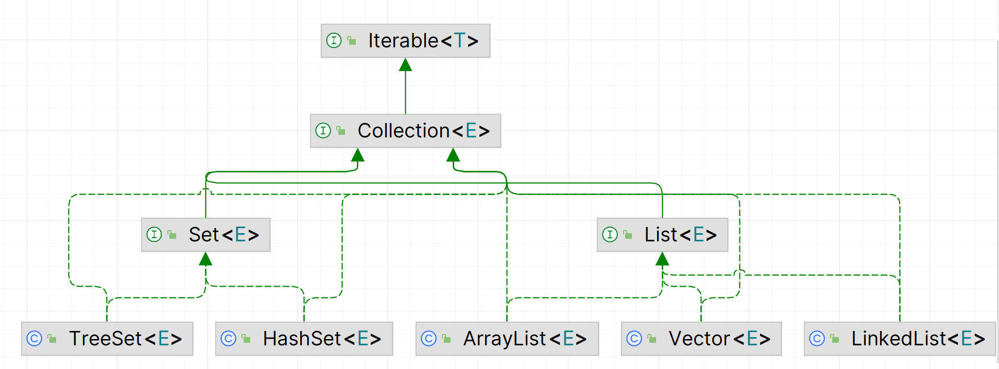
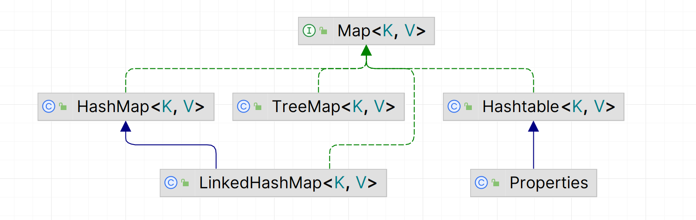
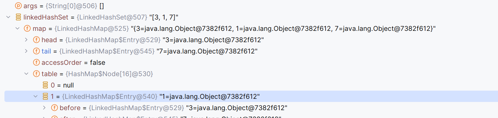
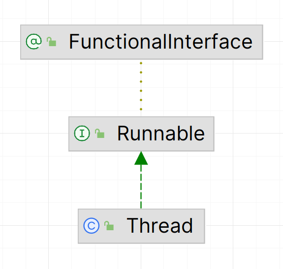
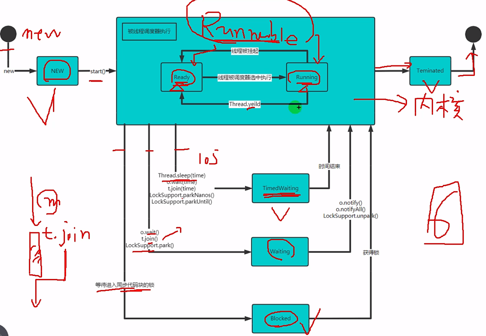

# Java第二阶段-2

## 2023/11/28

**开了新的一章的目的，是因为之前每天记得太详细，过于耗时间，在之后的笔记里，概念性的东西详细进行记录，所见即所得的东西（调用类下的方法）一笔带过**

今天学习了集合，一共分为两种

1. Collection由于每次记录单个元素，又根据具体将其实现的类分为元素有序/无序，可重复/不可重复等
2. Map用于每次记录一对键值对元素

上面提到的两个都是接口，具体由下面的类实现。下面图中的类便是本次集合学习中要学习的部分。

集合的出现，取代了数组的缺点，可动态扩展，可存储不同类型的元素，可方便进行crud





### 1.Collection

#### 1.Collection接口的常用方法

```java
//测试Collection的常用方法，因为他是一个接口，因此用实现了该接口的ArrayList类来进行测试
        List list = new ArrayList();
        //1.添加元素
        list.add("三国演义");
        list.add("水浒传");
        System.out.println(list);
        //2.检查是否为空
        System.out.println(list.isEmpty());
        //3.获取长度
        System.out.println(list.size());
        //4.添加多个元素
        ArrayList arrayList = new ArrayList();
        arrayList.add("红楼梦");
        arrayList.add("西游记");
        list.addAll(arrayList);
        System.out.println(list);
        //5.检查某个元素是否存在
        System.out.println(list.contains("三国演义"));
        //6.检查多个元素是否存在
        System.out.println(list.containsAll(arrayList));
        //7.清除所有元素
//        list.clear();
//        System.out.println(list);
        //8.删除元素
        list.remove(0);    //根据下标删除元素
        System.out.println(list);
        list.remove("西游记");
        System.out.println(list);   //根据值删除元素
        //9.删除多个元素
        list.removeAll(arrayList);
        System.out.println(list);
```

#### 2.用迭代器iterator遍历集合

一般情况下，输出的集合都是显示所有元素，想要一个一个列出，需要用到迭代器进行遍历，一共分为三步：

1. 创建指定对象下的迭代器
2. 判断当前指向的下一个是否为空 hasnext()
3. 移动到下一元素并返回指向的元素

````java
		Iterator iterator = col.iterator();    //初始指向第一个元素的上一位置
        while (iterator.hasNext()){         //若下一个元素存在
            Object obj= iterator.next();    //向下移动一步并输出当前指向的元素
            System.out.println(obj);
        }
````

注意：迭代器在遍历完成后，会停留在最后一个元素上，若此时在用`iterator.next()`，则会越界报错。若还需要遍历集合，只能手动对迭代器再进行赋值

```java
iterator=col.iterator();
```

生成迭代器循环遍历的快捷指令`itit`

查看所有快捷指令`ctrl+j`

#### 3.增强for循环

之前学习的时候也接触过，只不过这次是将其用于集合元素的遍历

```java
		Collection col=new ArrayList();
        //先在集合中放入对象
        col.add(new Book("三国演义","罗贯中"));
        col.add(new Book("红楼梦","曹雪芹"));
        //底层实现就是迭代器那一套 hasnext() next()
        for(Object object:col){     //将col中的元素逐个赋给object
            System.out.println(object);
        }
```

生成增强for循环的快捷指令`I`

### 2.List

* List是实现了Collection接口的一个接口，将其具体化（实现）的类包含ArrayList,Vector,LinkedList

* List的特点是存储的数据是有序的，可重复的
* 因为List实现了Collection,所以Collection的方法都被其进行了重写（可以使用）

#### 1.List接口的常用方法

````java
//本目录下主要是讨论List接口的特有方法
        //因为接口无法实例化，通过实现了该接口的类ArrayList来测试方法
        //先创建对象并插入一些元素
        List list=new ArrayList();
        list.add("syx");
        list.add("jack");
        list.add("syx");
        //list中存储的元素是有序且允许重复的
        System.out.println(list);
        //1.指定位置插入元素
        list.add(1,"wanke");
        System.out.println(list);
        //2.指定位置插入多个元素
        List list1 = new ArrayList();
        list1.add("zj");
        list1.add("horzien");
        list.addAll(1,list1);
        System.out.println(list);
        //3.获取指定下标位置的元素
        System.out.println(list.get(1));
        //4.返回索引到的第一个元素的下标位置
        int syx = list.indexOf("syx");
        System.out.println(syx);
        //5.返回索引到的最后一个元素的下标位置
        int syx1 = list.lastIndexOf("syx");
        System.out.println(syx1);
        //6.替换指定位置的元素,即更改值
        list.set(1,"yz");
        System.out.println(list);
        //7.获取[a,b)的元素
        List list2 = list.subList(0, 2);
        System.out.println(list2);
        //8.移除指定位置的元素  这个方法是Collection接口的
        list.remove(1);
        System.out.println(list);
````

***

***

## 2023/11/29

今天将前面20天学的知识复习了一遍；深究了ArrayList初始化，插入数据，以及动态扩充的底层原理

###1.ArrayList插入数据及扩容的底层实现

```java
//ArrayList的元素都存储在transient Object[] elementData;所以它能够存储各种类型的数据
transient Object[] elementData;

//定义不带参数的ArrayList对象时，数组初始空间为0，即DEFAULTCAPACITY_EMPTY_ELEMENTDATA的大小
private static final Object[] DEFAULTCAPACITY_EMPTY_ELEMENTDATA = {}; 

//添加元素语句第一个进入的函数，先进行装箱
public static Integer valueOf(int i) {
        if (i >= IntegerCache.low && i <= IntegerCache.high)
            return IntegerCache.cache[i + (-IntegerCache.low)];
        return new Integer(i);
    }

//添加元素语句第二个进入的函数
private void ensureCapacityInternal(int minCapacity) {
        if (elementData == DEFAULTCAPACITY_EMPTY_ELEMENTDATA) {   //判断数组是否为空
            minCapacity = Math.max(DEFAULT_CAPACITY, minCapacity);    //max(10,1)=10
        }

        ensureExplicitCapacity(minCapacity);    //进入第三个函数
}

//添加元素语句第三个进入的函数
private void ensureExplicitCapacity(int minCapacity) {
        modCount++;     //添加的元素个数

        // overflow-conscious code
        if (minCapacity - elementData.length > 0)   //当当前元素个数>数组容量时
            grow(minCapacity);     //扩充数组长度
    }

//添加元素语句第四个进入的函数
private void grow(int minCapacity) {
        // overflow-conscious code
        int oldCapacity = elementData.length;     //获取当前数组的长度
        int newCapacity = oldCapacity + (oldCapacity >> 1);   //新数组长度=老数组长度*1.5
        if (newCapacity - minCapacity < 0)    //第一次扩容时，因为数组长度为0，new-min=0-10<0
            newCapacity = minCapacity;       //新数组长度=10
        if (newCapacity - MAX_ARRAY_SIZE > 0)
            newCapacity = hugeCapacity(minCapacity);
        // minCapacity is usually close to size, so this is a win:
        elementData = Arrays.copyOf(elementData, newCapacity);   //用copyOf,可以保证原先数组中的数据不变，在尾部加上长度的部分填充为0
    }    
```

总结ArrayList数组扩容的规则：

1. 初始化ArrayList对象时，数组elementData容量为0
2. 添加第一个数据时，将数组容量扩为10
3. 后续添加元素过程中，每次达到容量上限，都会将数组容量扩充成当前容量的1.5倍

***

***

## 2023/11/30

今天学习了ArrayList类的带参对象的初始化及扩容底层原理；Vector类的无参/带参对象初始化和扩容的底层原理；LinkedList的底层数据结构实现，其对象的初始化及添加元素原理；Set容器的特点及常用方法

###1.ArrayList类的带参对象的初始化及扩容底层原理

昨天学的是无参对象的底层原理，带参对象即在创建对象时指定了数组的长度，规则可总结如下：

1. 初始化ArrayList对象时，数组elementData的容量为初始化时设置的参数
2. 每当容量达到上限，扩充为当前容量的1.5倍

```java
public ArrayList(int initialCapacity) {
        if (initialCapacity > 0) {     //若参数>0
            this.elementData = new Object[initialCapacity];  //指定elementData数组的初始长度为initialCapacity
        } else if (initialCapacity == 0) {
            this.elementData = EMPTY_ELEMENTDATA;
        } else {
            throw new IllegalArgumentException("Illegal Capacity: "+
                                               initialCapacity);
        }
    }
```

###2.Vector类的无参对象初始化和扩容的底层原理

Vector同样是实现了List接口的类，其扩容方法和使用场景和ArrayList有些不同，下面会进行比较

Vector容器的初始化及扩容规则总结如下：

1. 初始化类对象时，就分配10的数组空间
2. 后续扩容时，每次更新的容量都是原容量的两倍

```java
public Vector() {     //初始默认容量为10
        this(10);
    }

//扩容函数，中间省略了一些和ArrayList底层代码相同的部分
private void grow(int minCapacity) {
        // overflow-conscious code
        int oldCapacity = elementData.length;    //获取数组长度
        int newCapacity = oldCapacity + ((capacityIncrement > 0) ?   
                                         capacityIncrement : oldCapacity); //capacityIncrement始终是0，因此newCapacity=oldCapacity*2,即新容量是老容量的两倍
        if (newCapacity - minCapacity < 0)
            newCapacity = minCapacity;
        if (newCapacity - MAX_ARRAY_SIZE > 0)
            newCapacity = hugeCapacity(minCapacity);
        elementData = Arrays.copyOf(elementData, newCapacity);
    }
```

###3.Vector类的带参对象初始化和扩容的底层原理

带参对象的扩容原理和无参相同，只是在初始化时，会将数组大小变成指定的值

```java
public Vector(int initialCapacity) {
        this(initialCapacity, 0);        //构造器中为数组容量赋予指定的值
    }
```

### 4.ArrayList和Vector的比较

| 类名      | 适用场景                       | 初始化机制                                                   | 扩容机制              |
| --------- | ------------------------------ | ------------------------------------------------------------ | --------------------- |
| ArrayList | 单线程                         | 无参：初始长度为0，插入第一个元素之前，数组扩容为10。带参：初始长度为指定长度 | 扩充为当前容量的1.5倍 |
| Vector    | 多线程，其方法都有synchronized | 无参：初始长度为10。带参：初始长度为指定长度                 | 扩充为当前容量的2倍   |

###5.LinkedList类

#### 1.底层数据结构

LinkedList的底层数据结构是双向链表，因此增删很方便

####2.LinkedList添加数据的底层实现

```java
public LinkedList() {     //初始化对象时为空
    }

void linkLast(E e) {     //在链表尾部加入元素
        final Node<E> l = last;     //l用于记录当前尾部元素，作为新插入元素的上一个元素
        final Node<E> newNode = new Node<>(l, e, null);   //前指针 元素值 后指针
        last = newNode;    //尾指针指向新插入的元素
        if (l == null)     //用于处理插入的首个节点，头尾指针指向同一个
            first = newNode;
        else
            l.next = newNode;
        size++;
        modCount++;
    }
```

####3.LinkedList删除数据的底层实现

```java
public E removeFirst() {     //删除元素，若不输入参数，默认删除的是第一个元素
        final Node<E> f = first;
        if (f == null)
            throw new NoSuchElementException();
        return unlinkFirst(f);
    }

private E unlinkFirst(Node<E> f) {
        // assert f == first && f != null;
        final E element = f.item;
        final Node<E> next = f.next;    //获取第二个元素
        f.item = null;
        f.next = null; // help GC
        first = next;     //改变头指针的位置
        if (next == null)     //用于处理只有一个元素的情况，删完头尾都为空
            last = null;
        else
            next.prev = null;    //第二个元素的前指针设为空
        size--;
        modCount++;
        return element;
    }
```

### 6.LinkedList和ArrayList的比较

| 类         | 底层存储数据 | 使用场景         | 安全性 |
| ---------- | ------------ | ---------------- | ------ |
| LinkedList | 双链表       | 增删用的比较多时 | 不安全 |
| ArrayList  | 可变数组     | 改查用的比较多时 | 不安全 |

### 7.Set

Set是实现了Collection接口的接口，有以下特点

1. 存储的元素是无序的（但后序再输出都是固定的相对顺序）
2. 不包含重复元素
3. 不能通过索引去访问元素

***

***

## 2023/12/1

今天学习了HashSet对于同名元素的存储特性（初步了解，学完底层代码之后再进行总结），HashSet底层存储数据结构的模拟实现（哈希表），HashSet中存储第一个数据时的底层代码流程（这个第一遍没怎么理解，下次再看一遍）

###1.HashSet底层存储数据结构的模拟实现

创建HashSet时，底层创建的是HashMap,因此本质研究的是HashMap的底层数据结构，就是一个数组加上拉链，类似于哈希表

```java
public class HashSet02 {
    public static void main(String[] args) {
        //模拟HashSet底层存储数据的实现（即HashMap的底层实现，其实质是数组+链表+红黑树）
        //可以将其看作散列表+红黑树（暂时不涉及）
        //先创建一维数组
        Node[] table=new Node[16];
        Node jack = new Node("jack", null);
        table[1]=jack;
        //在jack后继续挂载
        Node tom = new Node("tom", null);
        jack.next=tom;
    }
}
class Node{     //单个表节点
    Object item;
    Node next;

    public Node(Object item, Node next) {
        this.item = item;
        this.next = next;
    }
}
```

###2.HashSet中存储第一个数据时的底层代码流程

```java
HashSet hashSet = new HashSet();
hashSet.add("jack");

public boolean add(E e) {
        return map.put(e, PRESENT)==null;  //e是生成对象时输入的字符串变量，PRESENT对HashMap才有效，这里仅是占位符
    }
    
public V put(K key, V value) {     //重量级在putVal()中
        return putVal(hash(key), key, value, false, true);   //hash()生成字符串地址对应的哈希
    }
    
static final int hash(Object key) {
        int h;
        return (key == null) ? 0 : (h = key.hashCode()) ^ (h >>> 16);  //字符串不为空时，生成哈希值返回
    }
    
final V putVal(int hash, K key, V value, boolean onlyIfAbsent,
                   boolean evict) {
        Node<K,V>[] tab; Node<K,V> p; int n, i;     //tab即模拟HashSet的底层结构中的table，一个结点数组
        if ((tab = table) == null || (n = tab.length) == 0)    //初始table为空，会进入该判断语句
            n = (tab = resize()).length;	//resize()将数组长度赋予16，这个函数在下面有详细展开
        if ((p = tab[i = (n - 1) & hash]) == null)    //转为哈希地址，查看当前位置是否为空
            tab[i] = newNode(hash, key, value, null);   //为空则插入元素
        else {
            Node<K,V> e; K k;
            if (p.hash == hash &&
                ((k = p.key) == key || (key != null && key.equals(k))))
                e = p;
            else if (p instanceof TreeNode)
                e = ((TreeNode<K,V>)p).putTreeVal(this, tab, hash, key, value);
            else {
                for (int binCount = 0; ; ++binCount) {
                    if ((e = p.next) == null) {
                        p.next = newNode(hash, key, value, null);
                        if (binCount >= TREEIFY_THRESHOLD - 1) // -1 for 1st
                            treeifyBin(tab, hash);
                        break;
                    }
                    if (e.hash == hash &&
                        ((k = e.key) == key || (key != null && key.equals(k))))
                        break;
                    p = e;
                }
            }
            if (e != null) { // existing mapping for key
                V oldValue = e.value;
                if (!onlyIfAbsent || oldValue == null)
                    e.value = value;
                afterNodeAccess(e);
                return oldValue;
            }
        }
        ++modCount;     //添加元素次数
        if (++size > threshold)     //检查是否快要达到上限
            resize();
        afterNodeInsertion(evict);    //这个函数是留给其子类实现的，对父类没什么用
        return null;      //返回Null值，才表示添加成功
    }

//putVal()中的resize()，只复制了在加载第一个元素需要用到的部分
final Node<K,V>[] resize() {
        Node<K,V>[] oldTab = table;
        int oldCap = (oldTab == null) ? 0 : oldTab.length;   //获取当前数组长度，第一次为0
        int oldThr = threshold;
        int newCap, newThr = 0;
        if (oldCap > 0) {
            if (oldCap >= MAXIMUM_CAPACITY) {
                threshold = Integer.MAX_VALUE;
                return oldTab;
            }
            else if ((newCap = oldCap << 1) < MAXIMUM_CAPACITY &&
                     oldCap >= DEFAULT_INITIAL_CAPACITY)
                newThr = oldThr << 1; // double threshold
        }
        else if (oldThr > 0) // initial capacity was placed in threshold
            newCap = oldThr;
        else {               // 数组长度为0进入的判断语句
            newCap = DEFAULT_INITIAL_CAPACITY;      //新的长度变为16
            newThr = (int)(DEFAULT_LOAD_FACTOR * DEFAULT_INITIAL_CAPACITY);    //新的门槛设为0.75*16，即到达12时就准备开始扩容，0.75称为加载因子
        }
```

***

***

## 2023/12/3

今天学习了HashSet的存储数据流程，HashSet的扩容机制，HashSet中的超个数链表转为红黑树的实现流程

###1.HashSet的存储数据流程

昨天学的是往里面放第一个数据的流程，也就是学了该函数内的部分分支语句，今天学习剩余的。可分为

1. 往table里放数据，当前哈希值对应的数组位置没有元素的情况，可直接放入
2. 往table里放数据，碰到冲突，去拉链上进行比较插入位置，拉链上又分为冲突和不冲突的情况。这里的冲突指哈希值相等且（地址/名字）相等，第二个名字可以换为其他的元素，取决于当前类中有没有对equals进行重写

源码中的代码写法是值得学习的，精简且到位

```java
//此函数包含了所有插入哈希表的数据遇到的各种情况
final V putVal(int hash, K key, V value, boolean onlyIfAbsent,
                   boolean evict) {
        Node<K,V>[] tab; Node<K,V> p; int n, i;
        if ((tab = table) == null || (n = tab.length) == 0)
            n = (tab = resize()).length;
        if ((p = tab[i = (n - 1) & hash]) == null)    //在table上匹配
            tab[i] = newNode(hash, key, value, null);
        else {
            //转入此判断语句，代表发生哈希冲突，table表上相同位置已存有元素，根据冲突的不同情况，又分为以下三种
            Node<K,V> e; K k;    //局部变量，用到时再声明
            if (p.hash == hash &&   //到这句话，p.hash=(n - 1) & hash,这是由上面第二个判断语句先赋值后判断的
                ((k = p.key) == key || (key != null && key.equals(k))))
                //若哈希值相等且满足以下其一情况
                  //1.两个对象的地址相等
                  //2.两个对象经过equals比较相等（具体比的什么取决于每个类对于equals有没有重写，比如String的equals，就是比较字符串值是否相等）
                e = p;   //用于衔接下面的if (e != null)判断
            else if (p instanceof TreeNode)    //判断是否为红黑树
                //用红黑树的putTreeVal方法插入数据
                e = ((TreeNode<K,V>)p).putTreeVal(this, tab, hash, key, value);
            else {
                //到这个分支，证明哈希冲突出现在了拉链支路上，即在拉链上进行匹配时可能出现问题
                for (int binCount = 0; ; ++binCount) {    //在拉链上逐一匹配
                    if ((e = p.next) == null) {    //匹配到最后，未出现冲突，尾部插入元素
                        //注意是先转到下一个p.next，再比较是否为控制，这种代码写的很优美
                        p.next = newNode(hash, key, value, null);
                        if (binCount >= TREEIFY_THRESHOLD - 1) // 插入后检查该拉链上元素个数是否>=8，满足则扩展成红黑树treeifyBin
                        /*
                        treeifyBin()中会先判断table数组容量是否小于64，符合则实际上进行的是数组扩容操作resize()，否则才是真正地创建红黑树
                        if (tab == null || (n = tab.length) < MIN_TREEIFY_CAPACITY)
            				resize();
                        */
                            treeifyBin(tab, hash);
                        break;     //因为这个循环是没有终止条件的，需手动退出
                    }
                    if (e.hash == hash &&    //在拉链上匹配到了相同元素，插入失败
                        ((k = e.key) == key || (key != null && key.equals(k))))
                        break;
                    p = e;    //因为开始时先e=p.next,这两个组合相当于移到下一个元素
                }
            }
            if (e != null) { // existing mapping for key
                V oldValue = e.value;
                if (!onlyIfAbsent || oldValue == null)
                    e.value = value;
                afterNodeAccess(e);
                return oldValue;    //return的是旧值，而不是null，代表添加元素失败
            }
        }
        ++modCount;
        if (++size > threshold)
            resize();
        afterNodeInsertion(evict);
        return null;
    }
```

学完这个，也就理解了为什么自定义对象可以是名字相同的，而String类却不能存储名字相同的。因为：

1. 两个自定义对象的地址不同

2. 未重写equals方法，那么返回的还是地址不同。而String类对equals进行了重写，比较的是值是否相同

```java
//插入同名自定义对象
        hashSet.add(new Dog("tom"));
        hashSet.add(new Dog("tom"));   //因为不是同一个对象，可以存储
        System.out.println(hashSet);

        //插入同名String类对象
        hashSet.add(new String("hhh"));
        hashSet.add(new String("hhh"));    //下面两个并没有存入
        hashSet.add(new String("hhh"));
        System.out.println(hashSet);
```

### 2.HashSet的扩容机制

流程总结为以下几步：

1. 初始容量为16，当达到门槛值的75%时，进行扩容
2. **门槛值即当前容量，扩容是扩为当前容量的两倍**，接下来以此类推。即16（12）-》32（24）-》64（48）。。。  到括号内的数字时就扩容。可以这么理解：不是用完才扩容，而是达到预警值就扩容

注意：HashSet中的元素个数，包含拉链上的元素个数，而不仅仅是table里的

###3.HashSet中的超个数链表转为红黑树的实现流程

这种情况出现在一条拉链上的元素个数>=8个的情形，分为以下几步：

1. 当同一个拉链上的元素个数达到8个，先看数组长度是否<64，符合则先对数组进行扩容
2. 以后每在这个拉链上再添加一个元素，还符合上面的逻辑。（也就是说在同一超过个数的拉链上再次添加元素，数组容量就会翻倍，底层调用的resize(),即数组扩容机制
3. 若数组长度>64，则将该拉链改为红黑树

***

***

## 2023/12/4

今天学习了LinkedHashSet的存储结构，LinkedHashSet存储数据的底层实现，Map接口的特性。最近一直在学各种集合的底层原理，知识点很多，进度很慢。

###1.LinkedHashSet的存储结构

LinkedHashSet是HashSet的子类，其数据结构是table+双向链表，拥有前后指针(head,tail)指向链表的头部和尾部，且每个节点都有头尾指针(before,after)，在插入数据时，前后指针和头尾指针都会更新，因此用该类存储数据是有序的(插入元素顺序和读取相同)



###2.LinkedHashSet存储数据的底层实现

LinkedHashSet的底层实际上是LinkedHashMap，而LinkedHashMap又是HashMap的子类，因此其存储数据的原理和之前的Hash类似，总结过程如下：

1. 初始赋予16的空间
2. 当达到门槛值的75%时，进行扩容，扩容为当前容量的两倍

```java
//存放数据的数组类型是HashMap$Node
//存放的数据类型是LinkedHashMap$Entry（在上面一张图中也可以看出来）
public LinkedHashSet() {
        super(16, .75f, true);    //调用父类的构造器
    }
   
HashSet(int initialCapacity, float loadFactor, boolean dummy) {
        map = new LinkedHashMap<>(initialCapacity, loadFactor);   //底层生成的是LinkedHashMap
    }
    
static class Entry<K,V> extends HashMap.Node<K,V> {     //LinkedHashMap中的静态内部类，继承了Node类
        Entry<K,V> before, after;     //用于双向链表的连接
        Entry(int hash, K key, V value, Node<K,V> next) {
            super(hash, key, value, next);
        }
    }
```

### 3.Map

又称映射，存储键值对的集合，和collection接口平行（即不属于collection)，有以下特点：

1. 键不可重复，若对重复的键赋予不同的值，新值会覆盖旧值
2. 值可以重复
3. 键可以为空，但只能有一个空。值可以为空，不限个数
4. 可通过键找到值
5. 存储的键和值可以是任何引用型类型，会存储在HashMap$Node对象中。Node是HashMap的一个静态内部类，包含hash值，键值对，下一元素的指针等，可将链表进行连接

常用方法（以实现Map接口的HashMap类为例）：

```java
		//插入新的映射
		hashMap.put("01","wanke");
        hashMap.put("02","wanke");

        //键值都可以为null，但键只能有一个null，值不限制
        hashMap.put(null,null);
        hashMap.put(1,null);
        System.out.println(hashMap);
        
        //key与map一一对应，用get方法，通过键找值
        System.out.println(hashMap.get("01"));
```

***

***

## 2023/12/5

今天又把Map接口的特性看了一遍（Node-Entry-EntrySet)，学习了Map的常用方法，遍历Map键值对的六种方式

###1.Node-Entry-EntrySet

这一小结讲的是探索Map底层存储键值对的方式，本质上是存储在了HashMap$Node中

1. Map映射的键值对在底层封装为Node，Node再封装为Entry存入EntrySet中，这么做是为了方便用户遍历
2. EntrySet中存储的元素均为Entry，而Entry为编译类型，其真正的运行类型是Node，因为Node实现了Entry类（多态）

```java
static class Node<K,V> implements Map.Entry<K,V> {
        final int hash;   //hash值
        final K key;   //键
        V value;     //值
        Node<K,V> next;    //指向下一个元素的指针

        Node(int hash, K key, V value, Node<K,V> next) {
            this.hash = hash;
            this.key = key;
            this.value = value;
            this.next = next;
        }
```

3. 说它方便用户遍历，是因为Entry接口中定义两个方法：getkey(),getvalue()，可以分别获取键和值

```java
interface Entry<K,V> {
        K getKey();
        V getValue();
        ...}
```

下面是实操：

1. 实体化EntrySet类对象时，其对象类型是HashMap$EntrySet，这个`$`的含义是HashMap类中的静态内部类EntrySet

```java
		Set set = hashMap.entrySet();    //存放了集合entry的entryset类
        System.out.println(set.getClass());    //class java.util.HashMap$EntrySet
```

2. 获取entryset中的每个Entry，其真正的运行对象是HashMap$Node

```java
		for (Object obj :set) {
            //System.out.println(obj.getClass());  //class java.util.HashMap$Node
            Map.Entry ent=(Map.Entry)obj;     //先向下转型才能用Entry类的特有方法
            System.out.println(ent.getKey()+"--"+ent.getValue());   //通过Entry类的getKey和getValue方法分别获得键和值
        }
```

注意：

1. EntrySet只是对Node链表的一个视图化，并没有再次生成数据，可从底层的地址来观察，EntrySet中存储的Entry的数据的地址和table中是相同的
2. 也可以通过keyset(),values()获取键值对，这种做法跳过了EntrySet，直接通过HashMap下的方法去取值

```java
		Set set1 = hashMap.keySet();      //也可以直接通过hashmap对象获取键和值，跳过了entryset
        Collection values = hashMap.values();    //注意Set和Collection只是编译类型
        System.out.println(set1.getClass());    //运行类型：class java.util.HashMap$KeySet
        System.out.println(values.getClass());   //class java.util.HashMap$Values
```

### 2.Map的常用方法

```java
		//插入数据
        HashMap hashMap = new HashMap();
        hashMap.put(1,"syx");
        hashMap.put(null,"syx");
        hashMap.put(2,"wanke");
        hashMap.put(3,"add");
        //查找元素
        Object object = hashMap.get(3);
        System.out.println(object);
        //根据键删除键值对
        Object remove = hashMap.remove(2);
        System.out.println(hashMap);
        //检查映射是否为空
        boolean empty = hashMap.isEmpty();
        System.out.println(empty);
        //查看是否包含某个键
        boolean b = hashMap.containsKey(null);
        System.out.println(b);
        //查看当前的映射个数
        System.out.println(hashMap.size());
        //清空所有映射
        hashMap.clear();
        System.out.println(hashMap);
```

### 3.遍历Map键值对

一共有六种，细分的话就是三种，每种包含了for循环和迭代器循环两种方式，能够用迭代器，因为得到的集合都是实现了collection接口

```java
		//1.先获取key值，再通过key获取值
        System.out.println("法一：");
        Set set = hashMap.keySet();
        //增强for循环
        for (Object object :set) {
            System.out.println(object+"-"+hashMap.get(object));
        }
        //迭代器  因为运行类型是keyset,是实现了AbstractSet的类，因此可以用迭代器遍历
        System.out.println("法二：");
        Iterator iterator = set.iterator();
        while (iterator.hasNext()) {
            Object next =  iterator.next();    //这里的next就是key
            System.out.println(next+"-"+hashMap.get(next));
        }

        //2.获取value进行遍历  但这种方法无法获得key
        Collection values = hashMap.values();
        //增强for循环
        System.out.println("法三：");
        for(Object obj:values){
            System.out.println(obj);
        }
        //迭代器  原理同法二
        System.out.println("法四：");
        Iterator iterator1 = values.iterator();
        while (iterator1.hasNext()) {
            Object next =  iterator1.next();
            System.out.println(next);
        }

        //3.通过EntrySet进行遍历  涉及到向下转型以及Entry的两个方法
        Set set1 = hashMap.entrySet();
        //增强for循环
        System.out.println("法五：");
        for (Object object :set1) {
            //此时每个object实际上为Node类型
            //转成Entry类型，可以使用其方法
            Map.Entry object1 = (Map.Entry) object;
            System.out.println(object1.getKey()+"-"+object1.getValue());
        }
        System.out.println("法六：");
        //迭代器
        Iterator iterator2 = set1.iterator();
        while (iterator2.hasNext()) {
            Object next =  iterator2.next();
            Map.Entry next1 = (Map.Entry) next;
            System.out.println(next1.getKey()+"-"+next1.getValue());
        }
```

总结：

1. 第一种最简单，通过获取key，来获取value
2. 第三种最复杂，需和Map的键值对底层存储融汇贯通
3. 第二种有局限性，只能遍历value

***

***

## 2023/12/6

今天学习了HashMap的底层存储数据及扩容机制，HashTable的底层数据存储和扩容机制，Properties

###1.HashMap的底层存储数据及扩容机制

因为HashSet的底层实现就是HashMap，因此其底层的存储数据和扩容代码相同，唯一的区别在于HashMap在存储相同键不同值时，新值会把旧值覆盖，而HashSet是不允许存相同值，下面是底层代码分析

```java
			//这段代码是底层putVal函数中的一部分
			if (e != null) { // existing mapping for key
                V oldValue = e.value;    //用oldvalue存储旧值
                if (!onlyIfAbsent || oldValue == null)   //onlyIfAbsent==false
                    e.value = value;    //新值赋给e.value
                afterNodeAccess(e);
                return oldValue;     //最后返回旧值
            }
```

总结HashMap的存储及扩容机制如下（同样也是对HashSet的总结，源码见12/3的第一条）:

1. 在创建对象时，底层生成HashMap$Node[] table数组，用于存储每个键值对（视为一个Node)，初始数组容量为空
2. 加入第一个数据之前，会触发数组扩容resize()，数组容量变为16，装填因子为0.75，门槛容量为12
3. 后续继续添加k-v时，会根据key的hash值得到数组下标的索引，若索引处没有值，则直接加入，若索引处有元素，判断两个元素的key是否相等，相等则覆盖，不相等则考虑在后面的链表/红黑树上进行插入，在链表上插入时就会涉及扩容以及链表->红黑树机制
4. 当一条链表上的元素>=8个时，会触发转为树的操作，不过在转为树之前会检查当前数组的长度是否>=64，若<64则进行数组扩容，容量变为原容量的两倍，若>=64则转换为红黑树
5. 数组扩容还会在当前数组元素（包含链表上的元素个数）个数>=门槛数时触发

### 2.HashTable

* HashTable是实现了Map接口的类，和HashMap是平行关系
* HashTable适用于多线程，其键值对都不能为空，有一个为空值就会报错
* 初始化对象时底层生成HashTable[] table这么一个数组
* HashTable的每个键值对是存储在HashTable$Entry对象中，也就是说table数组中每个元素都是Entry类型

###3.HashTable的底层数据存储和扩容机制

* 初始化时，数组无容量
* 插入第一个数据之前，容量变为11，装填因子为0.75，得出门槛值8
* 在插入第九个数之前，进行数组扩容，扩容源代码如下

```java
private void addEntry(int hash, K key, V value, int index) {
        modCount++;     //元素个数+1

        Entry<?,?> tab[] = table;
        if (count >= threshold) {    //当前元素数量>=门槛数
            // Rehash the table if the threshold is exceeded
            rehash();    //扩容函数，关键就在这

            tab = table;
            hash = key.hashCode();
            index = (hash & 0x7FFFFFFF) % tab.length;
        }
....
    }
    
protected void rehash() {
        int oldCapacity = table.length;    //存储原容量
        Entry<?,?>[] oldMap = table;

        // overflow-conscious code
        int newCapacity = (oldCapacity << 1) + 1;     //新容量=原容量*2+1
        if (newCapacity - MAX_ARRAY_SIZE > 0) {
            if (oldCapacity == MAX_ARRAY_SIZE)
                // Keep running with MAX_ARRAY_SIZE buckets
                return;
            newCapacity = MAX_ARRAY_SIZE;
        }
        Entry<?,?>[] newMap = new Entry<?,?>[newCapacity];    //以新容量创建新数组
....
    }
```

### 4.HashTableVSHashMap

| 类        | 适用场景 | 效率 | 键值对能否为空 | 初始数组容量 | 扩容机制   |
| --------- | -------- | ---- | -------------- | ------------ | ---------- |
| HashMap   | 单线程   | 高   | 可以           | 16           | 原容量*2   |
| HashTable | 多线程   | 低   | 不可以         | 11           | 原容量*2+1 |

### 5.Properties

* Properties是继承了HashTable的类，因此其键值对也不能为空
* 多用于读写xxx.properties型的文件

### 6.不同集合的适用场景总结

至此还没有学到Treemap和Treeset，这两个先跳过

> 存储的是一个一个的对象：collection

> > 存储的数据可以重复：list
> >
> > >多用到改查且是单线程：ArrayList，底层用数组进行存储
> > >
> > >多用到增删：LinkedList，底层用双链表进行存储
> > >
> > >多用到改查且是多线程：Vector
> >
> > 存储的数据不可以重复：set
> >
> > >存储的数据是无序的：HashSet，底层是HashMap,用哈希表存储（数组+链表+红黑树）
> > >
> > >插入和取出顺序一致，方便增删：LinkedHashSet,底层是LinkedHashMap,数组+双链表
>
> 存储的是一个个键值对：map
>
> >用于单线程且键无序：HashMap
> >
> >用于单线程且键插入和取出顺序一致: LinkedHashMap
> >
> >用于多线程且键无序：HashTable
> >
> >用于读取文件：Properties

***

***

## 2023/12/7

今天学习了TreeSet,TreeMap（重点是实现有序的底层代码），Collections工具类

### 1.TreeSet与TreeMap

这两个放在一起讲，是因为TreeSet的底层实现就是TreeMap，因此讲一个就是等于讲两个（类比HashSet和HashMap)

* 这两个集合的特点是可以用于输出数据有序的场景，但这里的有序是要经过自己编写匿名内部类来定义排序的方法，自然输出的话，仍是无序的

1. 通过构造器创建匿名内部类的案例

```java
		TreeMap treeMap = new TreeMap(new Comparator() {
            //用String类的compareto进行排序
            @Override
            public int compare(Object o1, Object o2) {
                return ((String)o1).compareTo((String)o2);
            }
        });
        treeMap.put("wabke",1);
        treeMap.put("wanke",2);
        treeMap.put("syx",3);
        System.out.println(treeMap);
```

2. 实现有序的底层源代码

```java
//底层调用的其实是TreeMap的比较器
public TreeSet(Comparator<? super E> comparator) {
        this(new TreeMap<>(comparator));
    }
    //构造器将比较器comparator赋给了TreeMap中的属性this.comparator
    public TreeMap(Comparator<? super K> comparator) {
        this.comparator = comparator;
    }
//转到了TreeMap的添加函数put
public V put(K key, V value) {
        Entry<K,V> t = root;
        if (t == null) {    //插入第一个元素时进入此判断
            compare(key, key); // 两个相同的键进行比较。目的是为了防止空值

            root = new Entry<>(key, value, null);   //创造新的结点，赋予键值
            size = 1;
            modCount++;
            return null;
        }
        int cmp;
        Entry<K,V> parent;
        // split comparator and comparable paths
        Comparator<? super K> cpr = comparator;
        if (cpr != null) {
            do {
                parent = t;    //t中包含了之前已经装入的Entry
                cmp = cpr.compare(key, t.key);    //这里转到实现匿名内部类compare的地方，根据返回值赋给cmp
                if (cmp < 0)
                    t = t.left;     //寻找新元素的插入位置
                else if (cmp > 0)
                    t = t.right;
                else
                    return t.setValue(value);   //若插入值和已有值相等，则返回，不插入
            } while (t != null);    //与之前的元素逐一进行比较
        }
        else {   //cpr==null  代表没有自定义比较器
            if (key == null)
                throw new NullPointerException();
            @SuppressWarnings("unchecked")
                Comparable<? super K> k = (Comparable<? super K>) key;  //向上转型，调用系统的比较器
            do {
                parent = t;
                cmp = k.compareTo(t.key);
                if (cmp < 0)
                    t = t.left;
                else if (cmp > 0)
                    t = t.right;
                else
                    return t.setValue(value);
            } while (t != null);
        }
        Entry<K,V> e = new Entry<>(key, value, parent);    //生成新的Entry结点
        if (cmp < 0)
            parent.left = e;
        else
            parent.right = e;
        fixAfterInsertion(e);
        size++;
        modCount++;
        return null;     //返回空值则代表插入成功
    }
```

注意：根据TreeMap底层代码的规则（别的集合不会出现这个情况），若把匿名内部类的compare函数中写为根据字符串长度进行排序，那么同长度的字符串只能插入一个，具体到代码，会走最后一个分支，cmp==0，从而退出程序：

```
				if (cmp < 0)
                    t = t.left;     //寻找新元素的插入位置
                else if (cmp > 0)
                    t = t.right;
                else
                    return t.setValue(value);   //若插入值和已有值相等，则返回，不插入
```

### 2.Collections工具类

* Collections是应用于对集合进行各种操作的工具类
* 和Collection区分，Collection是接口，Collections是类

以下是Collections的常用方法：

```java
//Collections工具类 可用于对集合的各种操作
        //以ArrayList为例
        ArrayList arrayList = new ArrayList();
        arrayList.add("jack");
        arrayList.add("tom");
        arrayList.add("tom");
        arrayList.add("jerry");
        System.out.println(arrayList);
        //1.翻转list
        Collections.reverse(arrayList);
        System.out.println(arrayList);
        //2.随机生成顺序
        for (int i = 0; i < 5; i++) {
            Collections.shuffle(arrayList);
            System.out.println(arrayList);
        }
        //3.排序  默认是用compareto排序
        Collections.sort(arrayList);
        System.out.println(arrayList);
        //自定义排序顺序以及规则
        Collections.sort(arrayList, new Comparator() {
            //按长度进行排序
            @Override
            public int compare(Object o1, Object o2) {
                return ((String)o1).length()-((String)o2).length();
            }
        });
        System.out.println(arrayList);
        //交换两个元素的位置
        Collections.swap(arrayList,1,2);
        System.out.println(arrayList);
        //获取最大值（默认字母排序，也可以通过比较器进行自定义）
        System.out.println(Collections.max(arrayList));
        //获取最小值
        System.out.println(Collections.min(arrayList));
        //拷贝元素到另一个list中
        ArrayList desc = new ArrayList();
        for (int i = 0; i < arrayList.size(); i++) {
            desc.add("");
        }
        Collections.copy(desc,arrayList);  //注意：若目标容量小于原数组容量，则会报错数组越界
        System.out.println(desc);
        //查找某一元素在数组中出现的频率
        int tom = Collections.frequency(desc, "tom");
        System.out.println(tom);
        //将指定元素值进行替换
        Collections.replaceAll(arrayList,"tom","汤米");
        System.out.println(arrayList);
```

***

***

## 2023/12/8

今天做了集合这一章节的练习。学习了泛型

### 1.集合作业小结

1. TreeMap的去重机制

* 当我们为了使输出是有序的，这时会自定义排序方法，当排序规则得出==时，就会去重。

* 当我们并没有自定义排序方法，即在创建TreeMap对象时调用的是空值构造器，系统内部也会自动调用一个比较器，这个比较器是基于当前输入数据类型的实现了Comparable接口的比较器，再使用其中的compareTo方法进行比较

* 也就是说，如果自己定义了一个类，却没有实现Comparable接口，那么该类的对象是无法插入进TreeMap类的对象的，底层在去重代码那一块向上转型为Comparable接口类型时会报错

2. hash地址改变的问题

```java
HashSet set = new HashSet();
        Person1 aa = new Person1(1001, "AA");
        Person1 bb = new Person1(1002, "BB");
        set.add(aa);
        set.add(bb);
        aa.name="CC";
        set.remove(aa);    //改过名字之后，该对象的hash值发生了变化，无法和原来的hash值匹配上->无法删除
        System.out.println(set);   //1001 CC 1002 BB
        set.add(new Person1(1001,"CC"));   //hash地址不同
        System.out.println(set);   //1001 CC 1002 BB 1001 CC
        set.add(new Person1(1001,"AA"));
        System.out.println(set);   //1001 CC 1002 BB 1001 CC 1001 AA
```

这个问题我还没总结出什么规律，碰到报错就去看源码吧，从底层执行机制可以看出到底是哪一步出了问题

### 2.泛型

#### 1.泛型的基本形式，应用场景

泛型，可以用于类，接口，集合的定义中，在实体化对象时将泛型的部分变为具体的数据类型，其基本形式如下：

```java
//这里以集合为例
		//底层源码public class ArrayList<E>，E为泛型，在实体化对象时，Dog替代了E
		ArrayList<Dog> dogs = new ArrayList<Dog>();
        dogs.add(new Dog("tom"));
        dogs.add(new Dog("happt"));
        //加入别的类则会报错
        //dogs.add(new Cat("cat"));
```

注意：

1. 实体化时定义的具体的数据类型在编译时就会生效，因此再加入其他的数据类型会提示报错。也就是说，在运行之前，就会用红线提示你错误
2. 用了泛型的集合，在进行遍历操作时，不用再经历Dog->Object->Dog的转型，而是可以直接使用泛化的类型去接收对象，效果如下：

```java
		//在遍历时，可以直接赋予Dog类型，而不用再用Object-》Dog进行向下转型
        for (Dog object :dogs) {
            System.out.println(object);
        }
```

由此可看出泛型的好处：

1. 有效保证了程序的安全性，控制了输入数据的类型
2. 跳过了向下转型

#### 2.泛型应用于类

泛型可以修饰类的属性类型，函数的返回值类型，函数的参数类型

```java
//泛型作用：用于在类定义时充当类的属性类型/方法返回值类型/方法形参类型
class Person<E>{
    E s;   //在实体化对象时，定义的类型会替代E
    public Person(E s) {
        this.s = s;
    }
    public E f1(){
        return s;
    }
    public void f2(E s){
        System.out.println(s);
    }
    public void f3(){
        System.out.println(s.getClass());
    }
}

Person<String> person = new Person<String>("tom");
//泛型的具体数据类型在编译时就已确定，若输入不符合类型的值，会直接显示有误
//Person<String> person1 = new Person<String>(100);
```

***

***

## 2023/12/10

今天学习了泛型的细节，自定义泛型类，自定义泛型接口，自定义泛型方法，泛型继承，通配符，JUnit进行单元化测试

### 1.泛型的细节

1. 泛型具体化时只能是引用类型，而不能是基本数据类型

```java
        //1.泛型中实现的只能是引用型数据类型
        ArrayList<Integer> integers = new ArrayList<>();
        //ArrayList<int> ints = new ArrayList<int>();
```

2. 若没有给泛型具体化，系统会默认其为Object类型。之前学习集合中的代码，全都是默认Object类型
3. 泛型具体化后，其输入的类型可以是本类型，也可以是本类型的子类

```java
class A{}
class B extends A{}

class Pig<E>{    //pig类为泛型类
    E name;

    public Pig(E name) {
        this.name = name;
    }
}

        //2.确定了泛型的具体类型后，输入数据可以是该类或者其子类
        Pig<A> aPig = new Pig<>(new A());    //泛型具体化为A，因此在后面调用其构造器时，只能输入A类对象
        Pig<A> bPig = new Pig<>(new B());    //因为B类继承了A类，因此编译通过
```

4. 泛型不能用于修饰类的静态成员

因为泛型类在类的实体化时进行具体化，而静态成员则是在类加载时就已启动，此时泛型还不能确定具体类型

5. 泛型数组不能初始化

因为在确定具体类型之前，每个元素的大小是不确定的，也就不能提前分配空间

### 2.自定义泛型类

基本形式就是在类名后加上`<E,J,T,...>`（不限个数），然后用于修饰类的方法/属性/返回值，在类实体化时赋予其相应的实际类型

```java
//定义泛型类
class Tiger<R,M,T>{
    String name;
    R r;
    M m;
    T t;

    //泛型数组不能在定义时初始化，还不知道数据类型->不知道大小
    //R[] rr=new R[9];


    public Tiger(String name) {
        this.name = name;
    }

    public Tiger(String name, R r, M m, T t) {
        this.name = name;
        this.r = r;
        this.m = m;
        this.t = t;
    }
    ...
}
//实体化泛型类，同时赋予泛型实值
Tiger<Double, String, Integer> jhon = new Tiger<>("jhon");
```

### 3.自定义泛型接口

1. 基本形式

```java
interface A<E>{}
```

2. 特点

* 泛型接口的泛型实体化，是在其被其他接口继承时，或是被类实现时。一旦实体化，其内部的泛型方法，属性都会自动变为具有实体化属性的形式，而不是再用泛型的字母代替

```java
//用接口IA继承泛型接口Iusb
interface IA extends Iusb<String,Integer>{
}

//用类A实现接口IA
class A implements IA{
    //U和R会自动替换为String,Integer,本质在于IA继承时将泛型具体化
    @Override
    public Integer get(String s) {
        return null;
    }
    @Override
    public void hi(Integer integer) {

    }
    @Override
    public String f1(Integer integer) {
        return IA.super.f1(integer);
    }
}

interface Iusb<U,R>{
    //不能用泛型去修饰接口中的属性，因为其属性自带public static
    //U a;
    R get(U u);
    //抽象方法，隐藏public abstract
    void hi(R r);
    //普通方法
    default U f1(R r){
        return null;
    }
}
```

3. 注意点

* 在接口中，属性隐性地包含了`public static`，因此不能用泛型修饰，原因在第一点中已经给出

### 4.自定义泛型方法

定义泛型供自己函数使用

#### 1.形式

```java
public <E> void f1(){E e}
```

注意和方法中使用了泛型进行区分：

```java
public E f1(){}    //返回值为泛型
public void f1(T t){}   //函数参数为泛型
```

#### 2.定义的位置

1. 可在普通类中定义泛型方法

```java
class B{
    public <T,S> void f1(T t,S s){
        System.out.println(t.getClass());   //参考下面第三点，类型输出为String
        System.out.println(s.getClass());   //Integer
    }
}
```

2. 可在泛型类中定义泛型方法

```java
class C<M>{
    public <M,T> void f2(M m,T t){
        System.out.println(m.getClass());    //Integer
        System.out.println(t.getClass());    //Float
    }
}
```

在这种情况下，是可以使用泛型类定义的泛型字母的，且两个不冲突，比如实体化类时定义了M的实际类型，在使用f2方法时，这个类型可以不一样

#### 3.实体化方法

这和之前学的几个不太一样，通过调用方法时填入参数，系统会自动识别参数的类型，然后转为相应的类型

```java
		B b = new B();
        b.f1("梅德赛斯",100);     //调用方法时根据输入数据的类型决定泛型实体化的类型
        C<ArrayList> arrayListC = new C<>();
        arrayListC.f2(1,1.1f);
```

### 4.泛型的继承

具体说是其中的多态性质，泛型是不具有多态性质的，所以==两边的泛型实体化类型要相同，不存在什么父类子类

```java
//错误示例
D<Object> objectD = new D<String>();
```

### 5.通配符

通配符，写在泛型的定义中，用于限制可以放置的类的上下界

1. 允许任何类型的实体化

```java
List<?> c
```

2. 限制上界的实体化

```java
//规则
class AA{}
class BB extends AA{}
class CC extends BB{}

//实参只能是AA类或者是其子类，所以extends规定了上限为AA
List<?extends AA> c
```

3. 限制下界的实体化

```java
//实参只能是AA类或者是其父类，所以super规定了下限为AA
List<?super AA> c
```

***

***

## 2023/12/12

今天学习了Junit，坦克大战项目入门

### 1.Junit

很好用的代码测试工具，在要测试的函数上标注`@Test`即可，好处如下

1. 不用再在主函数中调用指定方法进行测试
2. 不用再把所有方法的具体实现形式写在主函数中，而是可以封装成方法进行调用

但需要注意，若该函数的功能还依赖于其他模块（不是完全独立的），则进行单个测试时会报错

### 2.坦克大战

今天主要学习了Java中的画框，画板，笔，绘制了几种常见的图形以及填充图形

#### 1.画图的基本要素

画框->画板->笔，一个套在一个中

```java
public class DrawCircle extends JFrame{
    //JFrame表示画框  画框->画板->图形
    //定义一个画板
    public MyPanel mp=null;
    public static void main(String[] args) {
        new DrawCircle();
        System.out.println("退出程序");
    }
    //该类（画框）的构造函数
    public DrawCircle(){
        mp=new MyPanel();    //赋予画板对象
        this.add(mp);     //画板嵌入画框
        this.setDefaultCloseOperation(JFrame.EXIT_ON_CLOSE);   //退出画框时终止程序，否则程序不会停止
        this.setVisible(true);
        //设置画框大小
        this.setSize(800,800);
    }
}


//自定义一个画板继承JPanel
class MyPanel extends JPanel{
    //重写其中的paint方法

    //在第一次显示画框时，会自动调用paint方法
    //调整窗口大小时，会自动调用paint
    //将最小化的窗口显示出来时，会自动调用paint
    @Override
    public void paint(Graphics g) {
        super.paint(g);
        System.out.println("调用paint函数");
        //g相当于是画板中的笔
        //x,y表示图像左上角的起始位置 ，后面两个参数表示图形的长度和宽度
        //g.drawOval(100,100,200,200);
	}
}
```

注意：在继承了JPanel的类中，重写的是其paint方法，而不是其他方法（就不写出来是什么了，因为这个问题卡了好久）

#### 2.绘制几种常见图形

还包含了将图片显示在画板上

```java
//画一条线  起始坐标和终止坐标
        //g.drawLine(10,10,100,100);

        //画一个矩形
        //g.drawRect(100,100,300,300);

        //填充矩形
        //g.setColor(Color.CYAN);
        //g.fillRect(100,100,300,300);

        //填充椭圆
        //g.fillOval(10,10,100,100);

        //显示图片
        //获取图片   图片必须放在out文件夹下的chapter16文件夹中，才能搜索到
        Image image = Toolkit.getDefaultToolkit().getImage(Panel.class.getResource("/bg.png"));
        //将图片显示在面板上  左上角位置  像素
        //g.drawImage(image,10,10,175,221,this);

        //将字符串显示在面板上
        g.setColor(Color.red);
        //设置字体  字体名，风格，大小
        g.setFont(new Font("宋体",Font.BOLD,50));
        //画字体的xy表示的是左下角的位置
        g.drawString("你好",100,100);
```

***

****

## 2023/12/13

今天练习了坦克的绘制，事件处理机制

### 1.绘制坦克

本质上是昨天所学的几种图形的拼接，确定好大小，左上角的起始位置即可组合

### 2.事件处理机制

* 学这个在坦克大战里是为了处理子弹移动机制
* 通过对键盘按键的监听，采取不同的操作
* 代码上是实现接口KeyListener，通过画板去监听，当键盘按键按下时，通过对接口的方法keypress的重写，生成KeyEvent类对象，采取对按下键盘按钮的操作

```java
public class event01 extends JFrame{
    //初始化面板
    MyPanel mp=null;
    public static void main(String[] args) {
        new event01();
    }
    //画框构造器
    public event01(){
        mp=new MyPanel();
        this.add(mp);
        this.setDefaultCloseOperation(JFrame.EXIT_ON_CLOSE);
        this.setSize(800,800);
        this.setVisible(true);
        //画框也要添加对键盘的监听
        this.addKeyListener(mp);
    }
}

//创建画板
//实现接口KeyListener，从而对键盘进行监听
class MyPanel extends JPanel implements KeyListener {
    //定义初始位置
    int x=10;
    int y=10;
    //重写paint
    @Override
    public void paint(Graphics g) {
        super.paint(g);
        //绘制小圆
        g.fillOval(x,y,10,10);
    }
    //输出字符时进行操作
    @Override
    public void keyTyped(KeyEvent e) {

    }
    //按下键盘按键时进行操作
    @Override
    public void keyPressed(KeyEvent e) {
        //System.out.println(e.getKeyChar()+"被按下");
        //针对按下上下左右进行位移操作
        if(e.getKeyCode()==KeyEvent.VK_UP){
            //向上走  因为画框左上坐标为（0，0）
            y--;
        } else if (e.getKeyCode()==KeyEvent.VK_DOWN) {
            y++;
        }else if(e.getKeyCode()==KeyEvent.VK_LEFT){
            x--;
        }else if(e.getKeyCode()==KeyEvent.VK_RIGHT){
            x++;
        }

        //每次移动都要刷新界面，否则看不到变化
        this.repaint();
    }
    //松开键盘按键时进行操作
    @Override
    public void keyReleased(KeyEvent e) {

    }
}
```

注意：

1. 每次移动要手动刷新页面，即要加上`this.repaint()`
2. 画框也要实现对键盘的监听，即`this.addKeyListener()`，因为画板实现了KeyListener接口，因此画板的实例化对象就是该接口的引用，可以作为参数加入addKeyListener（）方法中
3. 需要不断变化的参数，可以在初始时设置为变量

***

***

## 2023/12/14

今天学习了画四种不同方向的坦克，坦克的移动，线程的入门

### 1.画坦克的不同方向

本质是左上角位置的变动和宽高的变换

### 2.坦克的移动

根据昨天所学的事件处理机制，将其运用到坦克上来是一样的，监听键盘的按键进行相应的操作，经过视频学习，将每个方法进行封装并放在合适的地方，有了面向对象的初步思想

### 3.线程

* 创建线程有两种方式，一是继承Thread类，二是实现Runnable接口



* 继承了Thread类，要重写其中的run方法，而这个run方法，是在Runnable接口中定义的，Thread也是实现了该接口并对该方法进行了重写

创建线程对象的实例：

```java
public class Thread01 {
    public static void main(String[] args) {
        Cat cat = new Cat();
        cat.start();    //启动线程
    }
}

class Cat extends Thread{
    @Override
    public void run() {
        super.run();
        int num=0;
        while(true){
            if(num==8)
                break;
            System.out.println("小猫叫");
            try {
                Thread.sleep(1000);    //休眠一秒钟
            } catch (InterruptedException e) {
                throw new RuntimeException(e);
            }
            num++;
        }
    }
}
```

***

***

## 2023/12/15

今天学习了主线程及子线程的概念，run与start方法的区别，利用Runnable接口创建线程，两种创建线程方式的对比

### 1.主线程及子线程

* 主线程，主函数运行时所创建的线程，名字为main
* 子线程，在主函数中创建线程时，会将该线程命名为子线程，名字为Thread-i，i=0,1,2,3...
* 子线程在运行时，主线程也在运行，两者是可以交替运行的（并不是说先运行完一个再去运行另一个），主线程运行的是定义在主函数中的一些事情，当其结束时，主线程就会消失

例子会贴在第二点中

### 2.run与start的区别

* 要区分这个，主要因为在继承Thread/实现Runnable之后，重写了其run方法，而在创建线程时，使用的却是start方法。
* start方法底层调用的是start0方法，这个方法才是关键所在，这是一个底层方法，由c++编写，jvm实现，其中调用了run方法，因此可以看作start->start0->run
* run方法是不会创建线程的，相反的，它会占用主线程，使主线程中的事件变成串行的方式，即必须将他执行完才能之前它后面的代码

```java
public class Thread01 {
    public static void main(String[] args) {
        Cat cat = new Cat();
        //start底层调用的是start0方法，而不是run，可以理解为进入到底层代码后再调用了run
        //start0方法由C++编写，由jvm实现，是底层方法
        cat.start();    //启动线程
        //若直接调用其重写的run方法，而不是使用start
        //此时创建的是main线程，在主函数中是串行方式
        //cat.run();
        //子线程运行的同时，主线程也会运行
        for (int i = 0; i < 10; i++) {
            //主线程名为main
            System.out.println("第"+i+"次，主线程名："+Thread.currentThread().getName());
            try {
                //主线程每次输出也同样休眠一秒，从而方便观察其与子线程的输出顺序
                Thread.sleep(1000);
            } catch (InterruptedException e) {
                throw new RuntimeException(e);
            }
        }
    }
}

class Cat extends Thread{
    @Override
    public void run() {
        super.run();
        int num=0;
        while(true){
            if(num==10)
                break;
            //子线程名为Thread-0
            System.out.println("小猫叫"+num+"线程名:"+Thread.currentThread().getName());   //获取子线程的线程名
            try {
                Thread.sleep(1000);    //休眠一秒钟
            } catch (InterruptedException e) {
                throw new RuntimeException(e);
            }
            num++;
        }
    }
}
```

注意：

1. 线程每次输出前，要用休眠`Thread.sleep()`，否则一瞬间执行完，看不出什么东西
2. 可通过`Thread.currentThread().getName()`获取当前的线程名

### 3.通过实现Runnable创建线程

* 之前所学的继承Thread创建线程的缺点在于，Java是单继承，若其还要继承别的类，则无法继承Thread

* 通过此方法创建线程，同样也要重写run
* Runnable接口没有start方法，因此需要代理模式去借用Thread实现start创建线程，下面会有一小点来模仿实现代理模式

####1.实现Runnable接口并创建线程

```java
public class Thread02 {
    public static void main(String[] args) {
        Dog dog = new Dog();
        //Runnable接口并没有start方法
        //通过借用Thread中的start达到启动线程的目的
        Thread thread = new Thread(dog);
        thread.start();
    }
}

class Dog implements Runnable{
    int num=0;
    @Override
    public void run() {
        while (true){
            System.out.println("hi"+(++num));
            if(num==10)
                break;
            try {
                Thread.sleep(1000);
            } catch (InterruptedException e) {
                throw new RuntimeException(e);
            }
        }
    }
}
```

#### 2.模拟代理模式

下面代码探究的是`Thread thread = new Thread(dog);`这句话的底层实现，即为什么创建线程对象时可以加入实现了Runnable接口的类对象这个参数

```java
public class Thread02 {
    public static void main(String[] args) {
        //接下来通过模拟线程的代理模式，来探究Thread thread = new Thread(dog);到底是如何实现的
        Tiger tiger = new Tiger();
        ThreadProxy threadProxy = new ThreadProxy(tiger);
        threadProxy.start();
    }
}
class Animal{}
class Tiger extends Animal implements Runnable{
    int num=0;
    @Override
    public void run() {
        while (true){
            System.out.println("老虎叫"+(++num));
            if(num==10)
                break;
            try {
                Thread.sleep(1000);
            } catch (InterruptedException e) {
                throw new RuntimeException(e);
            }
        }
    }
}

//模拟Thread中的代理模式
//简单来讲，我没有这个方法，就让有这个方法的人代我去做，结果返还给我
class ThreadProxy implements Runnable{
    Runnable target=null;
    //构造器
    public ThreadProxy(Runnable target){   //接收实现了Runnable接口的类
        this.target=target;
    }

    @Override
    public void run() {
        if(target!=null)
            target.run();   //动态绑定到实现了Runnable的类，从而启动线程,本例中是绑定到了Tiger类的run方法
    }

    //start是线程创建时调用的函数，其底层实现是start0
    public void start(){
        start0();
    }
    //底层的start0会调用run
    public void start0(){
        run();
    }
}
```

###4.两种创建线程方法的对比

1. 实现接口的方式更为方便，因为可以同时实现多个接口，而继承是单个
2. 实现了Runnable接口的类，在具体化后，可利用这一个对象创建多个线程，这么做就不用创建多个对象了

```java
Selltw selltw = new Selltw();
//        Selltw selltw1 = new Selltw();
//        Selltw selltw2 = new Selltw();
        (new Thread(selltw)).start();    //线程1
        (new Thread(selltw)).start();    //2
        (new Thread(selltw)).start();    //3
```

***

***

## 2023/12/18

今天学习了线程退出，中断线程，线程插队/礼让，守护线程

### 1.线程退出

用于在主线程中手动退出子线程，其本质是让子线程中的run运行完

```java
public class ThreadExit_ {
    public static void main(String[] args) throws InterruptedException {
        //手动退出线程，本质上是结束run方法
        T t = new T();
        t.start();
        //主线程沉睡6秒，然后终止子线程
        Thread.sleep(6*1000);
        t.setLoop(false);
    }
}

class T extends Thread{
    private int count=0;
    private boolean loop=true;

    public void setLoop(boolean loop) {
        this.loop = loop;
    }

    @Override
    public void run() {
        super.run();
        while(loop){
            System.out.println("线程"+(++count)+"运行");
            try {
                Thread.sleep(50);
            } catch (InterruptedException e) {
                throw new RuntimeException(e);
            }
        }
    }
}
```

在写程序时，也可以将退出指令交给子线程自己完成，通过计数计算自己的执行次数，满足要求后设法结束run方法（在上面的例子中是跳出死循环），从而做到真正的各司其职

### 2.中断线程

* 这个知识点是在学习线程的常用方法里的一个重要知识点，顺带一起总结了
* 中断线程，不是指终止线程，而是指提前结束线程的休眠状态，比如子线程要休眠20秒才能继续运行，而主线程经过5秒后就使用中断来中止其休眠，让其立即再次启动
* 线程的常用方法：睡眠，改名，设置优先级，中断

```java
public class ThreadMethod_ {
    public static void main(String[] args) throws InterruptedException {
        //常用的线程方法
        T t = new T();
        //更改线程名
        t.setName("syx");
        //设置优先级
        t.setPriority(Thread.MIN_PRIORITY);
        t.start();
        //主线程等待5秒，然后终止子线程的休眠
        for (int i = 0; i < 5; i++) {
            System.out.println(i+1);
            Thread.sleep(1000);
        }
        //获取线程名与优先级
        System.out.println(t.getName()+" "+t.getPriority());
        //提前中断子线程的休眠
        t.interrupt();
    }
}

class T extends Thread{
    @Override
    public void run() {
        super.run();
        while(true){
            for (int i = 0; i < 100; i++) {
                System.out.println("吃包子"+i);
            }
            //每吃100个包子，然后休息20秒，再继续吃
            try {
                Thread.sleep(20*1000);
            } catch (InterruptedException e) {
                System.out.println(Thread.currentThread().getName()+"被中止休眠");
            }

        }
    }
}
```

注意：使用中断线程，形式是`要中断的线程对象名.interrupt()`，而不是`Thread.interrupt()`，否则会中断失败

### 3.线程插队/礼让

* 插队是`join`，是指让别的线程插队，形式是`别的线程名.join()`，让别的线程执行完后，再回来执行当前线程
* 礼让是'yield'，是指将运行权让给别的线程，但这一操作不一定会成功，形式是`Thread.yield()`

```java
public class ThreadMethod02 {
    public static void main(String[] args) throws InterruptedException {
        //线程插队与礼让
        T2 t2 = new T2();
        t2.start();
        //主线程也开始吃包子
        for (int i = 1; i <=20 ; i++) {
            System.out.println("主线程吃包子"+i);
            Thread.sleep(50);
            //吃了5个之后让子线程插队，待其全部吃完再返回主线程
            if(i==5){
                System.out.println("让给子线程先执行");
                //t2.join();
                //礼让，可能分配失败   注意是Thread.方法名
                Thread.yield();
            }
        }
    }
}

class T2 extends Thread{
    @Override
    public void run() {
        super.run();
        for (int i = 1; i <= 20; i++) {
            System.out.println("子线程吃包子"+i);
            try {
                Thread.sleep(50);
            } catch (InterruptedException e) {
                throw new RuntimeException(e);
            }
        }

    }
}
```

注意：

1. 是先启动线程，再插队，顺序反了则插队失效
2. 设置主线程睡眠语句的位置是个讲究的问题，若放的位置不当，当输出语句个数满足时，会因为睡眠语句导致多输出一个才开始让别的线程插队

### 4.守护线程

守护线程，由于等待别的用户线程运行完毕后，自己自动结束。

```java
//守护线程 当用户进程结束时自己也会自动结束
        DaemonThread daemonThread = new DaemonThread();
        //先设置为守护线程再启动
        daemonThread.setDaemon(true);
        daemonThread.start();
        for (int i = 0; i < 10; i++) {
            System.out.println("主线程"+i);
            Thread.sleep(1000);
        }
```

上述代码，daemonThread是一个子线程（内部就是无限输出，用于测试守护进程的功能），在其启动之前，将其设置为守护进程（**先设置，再启动，和线程插队顺序正好相反**），待主进程输出十次退出之后，该守护进程也跟着退出，其无限输出也会结束。

***

***

## 2023/12/19

今天学习了线程的七种状态，如何保证线程间的同步，互斥锁，死锁

### 1.线程的七种状态

根据线程不同的时间结点及状态，可分为七种：

1. new:刚开始创建线程
2. Runable:线程进入运行状态，一般在start之后切换为此状态。其内部可以细分为两个状态，一是Ready,还没有真正运行，被挂起，或是礼让别的线程，自己会切为该状态。二是Running，这是真正的运行状态，表示进程被调度执行
3. TimeWaiting:睡眠，插队会进入此状态

4. Waiting:插队
5. Blocked:阻塞，等待别的线程归还同步锁时，会进入此状态
6. Terminated:线程终止，运行完毕



注：可通过`线程名.getState()`来获取线程当前状态

### 2.线程同步与互斥

* 使用Synchronized关键字来保证线程的同步
* 该关键字可以修饰方法或是代码块，一般使用代码块，这样可以精确到哪些代码是需要同步的

1. 用在方法中

```java
public synchronized void f1(){}
```

这样一次只允许一个线程进入该方法

2. 用在代码块中

```java
synchronized(this/类名.class){}
```

因为代码块是写在方法中的，有两种不同的情况：

（1）在普通方法中

此时`synchronized(this)`指向的是this当前对象，其实不一定要填this,也可以填其他对象，只要保证多个线程使用的是同一对象即可，我对于这个的理解是一个对象就相当于一把锁，若对象不同，则不同的线程用的是不同的锁，自然也就无法同步。此时就看出了实现接口的优势，实现了接口的类可以一次利用同一个类生成多个线程，而继承了Thread的类每次都会生成一个新的类，这样使用this每次指向的都不是同一个对象

（2）静态方法中

此时`synchronized(类名.class)`指向的是当前类的类名。用不了this，是因为静态方法内无法使用，语法冲突。

3. 总结

线程同步有以下几点需要注意：

* 同步方法若没有static，则默认锁是this
* 同步方法若有static，则默认锁是当前所在类类名.class
* 多个线程想要同步，必须用的是同一把锁。当`synchronized()`括号中的对象不一致时，用的就不是同一把锁

### 3.死锁

死锁发生在两个线程各自占有资源，又想要对方的资源时，会出现卡死的状况

案例如下：

```java
//模拟线程死锁
public class DeadLock {
    public static void main(String[] args) {
        //创建两个线程，分别去抢夺两个资源
        DL dl = new DL(true);
        DL dl1 = new DL(false);
        dl.start();
        dl1.start();
    }
}

class DL extends Thread{
    //创建两个对象，用于代表两个不同的锁
    static Object o1=new Object();    //保证多个线程共享一个对象，若不是static，每个线程对应的o1和o2都不同，那就不是同一把锁->做不到互斥
    static Object o2=new Object();
    boolean flag;

    public DL(boolean flag){
        this.flag=flag;
    }

    @Override
    public void run() {
        super.run();
        //模拟抢资源的方式
        if(flag){
            synchronized (o1){
                System.out.println(this.getName()+"进入1");
                synchronized (o2){
                    System.out.println(this.getName()+"进入2");
                }
            }
        }else{
            synchronized (o2){
                System.out.println(this.getName()+"进入3");
                synchronized (o1){
                    System.out.println(this.getName()+"进入4");
                }
            }
        }
    }
}
```

注意：在DL类中创建的两个Object类对象代表两把锁，其必须用static修饰，否则每次生成一个DL类的对象，都会生成两个新的Object类对象（new Object()创建了新的对象），那么两个DL类对象之间用的就不是相同的两把锁，那么就起不到同步与互斥的作用

***

***

## 2023/12/22

今天练习了线程的课后作业，开始坦克大战第三版的学习-用线程创建子弹类
