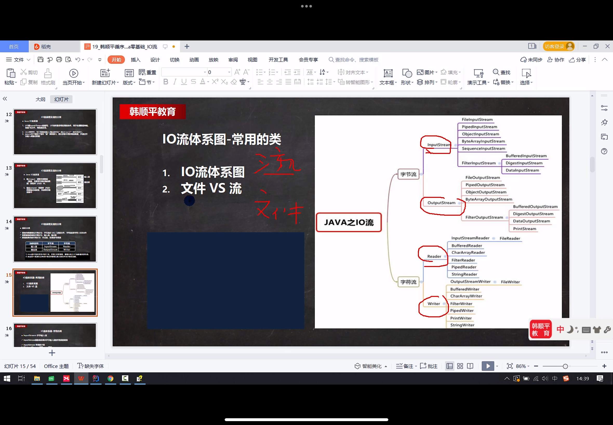
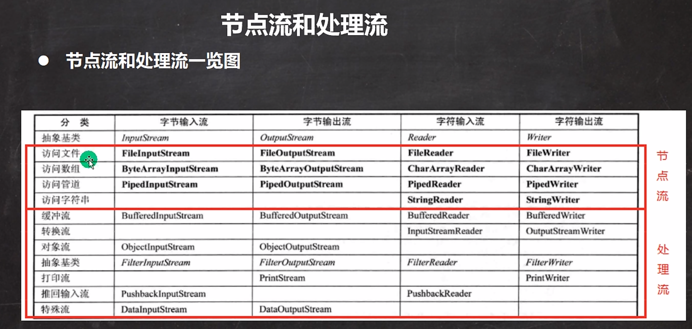
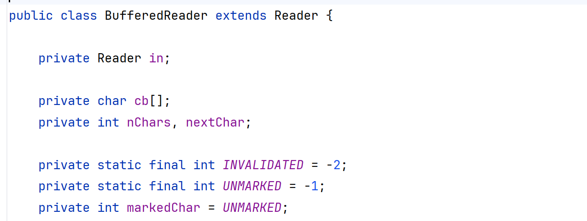
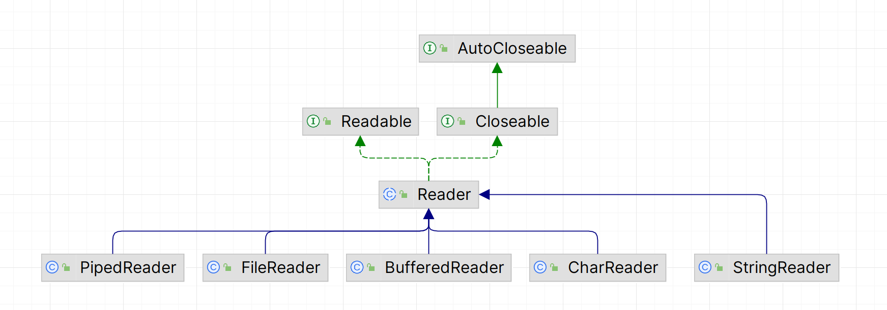
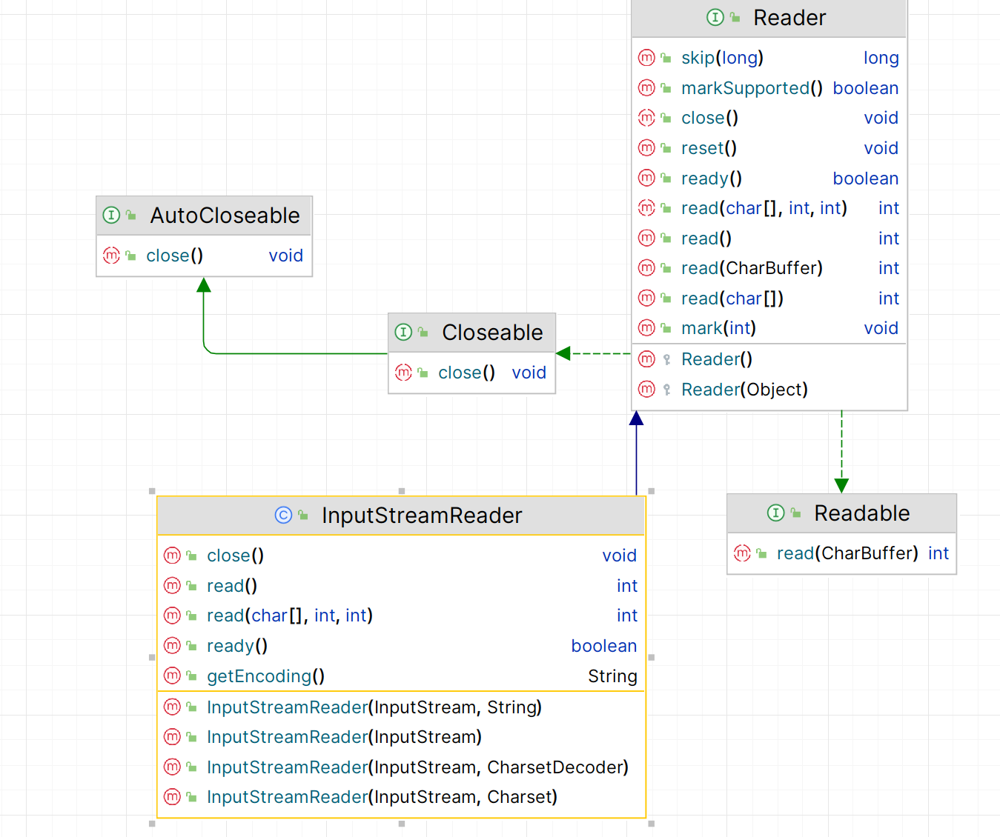

# Java第二阶段-3

## 2024/1/16

之前从去年12/22开始笔记开始中断，这期间去准备了研一上学期的期末考试，并将坦克大战的第三版完成。今天复习了之前所学的容器中的后半部分内容，泛型，事件监听-键盘监听，线程等知识点，从今天起恢复学习。

今天学习了创建文件，查看文件相关信息，文件类常用方法，创建文件目录/多级目录，输入输出流的知识点，文件输入输出流

### 1.创建文件

一共有三种方法，通过调用不同的构造器来实现

1. String：绝对地址

```java
    public static void creat01(){
        //法一：直接通过String赋予地址和文件名
        String filepath="d:\\test01.txt";
        File file = new File(filepath);
        try {
            file.createNewFile();
            System.out.println("文件创建成功");
        } catch (IOException e) {
            throw new RuntimeException(e);
        }
    }
```

2. File+String：父目录文件对象+子文件名

```java
    public static void creat02(){
        //法二：File+String命名（父目录文件+子路径）
        File filepath = new File("d:\\");
        String filename="test02.txt";
        File file = new File(filepath, filename);
        try {
            file.createNewFile();
            System.out.println("文件创建成功");
        } catch (IOException e) {
            throw new RuntimeException(e);
        }
    }
```

3. String+String:父目录名+子文件名

```java
    public static void creat03(){
        //法三：父目录路径+子路径
        String parent="d:\\";
        String child="test03.txt";
        File file = new File(parent, child);
        try {
            file.createNewFile();
            System.out.println("文件创建成功");
        } catch (IOException e) {
            throw new RuntimeException(e);
        }
    }
```

注意：

1. 文件路径名的两种写法`\\`或者`/`
2. 创建文件对象只是暂时保存在内存中，`createNewFile`才是将其写在硬盘上

### 2.查看文件相关信息

包括查看文件绝对路径，文件是否存在，当前是文件还是目录，获取文件名，获取父目录名，获取文件内容字节数

```java
    public void f1(){
        File file = new File("d:\\test01.txt");
        System.out.println(file.getAbsolutePath());    //获取绝对路径
        System.out.println(file.length());    //获取文件内容字节数
        System.out.println(file.isFile());    //判断是否是文件
        System.out.println(file.isDirectory());   //判断是否是目录
        System.out.println(file.exists());     //判断文件是否存在
        System.out.println(file.getParent());   //获取父路径
        System.out.println(file.getName());     //获取文件名
    }
```

### 3.文件类常用方法

使用这些方法的前提是创建File类对象->那么就要指明要操作的文件

1. 删除指定文件

```java
    public void f1(){
        //删除指定文件
        String filepath="d:\\test01.txt";
        File file = new File(filepath);
        if(file.exists()){     //先找再删
            if(file.delete()){     //关键方法
                System.out.println(filepath+"已删除");
            }else{
                System.out.println(filepath+"删除失败");
            }
        }else{
            System.out.println("文件不存在");
        }
    }
```

2. 删除指定目录

目录可以当作文件来看待，所以和删除文件步骤基本一致

```java
    public void f2(){
        //删除指定目录
        String filedictory="d:\\demo";
        File file = new File(filedictory);
        if(file.exists()){
            if(file.delete()){
                System.out.println(filedictory+"已删除");
            }else{
                System.out.println(filedictory+"删除失败");
            }
        }else{
            System.out.println("文件不存在");
        }
    }
```

3. 创建多级目录

```java
    public void f3(){
        //判断多层目录是否存在，不存在则创建
        String fileDictory="d:\\demo\\a\\b\\c";
        File file = new File(fileDictory);
        if(file.exists()){        //先判断再创建
            System.out.println(fileDictory+"已存在");
        }else{
            if(file.mkdirs()){
                System.out.println(fileDictory+"创建成功");
            }else{
                System.out.println(fileDictory+"创建失败");
            }
        }
    }
```

注意：`mkdir`是创建单层目录，`mkdirs`是创建多级目录

### 4.IO流

1. 文件流分为字节流和字符流，字节流以字节为传输单位，适用于二进制文件，字符流以字符为单位，根据不同的编码方式字符单位的大小也不同，适用于文件传输
2. 输出方向上分为输入流和输出流，输入流指由文件->控制台输出，输出流指由控制台->文件

|        | 字节流       | 字符流 |
| ------ | ------------ | ------ |
| 输入流 | InputStream  | Reader |
| 输出流 | OutputStream | Writer |

上面这四个类衍生出一系列类，它们是最根本的，但它们都是抽象类，需要其子类来实现其方法



### 5.文件输入输出流（字节流）

#### 1.文件输入流FileInputStream

* FileInputStream是继承了InputStream的类，也就表明其是以字节为传输单位
* 其作用是从文件读取数据，输出到控制台

```java
    public void f1(){
        FileInputStream fileInputStream=null;
        //int readData=0;
        byte[] rData=new byte[8];
        int len=0;   //记录每一轮实际读取的字节数
        try {
            //创建字节文件流对象
            fileInputStream = new FileInputStream("d:\\test02.txt");
            //read读到空值时会返回-1，否则对应每个字节会返回一个数字
            while((len=fileInputStream.read(rData))!=-1){
                //将读到的整型转为字符型输出
                //这种方式不太好处理中文，一个汉字可能会对应多个字节
                //升级：设置字节数组，一次最多可读取8字节
                //System.out.print((char)readData);
                //输出转换为字符串类型
                System.out.print(new String(rData,0,len));
            }
        } catch (Exception e) {
            throw new RuntimeException(e);
        }finally {
            //读取完毕要关闭文件输入流
            try {
                fileInputStream.close();
            } catch (IOException e) {
                throw new RuntimeException(e);
            }
        }

    }
```

根据上面代码案例总结几点：

1. 关键函数是fileInputStream对象的read方法，该方法通过读底层实现可以获知，当按字节读取时，未读到空值，会返回该字节对应的int值，若读到空值，则返回-1(判断结束的条件)；当按字节数组读取时，会返回该字节数组的有效数组长度，并将读取到的有效字节存储到字节数组中，空值则返回-1
2. String构造器有一个是将字符数组转化为字符串，参数为`(数组，起点，长度)`
3. 要设置finally以关闭IO流

#### 2.文件输出流FileOutputStream

* FileOutputStream是OutputStream的子类，表明其是按字节进行输出
* 作用：将控制台字符输入到指定位置的文件内

```java
    public void f1(){
        FileOutputStream fileOutputStream=null;
        String path="d://test04.txt";
        try {
            //fileOutputStream=new FileOutputStream(path);
            //设置追加而不是覆盖的写法
            fileOutputStream=new FileOutputStream(path,true);
            //写入单个字符
            //fileOutputStream.write('a');
            //设置一次添加多个字符
            String s1="hello";
            fileOutputStream.write(s1.getBytes());
        } catch (Exception e) {
            throw new RuntimeException(e);
        }finally {
            //关闭输出流
            try {
                fileOutputStream.close();
            } catch (IOException e) {
                throw new RuntimeException(e);
            }
        }
    }
```

注意：

1. 创建FileOutputStream对象时可以设置第二个位置的参数append，设置为true表示为追加模式，否则为覆盖模式
2. write方法中接收的是char型字符或者是数组

### 6.文件输入输出流（字符流）

读取方式为字符，比如应对中文，每次就是读入一个字，而字节流在此情况下可能一次读取不了一个字，因为一个字不止一个字节

#### 1.文件输入流FileReader

```java
public void readf1(){
        FileReader fileReader=null;
        int data=0;
        String path="D:\\story.txt";
        try {
            fileReader=new FileReader(path);
            //一次读取单个字符
            while((data=fileReader.read())!=-1){
                System.out.print((char)data);
            }
        } catch (IOException e) {
            throw new RuntimeException(e);
        } finally {
            try {
                fileReader.close();
            } catch (IOException e) {
                throw new RuntimeException(e);
            }
        }
    }

    @Test
    //利用数组，一次读取多个字符,这种方法更快
    public void readf2(){
        FileReader fileReader=null;
        char[] data=new char[8];
        int len=0;
        String path="D:\\story.txt";
        try {
            fileReader=new FileReader(path);
            //一次读取单个字符
            while((len=fileReader.read(data))!=-1){
                System.out.print(new String(data,0,len));
            }
        } catch (IOException e) {
            throw new RuntimeException(e);
        } finally {
            try {
                fileReader.close();
            } catch (IOException e) {
                throw new RuntimeException(e);
            }
        }
    }
```

方法和字节流差不多，只是作用不同，还有一些细节方面不同

#### 2.文件输出流FileWriter

注意这个方法必须要在最后关闭输出流，数据才会成功写入文件

```java
    public void f1(){
        FileWriter fileWriter=null;
        String path="d:\\note.txt";
        char[] data={'h','j'};
        try {
            //通过设置true变为追加模式
            fileWriter=new FileWriter(path,true);
            //fileWriter.write(1);
            fileWriter.write('H');
            fileWriter.write("哈哈哈哈");
            fileWriter.write("你好解耦",0,2);
            fileWriter.write(data,0,1);
        } catch (IOException e) {
            throw new RuntimeException(e);
        } finally {
            //必须要将写入流关闭，才能将数据成功写入，否则就是空文件
            try {
                fileWriter.close();
            } catch (IOException e) {
                throw new RuntimeException(e);
            }
        }
    }
```

***

***

## 2024/1/17

今天学习了节点流和处理流，BufferedReader和BufferedWriter，BufferedInputStream和BufferedOutputStream，对象处理流ObjectOutputStream和ObjectInputStream

### 1.节点流和处理流

* 节点流，即昨天所学的字节/字符的输入/输出流，根据存储/读取文件的不同类型（文件，数组，管道，字符串）实体化不同的对象，将数据和文件进行了一一对应



* 处理流，是节点流的进化版，对节点流进行了封装，该类继承了四个超类之一，其属性中有一个是对超类的实体化（下图以BufferedReader为例，其属性有一个是对Reader类进行了实体化），其构造器可以传入Reader及其子类，这样无论处理的是什么类型的文件，都可以统一进行处理流的实体化，在实体化时设置的参数再是对具体文件类型的实体化（比如我要读取字符流文件，那么具体类型实体化就是`new FileReader(path)`）



* 处理流的优点在于进一步体现了面向对象的思想，降低了不同操作的复杂度，并且可以根据不同类型的操作进行进一步的升级，比如原来一次读一行数据，通过在处理流的具体类中定义新的方法，实现一次可以读多行数据，这其中也体现了动态绑定机制。提供了缓冲功能，类中有数组存储数据（类似于昨天学习的用数组代替单个读取），从而提高效率

### 2.BufferedReader和BufferedWriter

这两个类属于处理流，用于处理字符的输入和输出

#### 1.BufferedReader

下图是BufferedReader类的一个结构图，因为BufferedReader在实体化时包装了一个Reader类对象，也就实现了对具体的文件类型进行操作，也就是说，根据不同情况，包装不同的Reader类的子类对象，但其外部流都是BufferedReader



```java
public class BufferReader01 {
    public static void main(String[] args) {
        String filepath="d:\\story.txt";
        BufferedReader bufferedReader=null;
        try {
            bufferedReader = new BufferedReader(new FileReader(filepath));
            String line=null;
            //readline,一次读一行，返回字符串，读结束返回Null
            while((line=bufferedReader.readLine())!=null){
                System.out.println(line);
            }
        } catch (IOException e) {
            throw new RuntimeException(e);
        } finally {
            //关闭外层，即关闭BufferReader即可
            try {
                bufferedReader.close();
            } catch (IOException e) {
                throw new RuntimeException(e);
            }
        }
    }
}
```

注意：

1. bufferedReader = new BufferedReader(new FileReader(filepath));表明是针对文件进行字符读取
2. `readLine()`是BufferedReader中的一个方法，从缓冲区中一次读取一行数据，并返回字符串
3. 最终关闭外部流即可，底层实现会将Reader的子类进行关闭（以下提到的处理流相关的类都是这样）

#### 2.BufferedWriter

```java
public class BufferWriter01 {
    public static void main(String[] args) throws IOException {
        String path="d:\\ok.txt";
        BufferedWriter bufferedWriter = new BufferedWriter(new FileWriter(path,true));
        bufferedWriter.write("你好");
        bufferedWriter.newLine();
        bufferedWriter.write("syx");
        bufferedWriter.newLine();
        bufferedWriter.close();
    }
}
```

注意：

1. 抛出异常在这种情况下比获取异常要方便
2. `newLine();`表示换行操作
3. `new BufferedWriter(new FileWriter(path,true));`表示对文件进行写入操作，并且是追加的方式

### 3.BufferedInputStream和BufferedOutputStream

这两个类属于处理流，用于对字节进行输入输出操作

```java
public class BufferCopy02 {
    public static void main(String[] args) throws IOException {
        String srcpath="D:\\JUST\\研1\\分享资料\\bhg.png";
        String despath="D:\\bhg.png";
        //利用字节数组进行存储
        byte[] data=new byte[1024];
        int len=0;
        BufferedInputStream bufferedInputStream = new BufferedInputStream(new FileInputStream(srcpath));
        BufferedOutputStream bufferedOutputStream = new BufferedOutputStream(new FileOutputStream(despath));
        while((len=bufferedInputStream.read(data))!=-1){
            bufferedOutputStream.write(data,0,len);
        }
        bufferedInputStream.close();
        bufferedOutputStream.close();
    }
}
```

上述例子是用两个类对文件进行了拷贝操作，因为基本和第二大点一致，只是一个是针对字符。一个是针对字节，所以不再详细记录

### 4.对象处理流

* 因为在存储数据时，符合常规的思想是既存储了数据，也存储了数据对应的类型，也就出现了将数据进行对象形式传输的方法，根据输入和输出分为ObjectOutputStream和ObjectInputStream
* 这种将数据及其类型进行存储的方式叫做序列化，反之称为反序列化

#### 1.ObjectOutputStream

```Java
public class ObjectOutputStream_ {
    public static void main(String[] args) throws Exception {
        String path="d:\\data.dat";
        ObjectOutputStream objectOutputStream = new ObjectOutputStream(new FileOutputStream(path));
        objectOutputStream.writeInt(1);
        objectOutputStream.writeBoolean(true);
        objectOutputStream.writeDouble(0.9);
        objectOutputStream.writeUTF("hello");    //存储String类型用writeUTF

        //以上几个都是实现了Serializable的类，存储时会自动装箱
        //必须是实现了Serializable接口的类才能进行序列化操作
        objectOutputStream.writeObject(new Dog(10,"hxy","白色",2));
        objectOutputStream.close();
    }
}

//其中的自定义Dog类
public class Dog implements Serializable {
    private int age;
    private String name;
    private static final long serialVersionUID=1;   //版本控制，当该类出现修改时，无需重新序列化和反序列化
    private transient String color;
    private static int add;

    public Dog(int age, String name,String color,int add) {
        this.age = age;
        this.name = name;
        this.color=color;
        this.add=add;
    }

    @Override
    public String toString() {
        return "Dog{" +
                "age=" + age +
                ", name='" + name + '\'' +
                '}'+color+add;
    }

    public void shout(){
        System.out.println("goujiao");
    }
}

```

####2.ObjectInputStream

```java
public class ObjectInputStream_ {
    public static void main(String[] args) throws Exception {
        String path="d:\\data.dat";
        ObjectInputStream objectInputStream = new ObjectInputStream(new FileInputStream(path));
        //要符合序列化时的输入顺序
        System.out.println(objectInputStream.readInt());
        System.out.println(objectInputStream.readBoolean());
        System.out.println(objectInputStream.readDouble());
        System.out.println(objectInputStream.readUTF());
        Object object = objectInputStream.readObject();
        System.out.println(object.getClass());
        System.out.println(object);
        Dog dog=(Dog)object;  //向下转型
        dog.shout();
    }
}
```

#### 3.注意细节

1. 所有存储的类都必须实现了Serializable这个接口，即可序列化
2. 自定义的类必须以public形式放在合适的位置，方便输入和输出同时共享。否则在反序列化时，想将自定义类进行向下转型，是找不到自定义类的位置的
3. 读取数据（反序列化）时，必须和输入数据的类型顺序是一致的，否则报错
4. 像`objectOutputStream.writeInt(1)`这些类中自带的方法，都会将数据进行装箱，而`Integer`类是实现了Serializable这个接口的，所以序列化成功
5. 自定义类中所有的属性必须都实现了Serializable这个接口，比如将别的类当作该类属性时，若别的类未实现接口，则序列化失败
6. 带有terminant和static修饰的属性是不会进入序列化的
7. 若自定义类中有所改动，则反序列化会失败，要重新序列化才可以。另外一个办法是在自定义类中加上`private final long seriaVersionUID`这个属性，表示版本号

***

***

## 2024/1/18

今天学习了标准的输入输出流，字节流转换为字符流

### 1.标准的输入输出流

1. System.out是输出流，其编译和运行类型都是PrintStream
2. System.in是输入流，其编译类型是InputStream，运行类型是BufferedInputStream

### 2.字节流->字符流

要转换的原因是，有的文件并非是按UTF-8编码，那么在读文件内容时可能就会乱码，此时需将字节流转为字符流（更好地读取中文），并选取恰当的编码方式，从而避免乱码

#### 1.输入转换InputStreamReader

* 根据名字就可以记住该类的功能，进行文件的读取，将字节流转为字符流
* 只能由字节->字符是由该类下的构造器的参数所决定的，第一个参数只能是InputStream类及其子类的对象，而InputStream对应的就是字节输入流
* 构造器的第二个参数了决定的编码的类型，这在读文件时是关键，只有和文件存储时的类型一致，才能不乱码



```java
public class transform01 {
    public static void main(String[] args) throws Exception {
        String path="d:\\note.txt";
        //将FileInputStream转为InputStreamReader,实现将字节流转换为字符流
        //因为其第一个参数要求是InputStream类及其子类，所以该位置参数只能是字节流
        //设置编码方式
        InputStreamReader inputStreamReader = new InputStreamReader(new FileInputStream(path),"gbk");
        //交给处理流去读取数据，效率更高
        BufferedReader bufferedReader = new BufferedReader(inputStreamReader);
        String s = bufferedReader.readLine();
        System.out.println(s);
        bufferedReader.close();
    }
}
```

上述代码在转换完成后还交给处理流去进行输出，可见面向对象思想的重要性

#### 2.输出转换OutputStreamWriter

* 同样根据名字看功能，用字符流替换字节流，将数据输出到文件内
* 该类的构造器也可以指定编码类型，用于定义文件的编码方式

```java
        //字节流->字符流，然后存储到文件中
        String path="d:\\note2.txt";
        OutputStreamWriter osw = new OutputStreamWriter(new FileOutputStream(path), "utf8");
        osw.write("hello!你好");
        osw.close();
```

注意：若设置了gbk编码，但输入文件的内容中不含中文，则文件还是默认是utf-8的编码方式

***

***

##2024/1/19

今天学习了标准输出流，Properties对文件的操作，并完成了该章节的习题

### 1.标准输出流

昨天是了解了一下概念，今天是学习了一些运用

#### 1.字节输出流PrintStream

* 进一步加深了对System.out.println的理解，System.out是输出到控制台上
* 可通过设置输出的地址输出到不同的地方

```java
        //System类下的out是PrintStream类对象
        PrintStream out=System.out;
        out.println("hello");
        //println底层调用的是write方法，因此这两个方法是一样的，只是输入参数类型不同
        out.write("hello".getBytes());

        //重新设置输出路径
        System.setOut(new PrintStream("d:\\f1.txt"));
        System.out.println("hellosyx");
        PrintStream printStream = new PrintStream(new FileOutputStream("d:\\f2.txt"));
        printStream.println("hhhh");
```

#### 2.字符输出流PrintWriter

主要还是学了个修改输出位置，从而将内容输入文件

```java
        PrintWriter printWriter = new PrintWriter(new FileWriter("d:\\f3.txt"));
        printWriter.println("字符输入流");
        printWriter.close();  //用完一定要关闭
```

### 2.Properties类

* Properties类是HashTable下的一个类，可方便地对键值对的文件进行修改，存储，查找操作，方便地修改这些配置类文件
* Properties类操作的文件内容必须是有=号的，即“键”=“值”

1. 读取文件

```java
        //1.实体化类对象
        Properties properties = new Properties();
        //2.将内容载入对象中
        properties.load(new FileReader("src//mysql.properties"));
        //3.选择将内容输出到控制台上
        properties.list(System.out);
        String user = properties.getProperty("users");
        System.out.println(user);
```

2. 修改，存储文件

```java
        Properties properties = new Properties();
        properties.setProperty("add","wanke");
        properties.setProperty("phone","11234");
        properties.store(new FileWriter("src\\mysql02.properties"),null);
```

注：

1. 若修改的键是不存在的，那就变成增加功能
2. store方法的第二个参数表示在存储文件中的备注，不填就写null

***

***

## 2024/1/20

今天开始坦克大战第五版，完成了避免敌方坦克相撞这一个功能模块，下面整理一下思路，总结我做错的几个地方

1. 碰撞是两个敌方坦克之间的时->涉及到遍历敌方坦克的容器，但需要注意不能自己和自己比较，要不然永远相撞
2. 判断相撞的范围，既包括上界，也包括下界。我一开始写只限制了上界，导致坦克一直在抖动换方向（也和1有关）
3. 在敌方坦克类中定义了坦克容器（之前是在Mypanel.java中就已经定义的），通过set的方式为每个敌方坦克对象都输入了敌方坦克容器这么一个属性，一是方便进行判断，单独拿出来写一个函数的话需要双重循环，这样通过this调用一个敌方坦克，少掉一重循环。二是方便针对每个敌方坦克进行碰撞判断
4. 将碰撞检测写在了敌方坦克每过一段时间就换一次方向的方法里，这是我未曾想到的
5. 面对两个敌方坦克，选取一个坦克作为主视角，自己共有上下左右四种方向，另外一个坦克可分为上下和左右移动两种情况，因为上和下都是一个维度的移动，必然会根据主视角的移动方向在重叠时会撞到某个角（比如主视角为上，另一个坦克上下移动，那么有可能会碰撞的就是左上角和右上角），思路理清楚之后，一共有八种情况

***

***

## 2024/1/22

今天继续坦克大战第五版，完成了记录击败坦克数量并在当局结束时记入文件模块，复现上一把游戏模块


