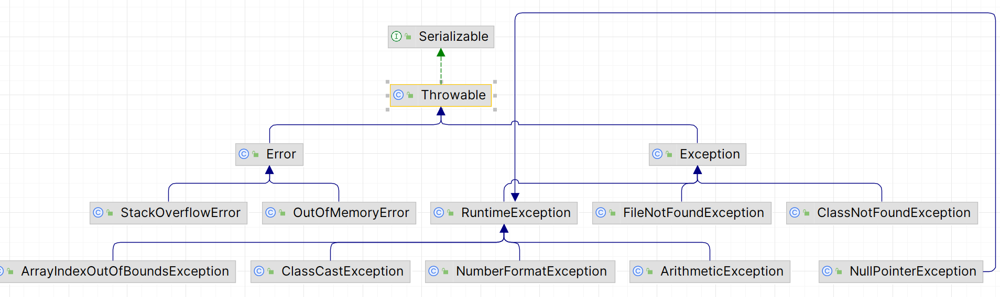
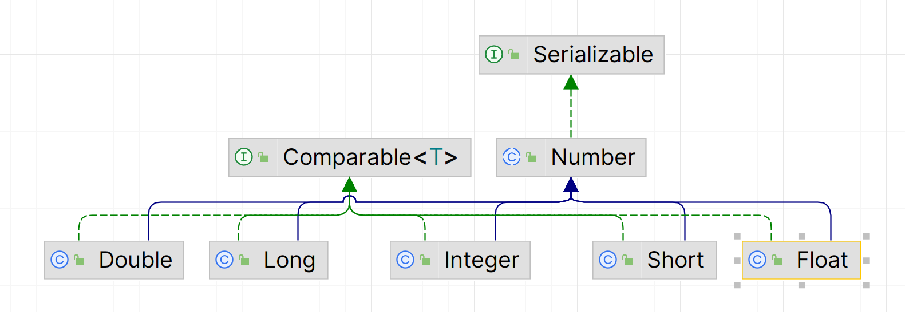
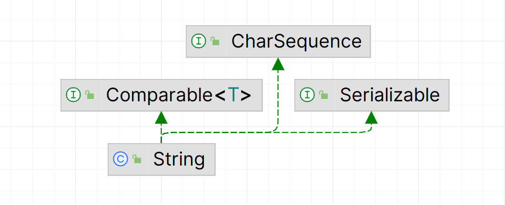
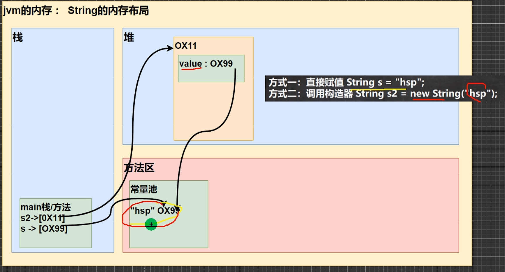
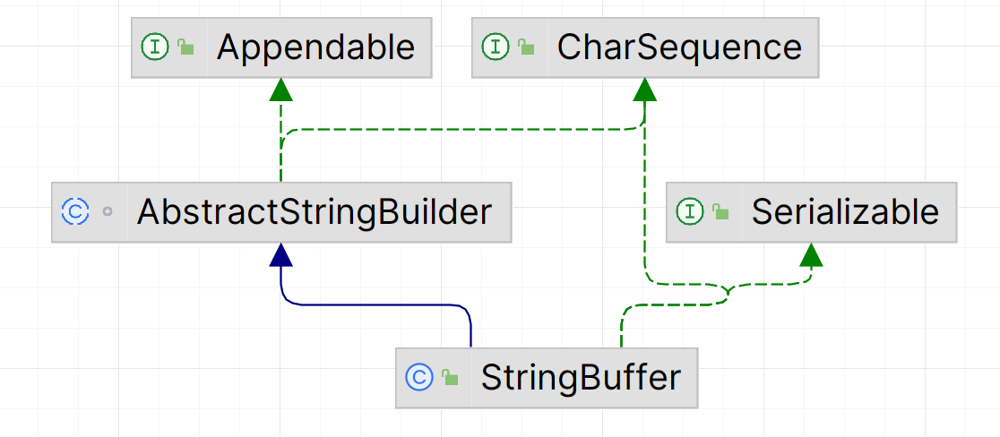
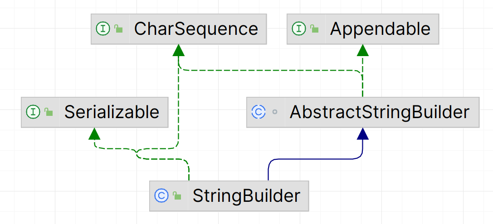

# Java第二阶段

## 2023/11/8

### 1.类变量（静态变量）

* 类变量又称静态变量，在声明时加入static即可，定义在一个类内

* 所有类成员共享类变量的值
* 类变量在类成员创始时就已经建立，存储于堆中，堆中所有的类成员都指向它，从而达成共享。并且只创建一次，后续再有对象实例化，该变量是不会再赋初值的
* 调用类变量，直接用`类名.类变量`即可，而不需要用类成员调用

```java
public static int num;
```

***

***

## 2023/11/9

今天学习了类方法，main函数，代码块

### 1.类方法（静态方法）

类方法又称静态方法，具有关键字static

#### 		1.类方法的定义

```
访问修饰符 static 返回值类型 方法名()
例：
public static void f1()
```

#### 		2.类方法的便利之处

当希望不用实体化对象就调用其中的方法时，可以用到类方法

#### 		3.类方法的注意点

1. 静态方法内部无法使用this,super
2. 静态方法无法调用非静态成员，而普通方法既可以调用非静态成员，也可以调用静态成员（成员包含了类中的属性，方法）
3. 若想在静态方法中调用非静态成员，需要先创建类对象，再通过类对象访问非静态成员

### 2.main函数

main函数是Java虚拟机执行程序的入口

#### 		1.main函数的形式

```java
public static void main(String[] args){}
```

#### 		2.main函数分析

```
public:想要Java虚拟机能够访问，访问权限必须为public
static:Java虚拟机无需生成对象就能访问main函数
void:返回值类型无所谓
String型数组args:可以在设置中自己设置Edit configurations带入什么参数，
```

由此看来，main函数具有静态函数的一切性质，这里不再重述

### 3.代码块

代码块主要用于对构造器内容的补充，**这块知识点很难，概念性东西偏多，需要掌握牢固**

#### 1.代码块的基本形式

```
[修饰符]{
代码内容
}
```

修饰符只能是static，称为静态代码块。要不然就不写，称为普通代码块

#### 2.静态代码块和普通代码块的区别

1. 在生成多个类对象时，普通代码块每生成一个都会调用一次，而静态代码块仅会调用一次
2. 静态代码块中仅能调用静态成员，而普通代码块都可以
3. 静态代码块会在类加载时执行，而普通代码块在生成类对象时才会执行。

#### 3.类加载

类加载分为三种情况：

1. 生成类对象
2. 创建子对象实例，父类也会被加载
3. 直接调用静态成员时会加载

#### 4.生成对象时，其类中的调用顺序

指的是在不考虑有继承的情况下，静态代码块，静态成员变量初始化，普通代码块，普通成员变量初始化，构造器的调用顺序。

初始化：指成员变量在定义时未赋值，通过后续方式动态赋值

1. 静态代码块和静态成员属性的初始化,若两个同时存在或有多个，根据定义顺序来调用（需注意，静态成员属性的初始化不会显性地告诉你先被调用了，需在初始化函数中加入显式的语句，从而可以验证调用顺序。静态代码块也是同理，不要因为自己没显性提示，就认为顺序出错）

2. 普通代码块，普通成员变量初始化

3. 构造器

稍后在第六条分析原理

#### 5.在继承情况下，生成对象类中的调用顺序

1. 父类的静态代码块和静态成员属性的初始化
2. 子类的静态代码块和静态成员属性的初始化
3. 父类的普通代码块和普通成员属性初始化
4. 父类构造器
5. 子类的普通代码块和普通成员属性初始化
6. 子类的构造器

#### 6.对于调用顺序的分析

1. 首先是类的加载，这会运行静态代码块和静态成员变量的初始化
2. 然后才到创建类对象，创建类对象，就会调用该类的构造器，而构造器中还有隐藏语句(以person类为例)

```
public person(){
	//super();
	//普通代码块
	其他构造代码
}
```

因此大致的调用顺序就为：静态->普通->构造器，当存在继承关系时，则会一直往上索引父类，将顶部父类到当前子类的所有静态执行完成（类的加载），然后是执行父类的普通+构造器，后来才是逐步往下执行子类的普通+构造器

***

***

## 2023/11/10

今天学习了单例模式的两种经典模式，final关键词的使用

### 1.单例模式

单例模式，保证一个类中只有一个实例，且在类中自己创建，根据创建的不同时机分为饿汉模式和懒汉模式，可以有效地节省系统的资源

#### 1.饿汉模式

1. 实现方法（以person类为例）

```
1.创建私有构造器,从而让外部无法生成该类的对象
private person(){}
2.直接在类内创建唯一的静态类对象,这里设置静态的目的是让静态方法能够调用
private static person p1=new person()
3.创建静态类方法，返回静态类对象，这是外部能够调用的唯一途径
public static person getInstance(){
	return p1;
}
```

2. 饿汉模式的特点

在类加载的时候，类就已经初始化了(不管以后用不用都存在)

3. 饿汉模式缺点

若该类后面没用到，则浪费了系统资源

#### 2.懒汉模式

1. 实现方法（以person类为例）

```
1.创建私有构造器,从而让外部无法生成该类的对象
private person(){}
2.创建静态类对象，但不初始化
private static person p1
3.创建静态类方法，返回静态类对象
public static person getInstance(){
	if(p1==null)
		p1=new person();
	return p1;
}
```

2. 懒汉模式优点

只有在调用类方法时，才会创建对象

3. 懒汉模式缺点

多线程下可能会出现问题，同时进入类方法的if语句，从而创建了多个类对象

#### 3.两种单例模式的比较

* 两种方法都仅创建一次类对象，后面再调用时赋的都是同一个类对象
* 结构基本相同，私有构造器+私有静态对象+公有静态方法，不同之处，也是最重要的地方在于类对象的实例化时间点不同。

### 2.final

final可以作为类，类成员属性/方法，普通属性的前缀，且会起到不同的作用

1. 修饰类，可以使该类称为最终类，其他类无法继承。但该类还是可以生成类对象的

2. 修饰类成员属性，使其无法被修改
3. 修饰类成员方法，使其子类无法对该方法进行重写。但子类的类对象还是可以调用父类的该final成员方法的
4. 修饰普通成员属性，使其无法被修改

#### 1.final修饰的成员属性初始化方式

1. 定义时赋值

```java
private final int a=10;
```

2. 通过构造器赋值

```java
private final int b;
public AA(int b){this.b=b;}
```

3. 通过普通的代码块赋值

```java
private final int c;
{
    this.c=20;
}
```

#### 2.final修饰的静态成员属性初始化方式

1. 定义时赋值

```java
private final static int a=10;
```

2. 在静态代码块中赋值

```java
private final static int a;
static{
	a=20;
}
```

注意：final修饰的静态成员属性不可以在普通代码块/构造器中赋值，因为静态成员是要在类加载时就要启动的，而普通代码块和构造器是在创建对象时才生成。

#### 3.final+static

两者的结合，可以避免类加载

***

***

## 2023/11/12

今天学习了类抽象，接口（入门）

### 1.类抽象

适用于每个子类都需要使用的方法，在父类却毫无作用时，可以将父类的方法进行抽象(抽象方法，即不含方法体{}的方法)

1. 定义

```
abstract class person{
	public abstract void f1();
}
```

2. 细节

* 抽象方法必须包含在抽象类内
* 抽象类中可以有任何形式的属性/方法，而不仅仅限于抽象方法
* 抽象类是无法被实体化的
* 子类必须重写抽象父类的抽象方法，否则只能将子类也变为抽象类
* abstract只能修饰类和方法
* abstract不能和private同时出现，否则子类根本无法访问父类的这个抽象方法
* abstract不能和final同时出现，否则子类无法重写父类的这个抽象方法
* abstract不能和static同时出现，static作用的是当前类成员，而不在于实体类或方法，abstract意图在于必须让子类进行重写，两者的意图对象完全不同

3. 抽象类/方法的应用

模板设计模式，将子类都会用到的不用修改的方法写在抽象类中，将子类都会用到但每个类对应的参数不同的方法将其抽象写在抽象类中（结合了动态绑定机制，在抽象类中声明，子类中重写，运行哪个看运行对象）

***

***

## 2023/11/13

今天学习了接口，内容很多，有和多态相似的地方，是个很重要的部分。还学了内部类（入门）

### 1.接口

* 接口，可以用于定义一些属性，方法以及尚未实现的方法，即抽象方法，然后交给类去实现该接口
* 接口可用将多个类定义的同功能但不同名的方法进行统一化，从而方便上级直接调用，直接使用统一的方法名即可

#### 1.接口的定义

```java
interface 接口名{}
```

接口中可以存放属性，方法，抽象方法，这其中的细节后面单独列小块去讲

#### 2.接口的实现

用类去实现接口，若接口中有抽象方法，则必须在类中进行重写，否则只能将实现接口的类定义为抽象类

```java
interface A{
    void work();
}
class person implements A{
    @override
    public void work(){
    }
}
```

#### 3.接口中可以定义的三种方法

普通方法，静态方法和抽象方法

```java
 //1.定义抽象方法,在接口中可不声明abstract
    public void f1();

    //2.定义普通方法,但需要用default修饰
    default public void f2(){}

    //3.定义静态方法
    public static void f3(){}
```

#### 4.接口中定义方法的细节

接口中定义的方法是默认包含`public static`属性的，因此可以不用显性地声明，还可以用`接口名.方法名`的方式直接调用

#### 5.接口中定义属性的细节

接口中定义的属性是默认包含`public static final`属性的，因此：

1. 不可修改
2. 可用`接口名.属性名`直接调用

#### 6.接口的一些细节

1. 接口是不能被实例化的
2. 用类来实现接口时，接口下的属性也可以为类所调用
3. 用类来实现接口时，将鼠标放在那句话上，按`shift+alt+enter`可以快速实现对接口的抽象方法的重写（加了个方法体，具体内容还是要自己写的）
4. 一个类可以实现多个接口
5. 一个接口可以继承多个接口

#### 7.接口VS继承

* 接口与接口之间是继承(extends)的关系，类与接口之间是实现(implements)的关系
* 接口和继承很像，都可以实现抽象的方法。继承是学得父类的成员，接口是学得额外的属性/方法，类似于扩展学习
* 继承是is，接口是like。举个例子，我是猴子，我天生会爬树，这是继承，我通过后天的学习学会了游泳，这是接口

#### 8.接口的多态特性

可以对照类的多态特性，比如类的多态数组，多态参数，动态绑定机制等等，接口都是有的

1. 多态参数

体现在方法传参上，和之前所学多态参数类似，形参用接口名，实参用实现接口的类名

```java
main函数：
    person p1=new person;
	f1(person);      //实参为类名。执行person类中的work函数

//多态参数
void f1(Interface interface){
	interface.work();
}
//接口A
interface A{
    void work();
}
//类person实现接口A
class person implements A{
    public void work(){
        .......
    }
}
```

2. 多态数组

体现在数组赋值上，和之前所学多态数组类似，定义数组类型用接口名，传入数据是实现接口的类

```java
I_1[] num=new I_1[2];          //I_1是接口，person1,person2是实现该接口的类
num[0]=new person1("jack");
num[1]=new person2("tom");
```

3. 动态绑定机制

体现在创建对象上  用接口定义的变量名指向实现接口的类对象实例

```java
I_1 p1=new person1("jgno");
```

**注**：不止这三个，多态有的特性，接口基本上都有，可以对标

#### 9.接口多态传递

假设有两个接口I_2,I_3,一个类person

```java
interface I_2{
    void work();
}
interface I_3 extends I_2{}

class Teacher implements  I_3{
    @Override
    public void work() {

    }
}
```

因为接口I_3继承了接口I_2，所以实现接口I_3的类Teacher也要去重写接口I_2的抽象方法。这么继承之后，接口I_2定义的参数名也可以指向实现接口I_3的类Teacher的类实体

```
I_2 per=new Teacher();
```

***

### 2.内部类

字面意思，设置在类中的类，一共有四种，今天学了第一种局部内部类，先行记录

```java
class A{}    //外部其他类
class B{     //外部类
	class C{}    //内部类
}
```

#### 1.局部内部类

定义在外部类中的局部区域的类，局部区域一般指方法或者代码块

1. 定义

```java
class A{
	public void f1(){
		class B{
		
		}
	}
}
```

2. 使用细节

* 局部内部类的有效范围仅限在当前方法/代码块中，在外部类和外部其他类中是无法实例化的
* 局部内部类中可以直接调用外部类的成员，包括私有的
* 外部类中想要调用局部内部类的成员，只能在局部内部类所在的方法/代码块中创建局部内部类的对象，然后再调用其成员
* 若外部类和局部内部类都定义了同名变量，输出时根据就近原则。若想调用外部类的该变量，使用`外部类名.this.变量名`的方式进行输出；`外部类名.this`本质上等于外部类的实体化对象名
* 局部内部类的访问修饰符只能声明为final或者默认，因为外部类中可以不止一个内部类，防止其他内部类继承该类

***

***

## 2023/11/14

今天学习了匿名内部类，成员内部类，属于内部类的第二种和第三种，今天承接昨天的序号去记录

### 1.内部类

#### 2.匿名内部类

* 说它匿名，是因为他的对象名是在系统起的，并且在底层运行完成，和表面上写的代码有些不一样，接下来也从表面和系统底层两方面进行讨论
* 匿名内部类用两种形式，一是实现了接口的匿名内部类，二是继承了某类的匿名内部类
* 匿名内部类的作用在于，一般要实现接口的方法或是类的抽象方法时，都需要新写一个类来implements/extends，才能够进行重写，后面若不再用，会造成资源浪费，而匿名内部类弥补了这一缺点，而且很便捷

1. 实现了接口的匿名内部类

这部分代码也包含了底层实现，实际上是根据外部类的`类名+$+数字`的方式定义的匿名内部类的类名，由他实现了接口IA，并将地址返回给了IA型对象cat

```java
class Animal{
    private String name;
    public void f1(){
        //1.基于接口的匿名内部类(implements)
        //匿名内部类，也是定义在外部类中的局部部分
        //适用于：实现接口必须要用类去implements，而这些类用一次就不用了->浪费资源，->匿名内部类很方便
        //在jdk底层，是立即生成了一个名为Animal$1的匿名内部类，并将地址返回给cat
        /*
        底层实现：
        class Animal$1 implements IA{
            @Override
            public void cry() {
                System.out.println("小猫叫");
            }
        }
         */
        //匿名内部类使用一次之后就不能再使用了，但其生成的对象可以反复使用。即不能用new IA赋给新的变量名
        //编译对象是IA，运行对象是Animal$1
        IA cat=new IA() {
            @Override
            public void cry() {
                System.out.println("小猫叫");
            }
        };
        cat.cry();
        System.out.println("cat的运行类型"+cat.getClass());
    }
}
interface IA{
    void cry();
}
```

2. 继承了某类的匿名内部类（在本例中为father类）

```java
class Animal{
    private String name;
    public void f2(){
        //基于类的匿名内部类(extends)
        /*
        底层代码：  Animal$2是系统根据外类名自动生成的->匿名
        class Animal$2 extends father{
            @Override
            public void work() {
                System.out.println(getName()+"在工作");
            }
        }
         */
        //本质上是生成了一个类
        //编译对象是father，运行对象是Animal$2
        //与生成father类对象唯一的不同就是多了{};
        father son=new father("小明"){
            @Override
            public void work() {
                System.out.println(getName()+"在工作");
            }
        };
        //别忘了用对象名去调用重写的方法
        son.work();
        System.out.println("son的类型是"+son.getClass());
        //若是基于抽象类的匿名内部类，则必须要重写抽象类的抽象方法
        monkey m1=new monkey() {
            @Override
            void f1() {
                System.out.println("小猴子");
            }
        };
    }
}

class father{
    private String name;

    public father(String name) {
        this.name = name;
    }

    public void work(){

    }

    public String getName() {
        return name;
    }

    public void setName(String name) {
        this.name = name;
    }
}
```

3. 匿名内部类的细节

有些在上面的代码注释中已经提到，这里进行一个总结

* 匿名内部类返回的是一个对象（这点和局部内部类不同，后者创建的是一个类，还需要实体化）
* 匿名内部类只能在外部类中的局部区域中
* 匿名内部类的作用就在于能够方便地重写接口/父类的抽象方法
* 匿名内部类可以直接访问外部类的成员，包括私有的
* 生成匿名内部类时，左边的编译对象是接口/父类，右边的运行对象是所在的外部类名的加上`$数字`的形式，而返回的就是运行对象生成的对象（这里要是看不懂，去看上面代码中的注释）

```
IB ib=new IB(){};
```

* 匿名内部类与外部类有重名属性时，也遵从就近原则，也用`外部类名.this.属性名`的方式调用远的重名属性

4. 调用匿名内部类的方法的两种方式

* 第一种，将匿名内部类对象赋给一个成员名，通过`成员名.方法名`的方式进行调用

```java
例：
father son=new father("小明"){
    @Override
    public void work() {
    	System.out.println(getName()+"在工作");
	}
};
son.work();
```

* 第二种，因为匿名内部类返回的是对象，直接通过`对象.方法名`的方式进行调用

```java
例：
new father("小明"){
    @Override
    public void work() {
    	System.out.println(getName()+"在工作");
	}
}.work();
```

5. 匿名内部类的运用

项目中，将匿名内部类当作方法的实参（实现了接口的对象）去使用，形参是接口

```java
public class AnonymousInnerClassExercise01 {
    public static void main(String[] args) {
        //匿名内部类可作为方法的参数传参（类似于接口多态传递）
        f1(new IB() {
            @Override
            public void work() {
                System.out.println("。。。");
            }
        });
    }

    public static void f1(IB ib){     //形参是IB接口
        ib.work();
    }
}

interface IB{
    void work();
}
```

#### 3.成员内部类

1. 定义形式

成员内部类可写在外部类中的成员位置上，因此对于外部类，可以将其当作成员看待，只不过这个成员是个类

```
class A{
	class B{}
}
```

2. 成员内部类的细节

* 外部类中可以实体化成员内部类，从而调用其成员
* 成员内部类中可以直接调用外部类成员，包括私有
* 符合就近原则那一套（上面写了两遍了）

3. 在外部其他类中调用成员内部类的两种方法

* 第一种，先实例化外部类，再通过外部类对象实例化内部类

```java
//假定Outer为外部类，Inner为内部类，Main为外部其他类
class Main{
	Outer outer=new Outer();
    outer.Inner inner=outer.new Inner();
}
```

* 第二种，通过在外部类中写一个方法，返回成员内部类的对象

```java
class Outer{
    class Inner{}
	public Inner getinstance(){
        return new Inner();
    }
}
class Main(){
    Outer outer=new Outer();
    outer.Inner inner=outer.getinstance();
}

```

但这两种方法都逃不过要创建外部类对象这一关

***

***

## 2023/11/15

今天学习了静态内部类，枚举类

### 1.内部类

#### 4.静态内部类

定义在外部类中的用static修饰的成员内部类，方便外部类直接调用

1. 定义形式

```java
class Outer{
	static class Inner{}
}
```

2. 静态内部类的细节

* 因为用static修饰，所以包含了静态的所有特性（通过类名直接调用，内部只能存储静态成员等）
* 静态内部类可以直接访问外部类的静态成员，包括私有的，但不能访问非静态的
* 外部类访问静态内部类成员，先生成对象，再访问
* 遵从就近原则，但调用较远的同名元素方式不同，`外部类名.属性名`即可，因为要相同，那么两个属性必然是静态类型，那么通过类名可以直接调用
* 静态内部类的访问权限四种都可以

3. 外部其他类访问静态内部类的两种方式

因为是静态的，所以相比成员内部类要方便一些，不需要实体化外部类

* 第一种，通过`外部类名.内部类名`的方式调用

```java
//假定Outer为外部类，Inner为内部类，Main为外部其他类
class Main{
	Outer.Inner inn=new Outer.Inner();
}
```

* 第二种，通过在外部类中写一个方法，返回静态内部类对象

#### 5.总结

至此，四种内部类就学完了，其中最重要的是匿名内部类，难理解且应用多

* 局部，匿名是定义在外部类的局部部分中
* 成员，静态是定义在外部类的成员位置上

定义位置的区别也就限定了实体化的范围不同，这四种还有许多相似点/区别，这里不再总结，去上面对比着看

### 2.枚举类

枚举类分为两种，一是自定义的枚举类，二是用关键词enum定义的枚举类，其中一是二的底层实现

#### 1.枚举类的好处

一般的类，需要在函数中自己实例化，定义类的变量名，若超出了原先想要构造这个类的初衷（取了不该取的名字，加了不正确的描述等），这些都是不可控的，而枚举类，就是在定义类时构造好了几个对象，且将构造器私有化，这样外部就只能使用已经枚举出的对象。

#### 2.自定义的枚举类

一共三步：

1. 构造器私有化
2. 对于类的成员，只允许读不允许写
3. 在类的内部定义`public static final`型的类对象

public:允许其他类调用

static:可通过类名直接调用

final:与static结合，延迟类加载，优化底层

例子如下：

```java
class Season{
    private String season;
    private String desc;

    //1.构造器私有化
    private Season(String season, String desc) {
        this.season = season;
        this.desc = desc;
    }

    //2.只能读取不能修改数据
    public String getSeason() {
        return season;
    }

    public String getDesc() {
        return desc;
    }

    //3.直接在类内创建静态对象
    //static+final 避免类加载，底层优化
    /*
    避免类加载的主要目的之一是延迟对类的初始化，从而提高程序的性能。
    在某些情况下，如果一个类的初始化开销较大，而且可能在程序运行的早期阶段并不需要使用，
    延迟加载可以减少不必要的性能开销
     */
    public static final Season SPRING=new Season("春天","温暖");
    public static final Season SUMMER=new Season("夏天","炎热");
    public static final Season AUTUMN=new Season("秋天","凉爽");
    public static final Season WINTER=new Season("冬天","寒冷");

    @Override
    public String toString() {
        return "Season{" +
                "season='" + season + '\'' +
                ", desc='" + desc + '\'' +
                '}';
    }
}
```

这样定义，在别的函数中，就可以通过`类名.对象名`的方法，直接调用枚举对象

#### 3.用enum定义的枚举类

本质上，该类是继承了Enum类

有以下几个修改的地方：

1. class改为enum
2. `public static final Season SPRING=new Season("春天","温暖");`改为`SPRING("春天","温暖")`,即枚举类名(实参)的形式

具体案例如下：

```java
enum Season2{
    //枚举对象必须写在首部，有多个时，用逗号间隔
    SPRING("春天","温暖"),   //由括号内的参数决定调用哪个构造器
    what,           //当创建的枚举对象不含参数时，可以不写括号,也可以写
    SUMMER("夏天","炎热");
    private String season;
    private String desc;

    //1.构造器私有化
    private Season2(String season, String desc) {
        this.season = season;
        this.desc = desc;
    }

    private Season2(){}

    //2.只能读取不能修改数据
    public String getSeason() {
        return season;
    }

    public String getDesc() {
        return desc;
    }

    @Override
    public String toString() {
        return "Season{" +
                "season='" + season + '\'' +
                ", desc='" + desc + '\'' +
                '}';
    }
}
```

#### 4.enum定义的枚举类的细节

1. 枚举对象的定义必须写在最前面，否则报错
2. 有多个枚举对象时，中间用逗号分隔，最后一个加上分号
3. 枚举对象的实参个数，是和构造器的参数个数相匹配的，在底层也就是借用构造器创建了枚举类对象，因此需要赋予不同个数的实参时，就要有对应的不同的构造器
4. 枚举对象没有实参时，括号可有可无
5. 因为枚举类隐式地继承了Enum类，因此不能再继承其他类
6. 枚举类也是类，可以实现接口

#### 5.父类Enum的一些方法

因为枚举类继承了父类，自然也就可以使用父类的方法。枚举类的定义见上面的Season2

1. name() 返回当前枚举对象的名字

```java
Season3 sum=Season3.SUMMER;
//name()  返回当前类对象所属的类名
System.out.println(sum.name());   //SUMMER
```

2. values() 返回枚举类中已经定义的枚举对象，以数组形式

这里还学了一个for循环的高级形式`for(a:b)`选取数组b中的当前元素赋给a，他是自动往下的

```java
Season3[] values = Season3.values();
for(Season3 season:values){   //强for循环
	System.out.println(season);
}
```

3. valuesOf() 将括号内的字符串转为枚举对象名去查找，若存在则返回相应对象，不存在则报错

这类似于查找并返回枚举对象，和1区分，1是赋值

```java
Season3 spr=Season3.valueOf("SUMMER");
System.out.println(spr);
```


4. compares() 对象1在枚举对象的序号-对象2在枚举对象的序号

```java
System.out.println(spr.compareTo(Season3.what));  //3-2=1
System.out.println(spr.compareTo(Season3.SPRING));  //3-1=2
```


5. ordinal() 返回当前类对象所属的类名在枚举对象中的定义顺序，从0开始

```java
Season3 sum=Season3.SUMMER;
System.out.println(sum.ordinal());
```

***

***

## 2023/11/16

今天学习了三种注解，对第十章的知识点进行了练习

### 1.注解

#### 1.Override

* 重写，之前就经常遇到了，只能写在函数的上面，表示对父类方法的重写。
* 显性标注则会在编译时检查语法是否正确

#### 2.Dprecated

* 表明下面注释的东西已经是过时了，但仍可以使用，用于新旧版本的更换
* 可以写在类，函数，属性名，方法包等上面

#### 3.SuppressWarning

* 压制警告，可以将编译器中给出的警告消除掉，在对应位置上方标注即可
* 可以写在类，函数，属性名，方法包等上面
* 写完还要在括号中加上{}，大括号中还要写明压制的警告类型，一般填all，表示消除一切

```java
@SuppressWarning({"all"})
```

***

***

## 2023/11/18

将本章练习做完

***

***

## 2023/11/20

今天学习了异常

### 1.异常总体结构图



1. 异常的父类是Throwable，实现了Serializable接口，其顶部父类是Object
2. 程序出错有两种问题

* Error，一般是不可修改的
* Exception，一般是可修改的

接下来都是着重于Exception去总结，并且提到的异常都是指Exception

### 2.五种常见异常

这五种异常都是继承了RuntimeException的类

#### 1.ArrayIndexOutOfBounds

数组下标索引越界异常，这没什么好说的，经常碰到

#### 2.ClassCast

发生在类对象的向下转型中，转回的不是原来的子类

```java
class A{}
class B extends A{}
class C extends A{}

public class Exception02 {
    public static void main(String[] args) {
        //1.ClassCastException  向下转型时转给了其他类
        A b = new B();
        C b2=(C)b;     //注意左边编译对象是C，不是B，否则报编译错误
        
    }
}
```

#### 3.NumberFormat

数据转类型时出错，常出现在String类型转为其他类型

```java
String n1="syx";
int n2=Integer.parseInt(n1);    //"syx"无法转为整型，报错
```

#### 4.Arithmetic

数学计算出错，一般是分母除零了

#### 5.NullPointer

空指针异常，未赋值就直接使用

### 3.try-catch-finally

捕获异常的三步骤

```
try{
将可能发生异常的代码放在此处
}catch(Exception e){
获取异常，并赋予Exception类的实体化e对象，然后通过e来调用一些方法
}finally{
无论是否发生异常，最后都会执行的语句
}
```

一些三部曲的细节：

1. 选中认为会出现异常的语句，按ctrl+alt+t。选择try catch语句，即可自动生成该格式
2. try中的语句若有异常，则执行到语句就会转到catch中，try中剩下的语句不再执行
3. 若没有异常，则将try中语句执行完，不会执行catch中的语句
4. finally一般用于关闭资源，用不到的时候可以不写这部分，即只有try-catch
5. catch部分可以不写，即只有try-finally，这么做的话，因为没有catch语句，即使获取错误也不会处理，而是直接报错，其目的就在于在报错前执行finally语句

6. 可调用多个catch来防止多重异常，但父类Exception必须写在最后一个，且碰到一个错误就会返回异常，并不会将所有错误检测出，相当于建立了多重墙，并返回首个异常

```java
try {
            int a=10;
            int b=0;
            //int num=a/b;
            AA bb = new BB();
            CC bb2=(CC)bb;
        }catch (ArithmeticException e) {
            System.out.println(e.getMessage());
        }catch (ClassCastException e) {
            System.out.println(e.getMessage());
        } catch (Exception e) {
            System.out.println(e.getMessage());
        } finally {
        }
    }
```

### 4.tcf练习题中碰到的一些问题

tcf，三部曲的简称

1. 当catch和finally都有return语句时，必定执行finally中的return，因为finally最后必须执行
2. 当catch中有return，finally中没有时，先把finally中的代码执行完，再执行catch中的return
3. 共享变量的问题，直接看下面的例子

```java
	int i=1;
	try {
            i++;
            String[] names=new String[3];
            if(names[1].equals("syx"))
                System.out.println(names[1]);
            return 1;
        } catch (NullPointerException e) {
            return ++i;      //temp=3   return tmp
        } finally {
            ++i;
            System.out.println("i="+i);   //i=4
        }
```

### 5.throws

* 抛出异常throws，一般和tcf只能同时存在一个，即不是处理异常就是抛出异常，当在当前函数中不知道如何处理异常时，就抛出

* 抛出异常，是指将异常返回给调用当前函数的函数

#### 1.基本形态

```java
	public void f2() throws NullPointerException, FileNotFoundException {
        //将异常返回给调用f2的方法
        //可以抛出多个异常，以及异常的父类Exception
        FileInputStream ifs=new FileInputStream("a.txt");
    }
```

由此可以看出：

1. 抛出异常写在方法后
2. 可以同时抛出多个异常，用逗号间隔
3. 可以直接抛出Exception，一个抵多个

#### 2.原理

一层一层往上抛出，直至有函数处理异常，或者是到达顶点JVM，JVM会直接输出异常原因

需要注意的是：

1. 当抛出的是运行异常时，即使不在方法后显示地写出`throws 异常名`,系统也会自动抛出，这也就解释了平时没有在函数后面写throws关键字，最后运行时还可以告诉我们异常，是由JVM输出的

```java
	public static void f1(){
        //因为f2抛出的是运行异常，系统不要求必须处理，且f1默认会有throws方法继续往上抛出
        f2();
    }

    public static void f2() throws ArrayIndexOutOfBoundsException{

    }
```


2. 当抛出的是编译异常时，必须显式地调用`throws 异常名`，否则无法传给调用该方法的方法

```java
    public static void f4() throws FileNotFoundException {

    }
	public static void f3() throws FileNotFoundException {
        //因为f4抛出的是编译异常，必须处理，try和throws二选一
        f4();
    }

    public static void f5(){
        try {
            f4();
        } catch (FileNotFoundException e) {
            throw new RuntimeException(e);
        }
    }
```


#### 3.运行异常和编译异常

1. 编译异常，指从javac转到class文件那一步，通俗说就是平常写代码标红的异常，不修改则无法运行
2. 运行异常，指从class到最后运行那一步，这种错误通常是隐性的，比如说我们的逻辑错误，数组越界等
3. Exception下的RuntimeException就是运行异常
4. Exception下的FileNotFoundException是编译异常，想想也正常，文件索引不到，代码就无法编译

#### 4.throws的细节

1. 上面说到的显性地在方法后加上throws是一个细节
2. 当子类重写了父类的方法并且在这两个方法中都抛出了异常时，子类抛出地异常类型必须和父类相同，或者是父类异常类型的子类

```java
class Father{
    public void work ()throws RuntimeException{}
}
class Son extends Father{
    //子类抛出的异常类型必须和父类抛出的类型相同，或是其子类
    @Override
    public void work()throws NullPointerException {

    }
}
```

### 6.自定义异常

一般继承RuntimeException的自定义类，因为RuntimeException是运行异常，往上抛时不用显性调用throws

```java
class AgeExecption extends RuntimeException{
    public AgeExecption(String message) {    
        super(message);      //这个往父类深挖，其实就是返回实例化对象括号内的字符串
    }
}

使用：
throw new AgeExecption("年龄超出范围");     //throw+实体化对象
```

注意：这里用到的是throw，和上面的throws是两个东西，下面将进行区分

### 7.throw与throws

| 名字   | 使用位置     | 后面跟的   | 作用                                         |
| ------ | ------------ | ---------- | -------------------------------------------- |
| throws | 方法体（）后 | 异常类名   | 抛出异常，返回给调用它的函数                 |
| throw  | 方法体内     | 异常类对象 | 返回异常，一般结合try语句，到这句就交给catch |

***

***

## 2023/11/21

今天学习了包装类，String类（入门）

### 1.包装类

* 一共有八种包装类，基于八种基本数据类型。其中，Character和Boolean是直接继承的Object类，实现了Serializable接口；其余六种继承的是Number类，实现的Comparable接口（Number类也实现了Serializable接口）

1. boolean->Boolean

2. char->Character
3. int->Integer
4. long->Long
5. short->Short
6. byte->Byte
7. float->Float
8. double->Double

* 包装类将基本数据转为对象，从而能够在面向对象的场景下使用



#### 1.基本数据类型与包装类之间的转换

* 转换又称为装箱（基本数据类型->包装类）/拆箱（包装类->基本数据类型）
* 转换分为手动和自动两种形式，现在一般用自动，自动的底层实现就是手动

以int<->Integer为例

1. int->Integer

* 手动 valueOf()/new Integer()

```java
int n1=10;
Integer integer=Integer.valueOf(n1);  //法一
Integer integer2=new Integer(n1);   //法二
```

* 自动 

```java
Integer integer3=n1;      //底层实现是上面的法一（下面会开一个细节仔细讨论）
```

2. Integer->int

* 手动 intvalue

```java
int n2=integer.intvalue()     //注意integer是实体化对象，i没有大写
```

* 自动

```java
int n2=integer;      //底层实现是包装类对象.intvalue()
```

#### 2.深究转换的底层实现

因为现在基本上都用自动转换，在比较操作时，需要通过去看底层源码，看看返回的到底是什么，下面是valueOf()的底层源码：

```java
	public static Integer valueOf(int i) {
        if (i >= IntegerCache.low && i <= IntegerCache.high)
            return IntegerCache.cache[i + (-IntegerCache.low)];
        return new Integer(i);
    }
```

这里以一组比较为案例：

```java
		Integer m=1;  //底层是Integer.valueOf() 主看值的范围 若是-128~127,返回的是缓存区中的同一个对象
        Integer n=1;
        System.out.println(m==n);  //true

        Integer x=128;   //超出范围，返回的是Integer的实体化对象
        Integer y=128;
        System.out.println(x==y);   //false
```

虽说valueOf中两个判断分支返回的都是对象，但是是不同的。当在装箱，i的值在low和high之间时，返回的是同一个缓存区的对象，这个对象涵盖的数值范围在-128(low)~127(high)之间，比如上面的m,n，虽然对象名不同，但因为都在范围中，因此指向的是同一个对象地址，这个对象就是缓存区对象。再看x和y，因为超出了缓冲区范围，会执行源代码中的`return new Integer(i);`，那么x和y指向的就是不同的对象。

***

上面是对象之间的比较，当遇到对象与基本数据进行的比较时，那么进行的就是数据之间的比较

```java
Integer a=10;
int b=10;
System.out.println(a==b);   //true
```

其原理是a会自动拆箱，转化成对应的基本数据类型进行比较

#### 3.String与包装类之间的转换

之前学过其中一种，现在列出一共三种。以String<->Integer为例

1. Integer->String

* +""

```java
Integer m=1;
String s1=m+"";
```

* .toString()

```java
String s1=m.toString();
```

* .valueOf()

```java
String s1=String.valueOf(m)
```

2. String->Integer

* parseInt

```java
String s1="123";
Integer a=Integer.parseInt(s1);
```

* new Integer

```java
Integer a=new Integer(s1);    //Integer其中一个构造器就是把String转为Integer
```

* valueOf()

```java
Integer a=Integer.valueOf(s1);
```

#### 4.包装类的常用方法

若要查找全部方法，需去找包装类的源代码，然后用Digram显式，选中method，即可看到。

这里列出部分方法

```java
		Character character='s';
        System.out.println(Character.isDigit(character));  //是否为数字
        System.out.println(Character.isLetter(character));  //是否为字符
        System.out.println(Character.isUpperCase(character));   //是否大写
        System.out.println(Character.isLowerCase(character));   //是否小写
        System.out.println(Character.toUpperCase(character));   //转换为大写
```

注意是用`包装类.方法名的形式`，若用类对象的话无法调用方法

### 2.String类



1. String类实现了Serializable接口，表明其是可串行化的（可以在网络上传输）

2. String类实现了Comparable接口，表明其是可以比较的

3. String类对象用于包含字符串数据

4. String为最终类，不可再继承

5. String的每个字符元素都是private final char，意味着是不可修改的。这里的不可修改指的是不可修改地址，若地址上的值改变了，只要指向的是原地址，就没有问题。总结：

   `final` 修饰引用型变量：地址（引用）不可修改，但对象内部内容可变。

   `final` 修饰基本数据类型变量：值不可修改

### 3.今天做练习碰到的问题

```java
		//三元运算符是一个整体，返回值自动提升精度
        Object obj=true?new Integer(1):new Double(2.0);   //obj被赋予true
        System.out.println(obj);  //1.0
```

***

***

## 2023/11/22

今天继续学习了String类

### 1.String类

#### 1.String类赋值的两种方式

1. 调用构造器new String()

```java
String s1=new String("syx");
```

2. 赋予字符串常量

```java
String s1="syx";
```

注意：这两种方式虽然得到的结果一样，但在内存中赋值的方位是不同的，下面详细讨论

#### 2.两种赋值方式的区别



1. 对于字符串常量的赋值方式（直接赋值），是先在方法区的常量池中查找是否有同名常量，若存在则直接将字符串对象指向常量池中的同名常量地址，若不存在，则先在常量池中开辟新地址，存储新常量名，再用字符串常量指向它
2. 对于用构造器赋值的方式，是在堆中创建一个对象地址空间，该地址中有个char型数组value，value指向常量池中的在构造器中赋予的常量名

简单来说，方法一，字符串对象指向的是常量池，方法二，字符串对象指向的是堆，再由堆中的value间接指向常量池。两者的地址是不同的

#### 3.intern()

String类下的一个方法，使用方式为`对象名.intern`。作用：先去常量池中查找是否有同名字符串，若存在，返回同名字符串在常量池中的地址，否则，先在常量池中开辟新地址，存储该字符串，再返回新地址

#### 4.构造对象的个数

因为String类是不可变的，当其对象被赋予新值时，相当于是修改了地址，也就是一个新的对象

例1：

```java
		//2个 分别是常量池中的a和b
        String s1="a";
        s1="b";
```

例2：

```java
		//1个，编译器自动连接，生成helloworld，而不是先生成hello和world
        //字符串常量相加，最后指向的是常量区中的地址
        String s2="hello"+"world";
```

例3：

```java
		//字符串变量相加
        //1.生成StringBuilder对象sb
        //2.sb.append("wanke")
        //3.sb.append("syx")
        //4.返回新的String类对象，return new String
        //因此最后s5指向的是堆中的对象地址
        String s3="wanke";
        String s4="syx";
        String s5=s3+s4;
        System.out.println(s5=="wankesyx");    //false
        System.out.println(s2=="helloworld");   //true
```

例2和例3对比可得出结论：

字符串常量相加，最后返回的字符串指向的是常量池中的地址。字符串变量相加，最后返回的字符串指向的是堆中的地址

#### 5.String类的常用方法

1. equals，**String类中进行了重写**，比较两个字符串每一位是否相等，有大小写的区分

```java
		String s1="syx";
        System.out.println(s1.equals("syx"));   //true
```

2. equalsIngoreCase  无视大小写的比较方法

```java
System.out.println(s1.equalsIgnoreCase("Syx"));   //true
```

3. length 返回字符串长度

```java
System.out.println(s1.length());  //3
```

4. indexOf返回第一次索引到的字符/字符串的下标

```java
System.out.println(s1.indexOf('s'));  //0
```

5. lastindexOf返回最后一次索引到的字符/字符串的下标

```java
System.out.println(s1.lastIndexOf('s'));  //0
```

6. subString(int n)   返回从n下标开始的字符串，直至末尾。  subString(int begin,int end) 返回下标从begin到end-1的字符串。左开右闭

```java
System.out.println(s1.substring(2));   //x
System.out.println(s1.substring(0,2));  //syx
```

***

***

## 2023/11/23

今天学习了String类的常用方法，StringBuffer类

### 1.String类的常用方法（11/22中也有一部分）

1. toUpperCase 将字符串转为大写

```java
		String s1="abc";
        System.out.println(s1.toUpperCase());  //ABC
```

2. toLowerCase 将字符串转为小写

```java
		System.out.println(s1.toLowerCase());   //abc
```

3. toCharArray 将字符串转为字符型数组

```java
		char[] c1=s1.toCharArray();     //需要新建一个char型数组进行接收
        for (int i = 0; i < c1.length; i++) {
            System.out.println(c1[i]);
        }
```

4. concat 字符串连接

```java
		System.out.println(ss2.concat(ss3));
        //可同时连接多个
        System.out.println(ss2.concat(ss3).concat(ss));
```

5. replace 替换字符串中指定内容

```java
		String ss="万科 飞鹰 syx";
        //返回替换后的新字符串，但原字符串不变
        String ss1=ss.replace("飞鹰","飞影");
        System.out.println(ss);      //"万科 飞鹰 syx"
        System.out.println(ss1);     //"万科 飞影 syx"
```

6. format 字符串内容格式化，使用占位符进行填补

```java
		String name="syx";
        int age=25;
        double salary=150000/12;
        char c='a';
		//%s替代字符串 %d替代整型  %f替代浮点型 %c替代char型  
        String strFormat="我叫%s,今年%d岁,月收入%.2f,代号%c";
        String ss4=String.format(strFormat,name,age,salary,c);
        System.out.println(ss4);
```

7. compareTo 比较两个字符串，共三种情况

```java
		String ss2="just";
        String ss3="just";
        System.out.println(ss2.compareTo(ss3));   //长度相等，且完全匹配，返回0
        ss3="jutt";
        System.out.println(ss2.compareTo(ss3));   //长度相等或不等，遇到不等的字符时，返回ascii码差值
        ss3="justtt";
        System.out.println(ss2.compareTo(ss3));   //较短的一个匹配完，且未碰到不等字符，返回长度差值
```

8. split 切割字符串

```java
		String s2="你好,我是,syx";
        String[] s3=s2.split(",");
        for (int i = 0; i < s3.length; i++) {
            System.out.println(s3[i]);
        }
        //注意在分割特殊符号时，前面要加转义字符\
        String s4="E:\\c\\a.txt";
        String[] s5=s4.split("\\\\");
        for (int i = 0; i < s5.length; i++) {
            System.out.println(s5[i]);
        }
```

### 2.StringBuffer类




####1.StringBuffer的底层细节

1. StringBuffer类为String类的增强版，主要体现在其存储字符串的字符数组values[]没有final修饰，因此StringBuffer可以存储字符串变量，可经常用于修改。而String类存储的是字符串常量，每次变动值都是一次修改地址的过程，这点比StringBuffer差很多
2. StringBuffer有final修饰，不可被继承
3. 父类是AbstractStringBuilder
4. 实现了两个接口Serializable和CharSequence
5. StringBuffer类的数组value是存储在堆中的，而String类的字符串一般存储在常量池中（构造器方法虽然对象在堆中，但其value数组还是指向了常量池中的具体值）

#### 2.StringBuffer类的几种常用构造器

1. 不带参数的构造器  默认16个空间

```java
StringBuffer stringBuffer = new StringBuffer();
```

2. 输入整型数据的构造器  指定空间大小

```java
StringBuffer stringBuffer1 = new StringBuffer(100);
```

3. 输入字符串数据的构造器  空间大小为字符串长度+16

```java
StringBuffer stringBuffer2 = new StringBuffer("syx");
```

这些构造器的具体方法及存储容量，都是通过看底层代码所得

#### 3.String->StringBuffer

1. 构造器

```java
String s1="syx";
StringBuffer sb1=new StringBuffer(s1);
```

2. append

```java
sb1.append(s1);
```

#### 4.StringBuffer->String

1. toString

```java
StringBuffer sb2=new StringBuffer("syx");
String s=sb2.toString();
```

2. 构造器

```java
String s=new String(sb2);
```

#### 5.StringBuffer类的常用方法

1. append 尾部追加，类似于String的concat

```java
		StringBuffer sb=new StringBuffer("");
        sb.append("syxwanke");
        System.out.println(sb);    //syxwanke
```

2. delete 删除[a,b)内的字符

```java
		sb.delete(3,5);
        System.out.println(sb);    //syxnke
```

3. insert 指定下标位置插入字符，从下标位置开始往后移

```java
		sb.insert(3,"wa");
        System.out.println(sb);    //syxwanke
```

4. indexOf ,length同String类中的方法
5. replace  将[a,b)范围内的字符换为指定字符串，原长度和替换的长度可以不等

```java
		sb.replace(3,5,"eka");
        System.out.println(sb);
```

注意和String类的replace区分，String类中是用新字符串代替其中部分旧字符串

***

***

## 2023/11/24

今天学习了StringBuilder(至此三个String类已学完，并对其进行总结比较)，Math类，Array类（入门）

###1.StringBuilder类



1. StringBuilder为StringBuffer的简易版，适用于单线程，速度更快。将其用于多线程是不安全的，因为其api都没有synchronized修饰。更安全的是StringBuffer
2. StringBuilder有final修饰，因此不可被继承
3. StringBuilder继承了父类AbstractStringBuilder，用的是父类的char[] value存储字符串，因此存储的是字符串变量，且存储在内存的堆中
4. StringBuilder类实现了Serializable接口，因此可串行化
5. StringBuilder类能够调用的api大致和StringBuffer类相同

### 2.对String,StringBuffer,StringBuilder的对比及总结

对比：

1. 就执行速度而言，StringBuilder>StringBuffer>String，String慢的原因在于每次赋新值都是创建新的对象（只有在同名时才不会）（存储的是字符串常量），效率很低。而StringBuffer和StringBuilder存储的是字符串变量，直接进行原地修改即可，效率高，而StringBuilder因为使用场景是单线程，速度最快
2. 就安全性而言，StringBuffer>StringBuilder,因为StringBuffer使用场景是多线程，线程保护机制比StringBuilder要强（体现在其方法都用synchronized进行修饰）

总结三种类的适用场景：

1. 若字符串不需要经常修改，且多个对象使用的是同一个字符串变量名（会直接指向常量池中的同名字符串），就用String类。String类的复用性很高
2. 若字符串需要经常修改，且运行在多线程环境下，就用StringBuffer类
3. 若字符串需要经常修改，且运行在单线程环境下，就用StringBuilder类

### 3.Math类

Math类下包含了许多与数学相关的静态方法，可通过类名直接调用

1. abs 取绝对值

```java
System.out.println(Math.abs(-3));   //3
```

2. pow 求幂   返回值为double类型

```java
double a=Math.pow(2,4);    //16
```

3. ceil 向上取整   返回值为double类型

```java
		double res=Math.ceil(-3.1);
        System.out.println(res);   //-3.0
```

4. floor 向下取整  返回值为double类型

```java
		double res1=Math.floor(-3.3);
        System.out.println(res1);  //-4
```

5. sqrt 开根号  返回值为double类型

```java
		double c=Math.sqrt(4);
        System.out.println(c);
```

6. MAX 求两数最大值    两个类型必须一致，且返回类型就是比较类型 

```java
		int res3=Math.max(3,4);
        System.out.println(res3);
```

7. MIN 求两数最小值

```java
		double res4=Math.min(3.3,-1.0);
        System.out.println(res4);
```

8. round 四舍五入  返回值为long型

```java
		long res2=Math.round(3.3);
        System.out.println(res2);
```

9. random 返回随机数  返回[0,1)之间的随机数

```java
		for (int i = 0; i < 5; i++) {
            System.out.println(Math.random());
        }
```

random应用：返回2~7之间的随机数

```java
//Math.random(7-2+1) 返回[0,6)之间的随机数
//2+Math.random(7-2+1)  返回[2,8)之间的随机数
//(int)(2+Math.random(7+2-1))  返回[2,7]之间的随机数
```

### 4.Array类

1. toString 输出数组所有元素

底层是将数组元素通过StringBuilder拼接成字符串，再在首尾加上[]。用于替代for循环遍历输出

```java
Integer[] arr1={3,-1,2,4,1};
String s=Arrays.toString(arr1);
```

2. sort 数组排序

普通调用：

```java
Arrays.sort(arr1);    //底层调用了快排
System.out.println(arr1);   
```

按照指定顺序进行排序，结合了匿名内部类+接口：

```java
//底层调用的是TimSort类的二分查找法
        /*
        其中的关键语句：
        while (left < right) {
                int mid = (left + right) >>> 1;
                if (c.compare(pivot, a[mid]) < 0)
                    right = mid;
                else
                    left = mid + 1;
            }
         其中在决定下一次排序时，会调用匿名内部类的compare方法，因此其返回的正负值决定了排序的顺序
         */		
		Arrays.sort(arr1,new Comparator(){

            @Override
            public int compare(Object o1, Object o2) {
                Integer i1=(Integer) o1;
                Integer i2=(Integer) o2;
                return i2-i1;
            }
        });
```

***

***

## 2023/11/25

今天学习了Arrays类的常用方法，Arrays.sort()的底层模拟实现，System类，BigInteger和BigDecimal类

### 1.Arrays类

接上昨天的

#### 1.常用方法

1. binarySearch 按值查找元素

用的是二分查找法，根据值返回数组下标，要求是有序数组

```java
int[] a={1,2,3,4,5};
System.out.println(Arrays.binarySearch(a,3))     //2
```

2. copyOf  复制数组元素，将指定长度内的元素赋给新数组，只能从头部开始复制，底层实现是System.arraycopy(下面有记录)

```java
int[] b=Arrays.copyOf(a,3)   //b={1,2,3}
```

3. equals 比较数组元素是否相同

```java
System.out.println(a.equals(b));  //false
```

4. fill 填充数组元素，将所有数组元素改为同一个值，但若数组中有些元素原本就有值，会被覆盖掉

```java
Arrays.fill(b,7);
System.out.println(Arrays.toString(b));    //b={7,7,7}
```

5. list 将数组元素放入list容器存储，包装类的数组存入List后显式的才是值，普通类型的数组存入List显式一串地址

```java
		Integer[] aa={1,2,3,4};
        List list1=Arrays.asList(aa);
        System.out.println(list1);
```

#### 2.模拟数组排序的底层实现

排序算法+接口+匿名内部类

```java
public static void main(String[] args) {
        int[] arr1={4,7,-1,2,6};
        Bubblesort(arr1, new Comparator() {     //使用匿名内部类实现接口
            @Override
            public int compare(Object o1, Object o2) {
                int a=(Integer)o1;    //向下转型+拆箱
                int b=(Integer)o2;
                return a-b;
            }
        });
        System.out.println(Arrays.toString(arr1));
    }

    //冒泡排序
    public static void Bubblesort(int[] arr, Comparator c){    //Comparator是一个接口
        for(int i=0;i<arr.length;i++){
            for(int j=0;j<arr.length-1-i;j++){
                if(c.compare(arr[j],arr[j+1])>0){     //即前一个>后一个时，进行交换
                    int temp=arr[j];
                    arr[j]=arr[j+1];
                    arr[j+1]=temp;
                }
            }
        }
    }
```

### 2.System类

1. 安全退出程序

```java
System.exit(0);
```

2. 复制数组

此方法是Array.copyOf的底层实现，输入参数也比其多，参数1：要复制的数组，参数2：参数1的复制起始位置，参数3：目的数组，参数4：复制到目的数组的起始位置，参数5：复制的参数个数。但一般使用Array.copyOf这个方法

```java
		int[] src={1,2,3,4,5};
        int[] des=new int[6];
        //System.arraycopy是Arrays.copyOf的底层实现
        //从des的第一个位置开始，复制从src从0开始的四个元素
        System.arraycopy(src,0,des,1,4);
        System.out.println(Arrays.toString(des));
```

3. 获取从1970-1-1到现在的时间，返回秒数

```java
System.currentTimeMillis()
```

4. 主动调用系统垃圾回收`System.gc()`

### 3.大数据类

用于存储非常大的数据，计算方式也与基本数据不同，根据数据类型分为BigInteger和BigDecimal类

#### 1.BigInteger类

* 用于存储非常大的整型，当long型都无法存储时，就用它
* 先以字符串形式存储，才能转为整数
* 想要进行加减乘除运算，必须调用BigInteger下的方法。先创造一个需要与之运算的对象

```
BigInteger integer=new BigInteger("2109421848201");
BigInteger integer1=new BigInteger("100");
```

1. add 加法

```java
BigInteger add=integer.add(integer1);
```

2. subtract 减法

```java
BigInteger subtract=integer.subtract(integer1);
```

3. mutiply乘法

```java
BigInteger mutiply=integer.mutiply(integer1);
```

4. divide 除法

```java
BigInteger divide=integer.divide(integer1);
```

#### 2.BigDecimal类

* 用于存储精度很高的浮点型，double型到一定精度会自动缩减，此时就用它
* 先以字符串形式存储，才能转为浮点数
* 加减乘除方法和BigInteger相同，但需要注意除法会有除不尽的情形，在divide函数中加上`BigDecimal.ROUND_CEILING`

```java
		BigDecimal bigDecimal = new BigDecimal("19.1111111111111111199999999");
		BigDecimal bigDecimal1 = new BigDecimal("1.2");
        //加上BigDecimal.ROUND_CEILING，可将结果精度变为和除数的小数精度相同
        BigDecimal divide = bigDecimal.divide(bigDecimal1,BigDecimal.ROUND_CEILING);
        System.out.println(divide);
```

***

***

## 2023/11/27

今天学习了和日期有关的三个类：Date,Calendar,LocalDateTime,及Instant类，并进行了第13章的知识点综合练习

### 1.Date类

第一版的时间类

#### 1.获取时间的形式

这种方法输出的是外国的时间形式，可通过格式化改为自己想要的形式

```java
Date date=new Date();
System.out.println(date);
```

#### 2.将时间进行格式化 Date->String

借用SimpleDateFormatter类，在实例化时输入要格式化的形式，再调用`对象名.format()`的方式将Date类对象转为String类对象

````java
SimpleDateFormatter sdf=new SimpleDateFormat("yyyy年MM月dd日 HH:mm:ss");  //字母不可更换，每个字母及个数都有意义
String s1=sdf.format(date);
````

注意：**在不确定调用的函数返回值是什么类型/是否有返回值时，可通过去看源代码或者直接再后面加上.var可自动补全。**

#### 3.将字符串转为时间 String->Date

有几点需要注意

1. 依然要借用上面的sdf对象
2. 字符串格式必须和sdf对象初始化时的格式一致，否则无法转换
3. 解析之后，返回的还是默认格式，要输出指定格式还得靠sdf.format

```java
		String s2="1996年11月27日 15:38:40 星期三";
        Date d2=sdf.parse(s2);    //parse返回的是Date对象
        System.out.println(d2);   //解析之后，返回的还是默认格式，要输出指定格式还得靠sdf
        System.out.println(sdf.format(d2));
```

#### 4.Date类总结

特点： Date 类在 Java 1.0 中引入，表示一个特定的瞬时点，以毫秒精度存储自1970年1月1日00:00:00（GMT）以来的时间。
问题： Date 存在一些设计上的问题，例如它的大部分方法已被标记为过时，而且它不提供时区支持，因此在处理时区时可能会引起问题。

### 2.Calendar类

这是一个抽象类，无法被实体化，仅能通过getInstance（其类中定义的public static方法）获取类对象

#### 1.获取时间的形式

```
Calendar c1=Calendar.getInstance();
```

#### 2.常用方法

获取时间中的具体部分，形式可总结为`c1.get(Calendar.时间)`

```java
		System.out.println(c1.get(Calendar.YEAR));
        System.out.println(c1.get(Calendar.MONTH)+1);    //若不用c1.get，获得的是默认值。 月份从0开始计算
        System.out.println(c1.get(Calendar.DATE));
        System.out.println((c1.get(Calendar.HOUR)+12)%24);
        System.out.println(c1.get(Calendar.HOUR_OF_DAY));   //获取到24小时制的时间
        System.out.println(c1.get(Calendar.MINUTE));
        System.out.println(c1.get(Calendar.SECOND));
```

注意：1.c1.get()必须加，表示从当前时间里获取部分，否则返回的是默认值。2.获取的月份是从0开始的，因此要+1

#### 3.Calendar总结

- **特点：** `Calendar` 是 `Date` 的抽象类的子类，提供了更多的日期和时间操作方法。它支持时区，可以进行日期和时间的计算、解析和格式化。
- **问题：** `Calendar` 也有一些问题，例如它的 API 不够直观，月份索引从0开始，而且它是可变对象，可能引起线程安全问题。且要格式化/输出时间中部分的组合时，没有对应的方法，不如Date方便

### 3.LocalDateTime类

其下还包含了LocalDate和LocalTime类，LocalDateTime类是最全的，返回年月日时分秒

#### 1.获取时间的形式

因为LocalDateTime的构造器是私有的，无法在外部创造对象，只能通过now()方法获取时间

```
LocalDateTime a=LocalDateTime.now();
```

#### 2.常用方法

1. 获取时间中的具体部分

形式可总结为`a.get时间`

```java
//获取时间中的一部分
        System.out.println(a.getYear());
        System.out.println(a.getMonth());    //November
        System.out.println(a.getMonthValue());  //11
        System.out.println(a.getDayOfMonth());
        System.out.println(a.getHour());
        System.out.println(a.getMinute());
        System.out.println(a.getSecond());
```

2. 获取将来的日期

通过`plus时间`的形式，加上小时/天数/秒数等时间，从而获得未来的一个时间

```java
LocalDateTime a1=a.plusYears(25);    //加上25年之后的时间
```

3. 获取过去的日期

通过`minus时间`的形式，理念同第二条

#### 3.格式化日期 LocalDateTime->String

借用`DateTimeFormatter`类进行转化

```java
//利用DateTimeFormatter 注意是调用其方法ofPattern 而不是创建对象
        DateTimeFormatter dateTimeFormatter = DateTimeFormatter.ofPattern("yyyy年MM月dd日 HH:mm:ss");
        LocalDateTime a=LocalDateTime.now();
        //同样使用String类接收
        String s1=dateTimeFormatter.format(a);
        System.out.println(s1);
```

#### 4.LocalDateTime类总结

* **特点：** `LocalDateTime` 是 Java 8 中引入的日期时间类，位于 `java.time` 包下，是不可变的对象。它提供了丰富的 API 用于处理日期、时间和时间间隔，并支持时区。

- **优势：** `LocalDateTime` 弥补了之前类的一些问题，提供了更清晰、更直观的接口，而且它是线程安全的。它也引入了新的时间类，如 `LocalDate`、`LocalTime`、`ZonedDateTime` 等。

### 4.Instant类

瞬时时间戳

#### 1.获取时间形式

和LocalDateTime类似，构造器私有化，通过now方法获取时间

```java
Instant instant=Instant.now();
```

#### 2.Instant->Date

```java
Date date=Date.from(instant);
```

#### 3.Date->Instant

````java
Instant instant1=date.toInstant();
````

### 5.本章练习总结

1. 要学会使用throw方法抛出异常，并用trycatch接收，而不是老一套地输出语句
2. 学会将方法进行封装，而不是团在一起写在一个函数里
3. 自己写程序测试功能，可以不用输入，而是提前预制好，要不然每次测试很麻烦

***

***

